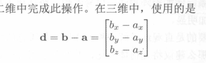
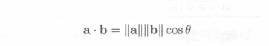
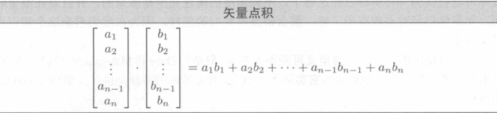
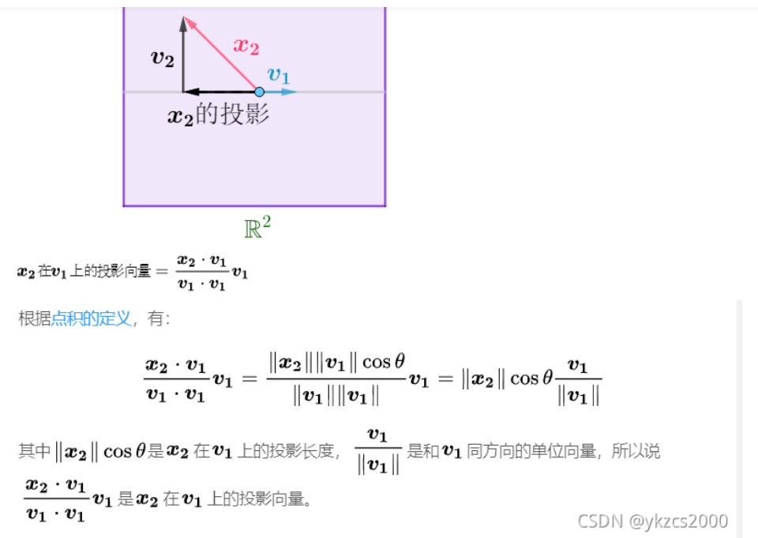
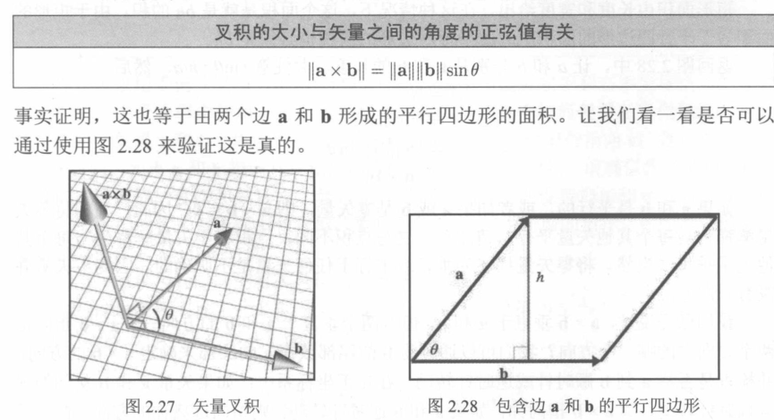
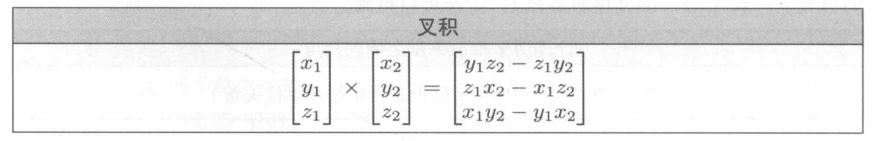

+ 以后我们所有的矢量计算A干什么B,都是统一从后往前翻译,也就是B到A.
+ 矢量两点之间的计算 AB矢量,是B点减去A点

+ 矢量的点积
  + 矢量的点积他是带符号的标量 用的是.这个符号计算的
  + A*B的点积在图形上就是B在A上面的投影,所以如果A和B矢量夹角小于90,那么点积为正,大于就为负数
  + B只要与X轴方向点积,那不就B在X轴方向上的投影,也就是我们可以轻松算出X轴上矢量的x大小
  + 点积他有个公式就是内积公式(所以点积也非常方便计算角度)

  + 点积他是如何计算的,
  
  + 点积你看他的计算,所以在很多运算上都是无所谓的,所以交换结合加减都是可行的.
  + 点积公式的推导公式:
  + 

+ 矢量的叉积(注意他们的名字)
  + 叉积代表的就是两个用X相乘的矢量计算
  + 矢量的叉积得到的是一个垂直于两个矢量的矢量也就是xy中的z轴,而右边的公式计算出来的是A和B两个矢量计算出来的平行四边形的面积,所以左边要加一个绝对值符号
  + 如果两个矢量平行,按照公式等于0,翻译过来就是根据这两个矢量找不到一个为2的矢量,所以0矢量代表任意方向与他垂直的矢量
  + A叉乘B他的方向是咋得到的,因为叉乘是垂直的,所以有两个方向,上和下,我习惯翻译过来是从B开始的,也就是B旋转到A,然后使用左手旋转法则,大拇指朝上,所以矢量朝上,B叉乘A就是,朝下,所以叉乘交换以后为负数
  + 
  + 
  + 你一看叉积这种复杂的计算方式就知道了,一般的交换,结合都不太满足的.
