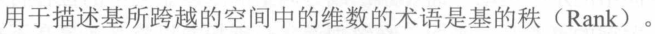
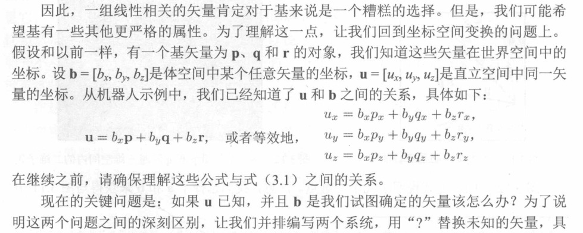
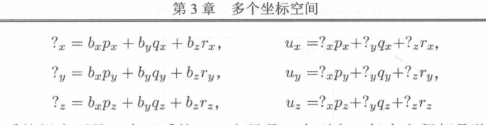
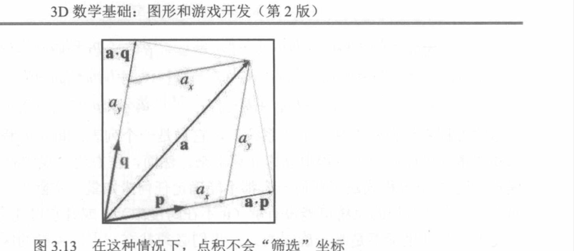

+ 为什么需要垂直空间
  + 首先垂直空间和世界空间轴方向相同,他们只有原点上的区别
  + 对象空间我们和垂直空间只有基矢量的不同
    + 这里谈论到基矢量,为什么对象空间不是由旋转垂直空间而得到的,而是引入了基矢量的概念
    + 基矢量就是一个空间的轴矢量,而这些基矢量他是可以朝向任何方向的,以他们为坐标轴的时候,你需要一些硬性条件,你需要确保基矢量他们之间不是线性相关的,线性相关代表,矢量A B C ,C可以有A和B代表,这样就造成了ABC他们之间的是在同一个平面,这是不合理的,因为你作为一个空间,你的轴矢量怎么能够只有一个平面或多个平面,最好是他们相互垂直的,此时这些基矢量的秩为2,代表他穿过2维空间,
    + 
  + 对象空间是如何使用基矢量的?
    +  首先b矢量是对象空间的矢量,有了b的坐标,而这个坐标是相对于基矢量的,基矢量的坐标是有针对于垂直空间的,所以你只要b的坐标每个值乘以p q r他们矢量,不就可以得到这个b矢量的垂直空间矢量的坐标u,
    + 前面就完成了对象空间到垂直空间的转换,垂直空间到世界空间不就是移动原点坐标吗,非常容易
    + 还要记住一点我们默认对象空间和垂直空间他们原点一直
    + 所以只要知道基矢量的垂直空间坐标,那么就可以完成转换,按照下面计算
  
  
  + 基矢量的特殊值
    + 如果我们还是按照前面所说的基矢量,他们之间并不互相垂直
       + a.q代表我们的点积值,但是因为基矢量的他们不垂直,所以ax才是投影的方向,所以实际上导致ay才是我们需要算出矢量相对于基矢量的坐标,点积不在代表我们实际计算出来的对象空间坐标了,这样就非常恼火
       + 
    + 所以我们喜欢是使用 垂直的基矢量,这也是为什么对象空间,他是互相垂直的,至少可以利用点积算对象空间坐标
     + 互相垂直的基矢量叫做标准基,单位长度基矢量叫做标准正交基.

+ 嵌套坐标空间的骚操作
  + 一头养儿,他有世界坐标,垂直坐标,对象坐标,这个对象坐标是对于羊整体来说,
  + 如果我想要让羊摇头只有用他的对象坐标就行,那如果我想要摇头的同时羊的耳朵也动,我就可以在搞一个头的坐标,这样就非常方便
  + 所以这样不断嵌套就非常方便,那如果羊的耳朵掉星星,羊的小星星就会掉到世界坐标,就需要你转换了.