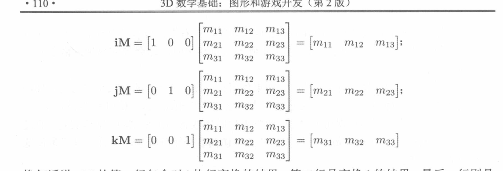
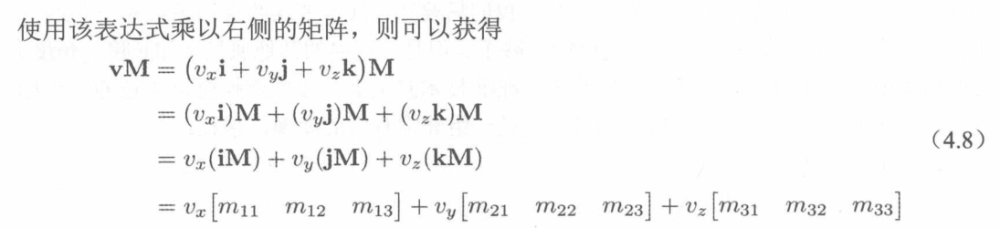
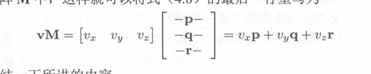

+ 矩阵
   + 矩阵相乘时候的转质是他们顺序交换
   + 转置是行和列交换
   + 矩阵的乘法就是前面的行和后面的列之间的点积
   + 这里给出矩阵的<mark>物理意义</mark>:一个物体他有非常多的点,我们每次都去计算一个点的坐标非常复杂,所以我们有一个想法,在物体不变的情况下,我们依靠原来点的坐标,重新搞一套基坐标,这样原来的点从世界坐标变成我们的基坐标,就可以完成我们想要的变化!
   + 矩阵本质就是提供了一套基坐标,和他的相乘就是改变了他的依赖基坐标
+  矩阵物理上面的解释
  +  i和j他们都是基矢量
  +  所以一个矢量V可以表示成 v =vx i+ vy J + vz k (x是v的下标)
  +  
  +  在他们相乘的时候发现了V和M相乘(M是矩阵) 他们最终有转换成类似一个矢量的表达式
  
+ <mark>通过对上面的式子观察可以得出:
  + vxi+vyj这样的写法说明,vx这个数量是基于世界坐标的,(vx,vy,vz) 构成了v的坐标,这个是v的世界坐标,在上面的式子中从来没有发生变化
  +  最后一行式子是在表明,矢量v和矩阵相乘的时候,最终在vx和vy不变的情况下,改变了基坐标的矢量,也就是说,M提供了一个基坐标的集合,让你v变化到想要的位置成为v'
  
+  这个时候我们把上面的每个后面的矢量,看做成基矢量,这样导致VM相乘,实际上得出了一个以v的坐标,而在一个新的基坐标中展现的坐标,矩阵本质是代表一种变换,他可以放大或者缩小.
  +  