+ 这一章大概的写法
  +  首先探讨2维中的变化 x 和y轴
  +  谈论3维中的变化  x y z (坐标轴)围绕着他们变化
  +  围绕任意矢量的变化
## 旋转
   + 同样的思路 一个矢量v他要围绕n党委矢量旋转@角度.
   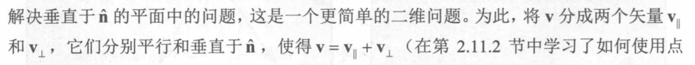
   + 得出一个关系:同时构造一个w 通过v的平行和v的垂直交积得出,所以这三个矢量变成了互相垂直的坐标轴,这里的平行都是相对于n矢量的
   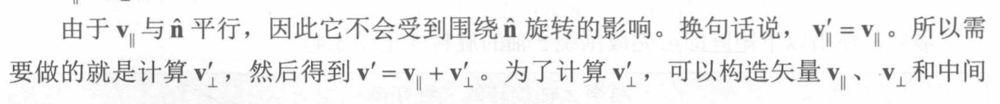
   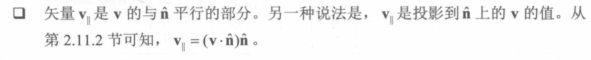
   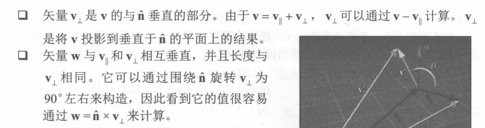
   看书上的结论(这里算出的就是任意一个矢量他围绕n旋转后的矢量)
   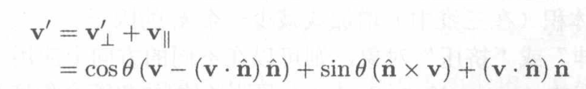
+ 为什么要算出p 和旋转以后的p,这里就是在按照第四章的思路,一个矢量乘以矩阵以后,实际上就是以这个矩阵为基坐标,矢量的坐标不变,只是相对于的基坐标发生改变
+ 这里是同样的思路,旋转某一个物体,我只要算出基坐标旋转以后的基坐标就行,这里p'是把p矢量带进前边算出的矢量旋转后的公式,就可以算出P'
 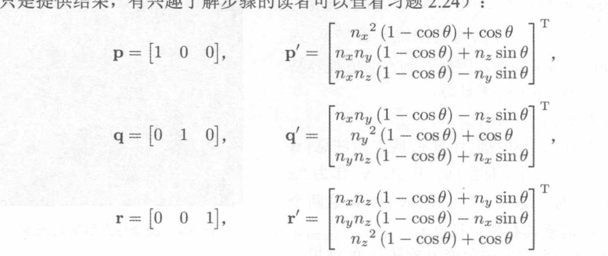  
+ 最后我们把这三个基坐标组装起来就可以得到旋转后的基坐标矩阵,
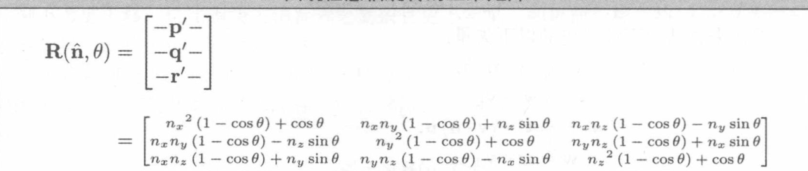
  
## 缩放非常简单
+ 原始基坐标方向没有改变,只要缩放基坐标的大小即可,直接可以得出新的基坐标矩阵
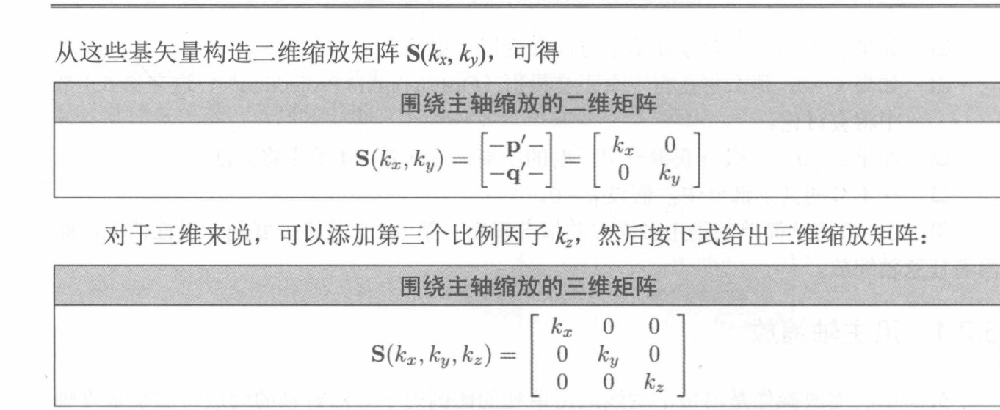
+ 对于按照任意方向进行缩放,还是要先算出任意一个矢量,相对于n矢量方向的缩放,才能算出基坐标的变化,在得出矩阵,用于计算整体的物体的缩放
+ 按照旋转的思路,这里v的相对于n的垂直他是没有变化的,只有v的平行,缩放k倍.
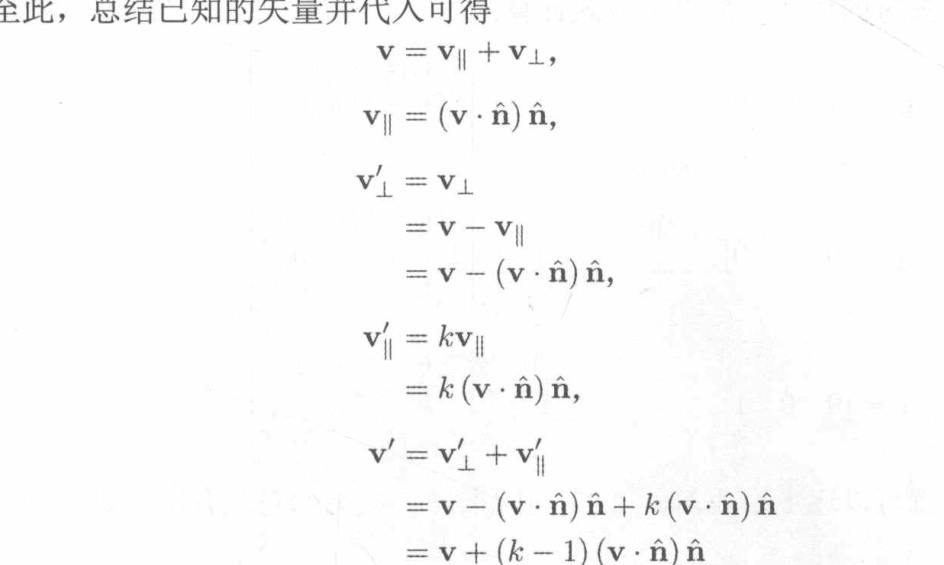
最终得到这样的矩阵
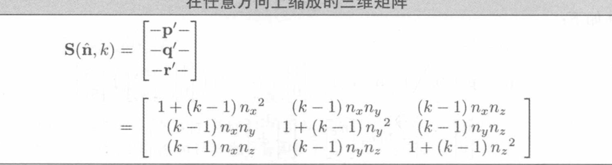

## 投影(更加简单)
+ 在三维空间中一个物体是从3D物体投影到平面上得到平面,二维就是线段投影成点或线.
+ 只要舍弃xy的z或者x的y,x这些都不用变
+ 沿用缩放的思路,只要将基坐标的z缩放0倍,不就是投影吗
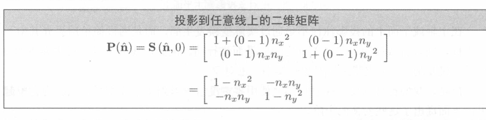
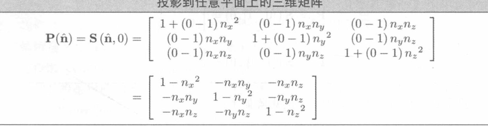

## 反射
+ 同样是思路,直接取反就是,反射
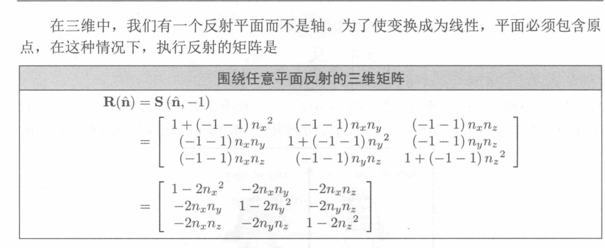

## 错切
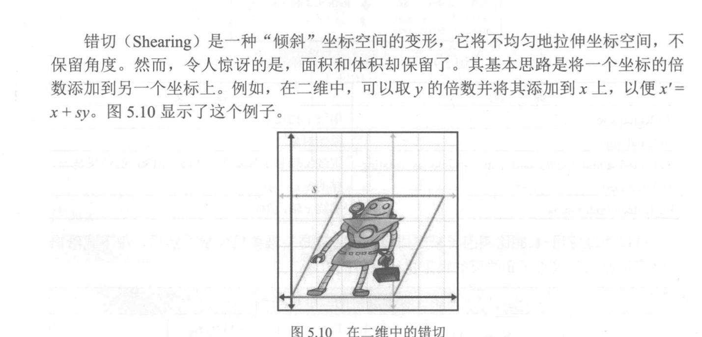
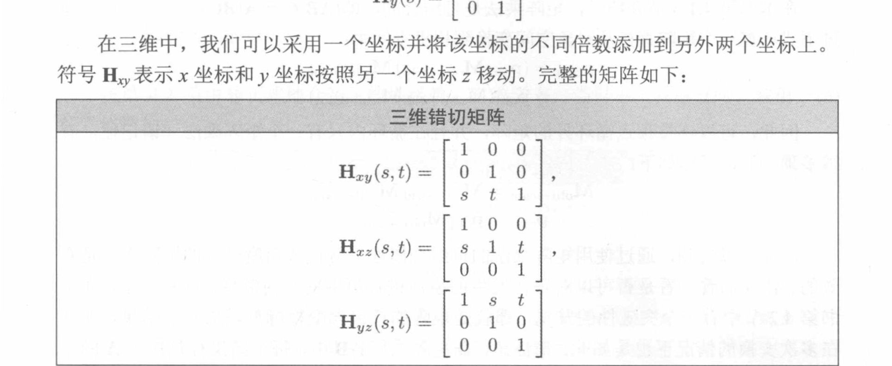

## 变换的分类
+ 这里提出一个概念:映射,或者函数,映射代表映射F将a映射到b,这里你可以理解为,矩阵F让物体A状态变化到B状态
+ 也就是说物体可以依照多个矩阵来变换.
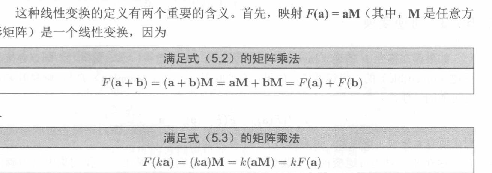

+ 正交矩阵
 + 平移 旋转 ,反射都是正交矩阵,如何去判断是不是正交矩阵, 物体本身的比例没有变换,
 + 正交矩阵就是等于逆矩阵,这个避免了很多计算 