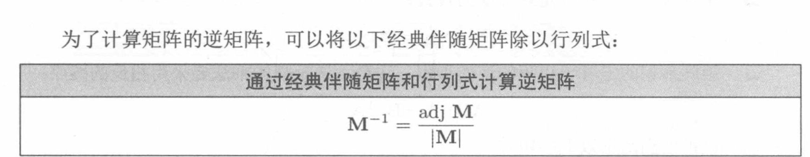
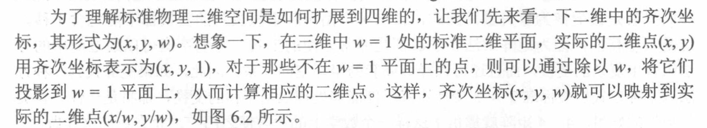

## 简单变换
+ 在前面我们研究矩阵,这里我们先研究了矩阵的标量也就是矩阵的值,成为行列式
+ 矩阵两行交换,行列式的值为负
+ 将某一行的倍数,添加到矩阵的一行值不变
+ 矩阵的标量行列式 他在几何二维上面代表面积,三维就是体积,

## 逆矩阵
+ 为什么要引入逆矩阵的概念,在3D中矩阵代表一种变换,那么逆矩阵就是撤销这种变换非常爽.
+ 矩阵和逆矩阵相乘是单位矩阵,这也就是逆矩阵为什么有撤销的操作.
+ 逆矩阵本身不为0,这也是他的标志.
+ 伴随矩阵
  + 是矩阵的余子式转置得到的.(p150)
  + 伴随矩阵除以矩阵行列式就得到逆矩阵

+ 逆矩阵的本身关系
 + 有一点需要注意,逆矩阵和矩阵的行列式,他们之间是倒数关系. 
  

## 正交矩阵
 + 正交矩阵的性质导致,转置矩阵就是等于逆矩阵,避免了上面的大量计算,
  

+ 正交矩阵的判断
 + 通过简单推演,一个矩阵正交的条件是
  +  矩阵每一行都是单位矢量
  + 每行都必须互相垂直
  
+ 矩阵正交化的方法
  
## 4乘4 齐次矩阵
+ 首先明白如何从三维降到二维表示
 + 下面图片解释
  1. (x/w,y/w)不应该是((w'/w )*x,(w'/w) *y)吗,写成这样解释了投影到w'的每个点,都理解成了这个点到原点这条线上,被w'这个平面阶段,所有现有的点继续等比缩放,从x需要缩放成 w'/w  *x,因为文中设定w'为1,自然成了x/w
  2. 为什么w选择了1,而不是其他的,在4维到三维,中这个w就是处于0和1的状态,也非常方便除法,
  3. w=0代表了除法无效,所有没有投影出来的点,也就是无限远的点
  4. w不是0就有意义了

+ 三维扩充到4维的方式
  
+ 4*4齐次矩阵
 + 引入他目的是补充矩阵的平移功能. 
 + 下面图片:
  + 前面的矢量w位置0和1代表了是否开启平移,算一下就知道为什么
  + 平移的距离是在最后一行里面,最后一列基本没意义,他的意义就是凑够4*4这样正方形举证
  

+ 放射变换进一步推广
 + 主要思路,先平移到目标坐标,在进行线性变换,再按照反方向移回去
 + 按照数学逻辑没有问题 
  

+ 4*4矩阵引入了针孔相机,人眼透视模拟的功能
 + 相较于原有的垂直线投影,我们更需要人眼的模拟,其实摄像机就是人眼,物体点透过一个投影中心呈现到我们屏幕上面,这也是我们渲染的思路
 +  第一个 需要知道投影中心,其次投影的面的位置也需要

1. 粗略计算
  + 这里我们把投影中心放在原点,所以缩放比例为-d/z

2. 去除负号
  + 逻辑上没有改变,就是整体平移了一下,方便数学计算

3. 模仿三维变二维操作
 + 三维变二维就是x y除以了w
 + 那么上面的图片是不是就是非常像4维除去了z/d变成的,所以我们反过来推出四维的矩阵
 + 这个四维并没有什么意义,但是他变成3维的时候,得到的矢量是不是就是我们针孔相机的投影
 + 所以我们为这种4维降成3维赋予了投影的功能.非常的神奇.
