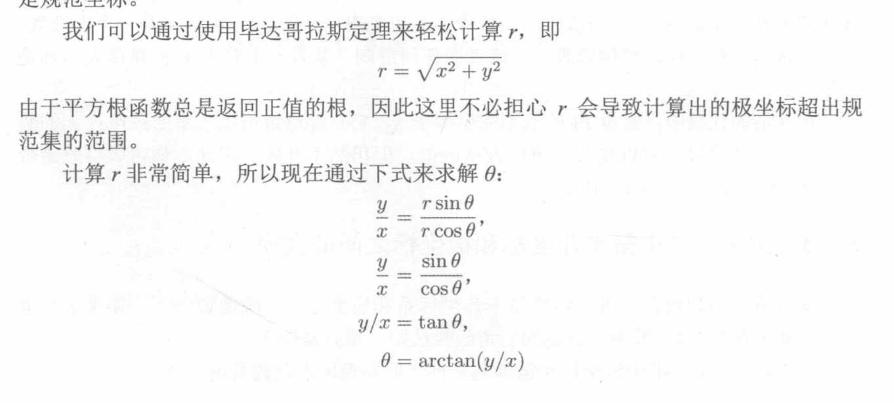
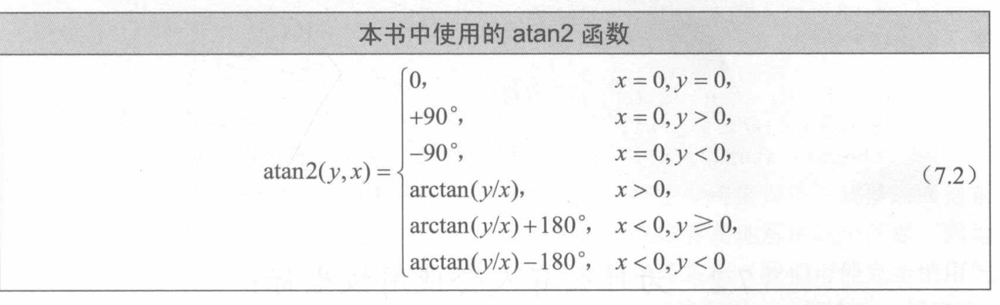
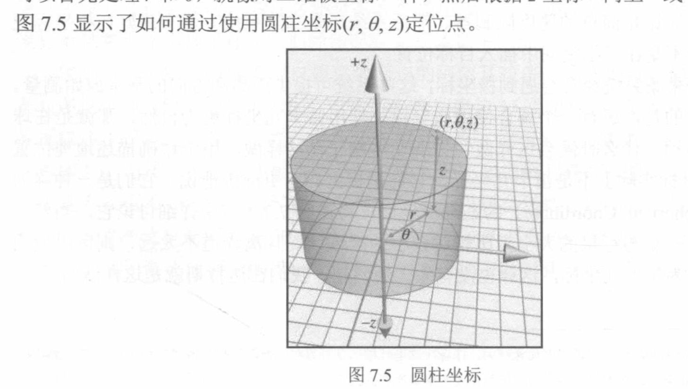
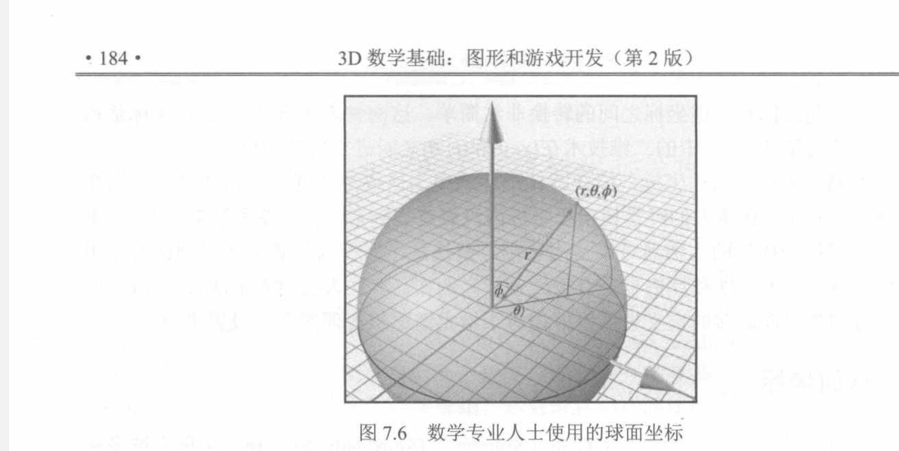
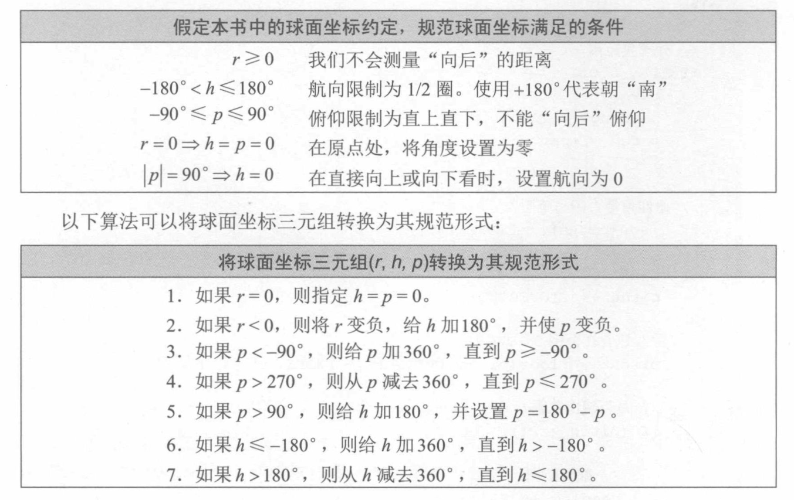
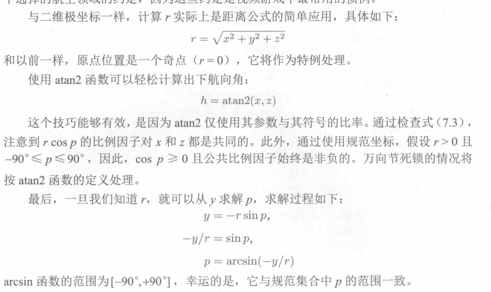

## 极坐标系的意义
+ 笛卡尔坐标计算机非常容易理解,但报位置等生活场景极坐标方便人的理解,例如6点钟方向有敌人飞机

+ 极坐标如何2维
 + 二维中(r,p) p代表角度,r代表长度,这种坐标当然可以表达出一整个平面
 + r=0时,这个点就非常奇特了,p的意义也没有了,所以为了方面表示原点,同一将r=0时,p改写成0

+ 笛卡尔坐标的二维2维---极坐标2维
 + 需要计算r和p,看下面的图片中直接急用tan的计算,会丢失很多信息,tan它可以做到-90到+90 表示所有的值,那么这样arctan出来的p也会落在这个范围,你写代码的时候就需要分情况,适当的加减π来扩充
 + 所有计算机提供了一个函数atan2这个方法,他自身就可以做到区分

+ 极坐标二维到三维 
 + 两种三维方式圆柱形和球形
 + 圆柱形(好理解不常用)
   + 他的移动思路首先移动到相应的z轴,让后在z轴平面按照原来方式的利用极坐标表示,这样就扩充到整个三维 
 
 + 球形(一般用它,他使用的是右手坐标系,我们一直使用左手)
  + 思路利用两个角度来扩充到三维,一个是垂直方向,一个是水平方向,这样就扩充到了整个层次
  + (r,p,h) p代表水平方向,h代表垂直方向
  + h处于90度的时候,陷入了二维的原点情况,称为万向死结,p失去了意义,所以当h=90时候 p=0来表示

+ 下面的约定是为了表示极坐标的唯一性,而不是多个坐标表示同一个点非常的麻烦

+ 极坐标和笛卡尔坐标的互相转换
 + 极坐标转笛卡尔就是数学层次简单计算
 + 笛卡尔转极坐标就要像二维一样小心计算的角度表示不全的问题 
   + 首先注意h的计算 因为h按照规定是 180到-180所以可以使用前面提到的atan2函数来计算,用于补充超过90的角度,至于万向死结,只要重新定义一下就行
   + p的计算配置有-90到90,所以每个p都对于一个sinx中的x值,没有歧义,直接算就行,不过我不太理解图片中的写法 

