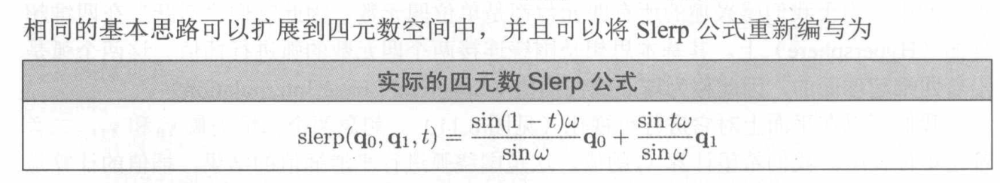

## 矩阵形式
+ 不太常用

## 欧拉角的优势
+ 三个角度数字来表示旋转,这个让人非常容易理解
+ 欧拉角描述的是一种变换状态,使用了欧拉角 就会使物体从a变换到b  ,这个物体a的状态就是物体没动的状态,每次欧拉角都会从这个状态开始再变化,虽然我们在引擎中看到变化x轴就会动,但是这个是欧拉角从最开始到最终的结构,其中的过程不会显示在图形上面.
+ 同时数字代表角度,而不像矩阵和四元数他们代表了余弦数,所以欧拉角的每个数都是有效的,但不一定合理
+ 非常容易压缩,最经济
+ 

+ 理解欧拉角(本书左手坐标系)
  + 三个方面的角 航向角(y) 俯仰角(x)  翻转角(z)
  +  我们制定了一套旋转的标准 y x z按照这样的变换顺序就会得到同一的定向
  + 为了制定唯一的欧拉角 放弃别名(x轴旋转360结构是一样的,但数值上面不同)

+ 万向死锁的情况发生
  + 记住我们在本书中yxz的变换顺序,万向死锁发生在中间位置的轴发生90度的旋转,无论它什么顺序
  + 想象一下y轴转动40  x轴转动90  得到一个状态A
  + y转 90 x转 90  得到状态B
  + 这样转的结构 飞机头指向最开始y轴的负方向, 经过系统层面的yxz顺序变化,y的变化好像就是可以用z轴上的变化来代替,物体处于这个状态时候y轴明明指向前面 ,却没有按照变化后的y轴转动,而是依照z轴方向转动,y和z重合了
  + 这种重合就是万向死锁,失去了一个方向轴,根本原因是,系统按照yxz变化,按照欧拉定理的原理,但是界面最终的显示是我们变化的结果,这样就看起来存在y和z的重合了,无论变化y和z,界面上看到的只有按照z轴旋转
+ 如何避免万向死锁
  + 将物体不太可能旋转到90的轴放在中间. 

+ 欧拉角的动画插针逻辑
  + 第一个是我们看到的图像,我们调整欧拉角的时候,他会随之移动,但内部的动画逻辑是,围绕y轴旋转90
  + 计算机会从0到1,再从1到2,2-3延续下去,这个就是欧拉角的内部逻辑,每次都是从最开始的状态,而不是上一个状态开始,形成了插针动画. 

+ 动画插针优化
  + 标准的欧拉角规范
   + 就是按照我们上面提到的标准去优化,例如 45和 360度他们之间的动画,你要按照实际旋转就需要315度旋转,但实际上360就是0只要转45度就行,而不是转一圈,为了解决这个问题,请使用标准欧拉角,把360转换成0解决
  + 标准欧拉角依然存在转的太多的问题
    + -170和170之间他们只需要旋转20度,但是这个的确符合标准欧拉角
    + 提供了一个非常方便的计算工具
    + wrapPi函数,你只需要将-170和170分别带入,得到 -160 和-180,两者相减就是20度,这个函数也叫<mark>最短狐线函数

+ 关于动画我们提出的建议
  +  yxz顺序中中间的x轴不要为90,设置成物体最不容易达到的90轴
  +  标准的欧拉角规范
  +  wrapPi函数计算最小弧线

+ 欧拉角始终无法解决万向死锁的问题,只不过你要懂得避免

## 轴和角
+ 这里提出一个假设3维中的角位移,都可以有一个精心设计的轴,然后使用一个角度完成旋转
  
+ 这里认为因为轴和角他没有规范化约束,也就是360度和720度都存在而且合理,所以这种别名造成了一定的影响,但是这种缺点却拥有一个四元数所不具备的功能,他可以描述角速度,360度每秒和720度每秒就可以区分开来,在这个上面的运用庭广的.

## 四元数的特殊表现
+ 书中的四元数只研究了旋转,所以一旦你要旋转一个点,那么我们就认为你使用的是旋转四元数,
+ 旋转四元数和单位四元数不同,单位四元数矢量部分是零矢量,而旋转四元数是单位矢量.
+ 四元数依据使用了轴和角的思路,所以可以表现为这样

+ 四元数的运算
+ 负数运算
  +  依照公式,我们将角度添加360度,你要理解四元数就是根据轴和角的思想,那么增加360转回了原地,根本没有动,但是反应到公式360除以2,为180,四元数的四个分量都成负数了,但是他实际上没有改变,也就是正数和负数相等.

+ 单位四元数
  
  

+ 四元数的标量运算
  +  基础公式
 
  +  因为n是单位矢量,他这里把n是单位矢量的四元数,描述成了旋转四元数,所以旋转四元数为1

+ 四元数的共轭和逆
+ 当图片中q的标量为1时,也就是单位四元数时,四元数的逆和共轭相等,这个就非常舒服的解决了计算两个四元数之间的差,也就是角位移.
  

+ 四元数的乘法
  + 可以结合但是不能交换

 + 四元数的乘法如何结合到旋转中去
   + 看p的形式,实数部分是0所以他不是一个单位四元数,这个也符合我们的逻辑,因为我们是随机挑选物体点,是不是单位四元数不是我们需要考虑的,不用为了方便而去构造一个单位四元数,就是随便挑的一个点
   + q就是我们旋转四元数,旋转四元数不是单位四元数,旋转四元数n是单位矢量,而单位四元数是0矢量
   + 下面的式子就是在表明 点p构成的四元数,围绕旋转四元数旋转
  

 + 这种乘法的运算顺序是有内到外
   + 并且多次旋转一个点是等于把多次旋转的四元数相乘,再进行一次点的旋转.
  
 + 四元数乘以标量

+ 四元数点积
  + 结果是标量,四元数的点积和矢量点积非常相似,矢量点积是两个矢量标量乘以cos角度,点积越大说明两个矢量越靠近
  + 四元数的点积是cos的角度一半,所以两个四元数越相近,两个四元数的角位移越相似.

+ 四元数的差
  + 差意味着从一个方向当另一个方向的角位移
  + 而这个角位移的四元数就是图片中a到b中,a的-1次方到b
 

+ 四元数对数和指数
  + 对数
 
  + 指数(exp类似于e 然后p是指数)

+ 四元数基于对数和指数得到的东西(q的t次方解释)
  + 四元数是最小弧度计算,转3圈不是四元数该干的事,请使用前面提到的角和轴
  + q的2次方 代表 四元数旋转的两倍了, q的1/3 代表原来的旋转1/3 ,q的-1次方原来是表示四元数的逆,这里代表反转q,两种不谋而合了.q的t次方是q乘以t.
  + 那这种t次方是如何得到的解释的?
   + 观察下面的光是 首先我们有对数和指数还有 四元数的标量概念,所以写成8.8式子中等号右边式子没有问题,但是这里需要翻译一下,首先四元数标量乘法实际上标量是可以乘进去的,t乘以角度,代表角度翻了t倍,这样就解释明白了,把t往上面一提就行了,代表了q的t倍,所以这里你就要区分开来,q的t次方在四元数中表示q乘以t,而不是t个q相乘,这个是他的内部式子解释.

+ 四元数插值
  +  单位四元数就是在我们视频中看到的,不动的圆上面 
  + 变化的q的次方代表了 变化的q乘以t
 

  + 实际的计算公式直接记就可以了

+ 四元数的的优势和劣势
+ 
+ 

## 四元数的方法和用法
+ 每一个旋转四元数他们的作用都是可以用来表示角的旋转
+ 角位移分为角旋转和角移动,这里我们在本书中只有角旋转,所以我们说的四元数都是单位四元数,他的大小都为1,
+ 一般计算的方式 一个点[1,1,1] 我们要计算他绕某一个轴的旋转,所以我们把点构造成一个[0,1,1,1]这样一个四元数,然后乘以一个旋转四元数用来计算他的旋转.
