<!-- vscode-markdown-toc -->
* 1. [选择数据库和显示数据库](#)
* 2. [数据的排序](#-1)
	* 2.1. [过滤数据](#-1)
		* 2.1.1. [ WHERE 必须写在ORDER BY的后面](#WHEREORDERBY)
		* 2.1.2. [ BETWEEN 用于范围查找](#BETWEEN)
		* 2.1.3. [ 空值检查 空值是null 而不是为0](#null0)
		* 2.1.4. [ 配合逻辑操作符 让过滤更加高级 (AND 和OR 和in)](#ANDORin)
* 3. [第八章使用通配符来进行过滤](#-1)
		* 3.1. [LIKE操作符 表示后面的匹配 是使用通配符匹配而不是直接相等匹配](#LIKE)
		* 3.2. [ 缺点:速度太慢,少用为妙!](#:)
* 4. [第九章 用正则表达式进行搜索](#-1)
		* 4.1. [ REGEXP 正则表达式](#REGEXP)
		* 4.2. [ LIKE和 正则表达式的细小区别  LIKE使用通配符后 跟正则表达式没啥区别!](#LIKELIKE)
		* 4.3. [ 代替OR进行过滤](#OR)
		* 4.4. [ 匹配几个字符 变相的OR 语句](#OR-1)
		* 4.5. [ 匹配特殊字符](#-1)
		* 4.6. [ 匹配字符类](#-1)
		* 4.7. [ 匹配多个重复字符 使用元字符](#-1)
		* 4.8. [ 定位符号](#-1)
* 5. [第十章创建计算字段](#-1)
		* 5.1. [ 注意](#-1)
		* 5.2. [ Concat()函数 用于字符段拼接](#Concat)
		* 5.3. [  RTrim()函数 删除多余空格](#RTrim)
		* 5.4. [ AS关键字用于别名,上面拼接的字符串没有一个列名 ,AS创建一个列名](#ASAS)

<!-- vscode-markdown-toc-config
	numbering=true
	autoSave=true
	/vscode-markdown-toc-config -->
<!-- /vscode-markdown-toc -->

##  1. <a name=''></a>选择数据库和显示数据库
```C++
SHOW DATABASES //显示
USE 数据库名称


```

##  2. <a name='-1'></a>数据的排序
1. ORDER　BY 排序
2. DESC　降序


```java
1. SELECT prod_id, prod_price，prod_name  //选择我们想要操作的列
2. FROM products // 我们从哪个表中获取
3. ORDER BY prod_price，prod_name;  //
3. ORDER BY prod_paice DESC ，prod_name;//prod_price 按照降序排序 ，mysql默认是升序
4. LIMIT 2，3；//  限制显示的信息，2 代表第二行开始，3代表显示三个信息。

```

---

###  2.1. <a name='-1'></a>过滤数据
####  2.1.1. <a name='WHEREORDERBY'></a> WHERE 必须写在ORDER BY的后面 


```java
WHERE pro_price =2.50;   //用于筛选 价格等于2.50块钱的用户
```

---


   #####  其他操作符
         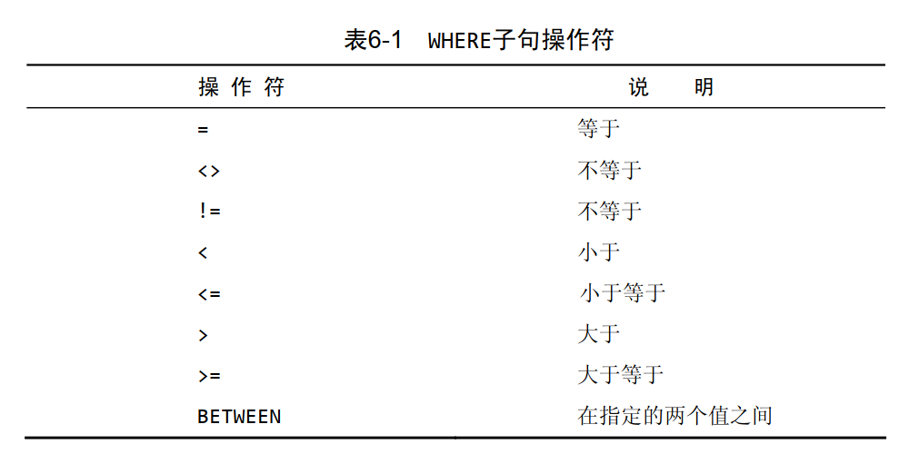


---

####  2.1.2. <a name='BETWEEN'></a> BETWEEN 用于范围查找

   ```C++
   WHERE prod_price BETWEEN 5 AND 10;
   ``` 
---

####  2.1.3. <a name='null0'></a> 空值检查 空值是null 而不是为0
   ```C++
   WHERE prod_price IS NULL;
   ```


   ---
####  2.1.4. <a name='ANDORin'></a> 配合逻辑操作符 让过滤更加高级 (AND 和OR 和in)
   ```java
   WHERE vend_id =1003 AND prod_price <=10;
   WHERE vend_id =1003 OR prod_price <=10;
   WHERE (vend_id =1003 OR vend_id =1002) AND prod_price <=10; //AND 优先级高于OR
   WHERE vend_id IN(1002,1003)//IN的速度比OR 快,同时可以选取其中的一个

   WHERE vend_id NOT IN(1002,1003)//IN的速度比OR 快,NOT 表示不匹配


   ```


---

##  3. <a name='-1'></a>第八章使用通配符来进行过滤  
####  3.1. <a name='LIKE'></a>LIKE操作符 表示后面的匹配 是使用通配符匹配而不是直接相等匹配
   ```C++
   WHERE prod_name LIKE 'jet%' //% 代表匹配任何字符 从出现任意次数, %他匹配不了NULL (这个玩意说真的意外)
   
   WHERE prod_name LIKE '_ ton anvil'; //_ 通配符只能匹配一个任意字符

   ```
####  3.2. <a name=':'></a> 缺点:速度太慢,少用为妙!

---

##  4. <a name='-1'></a>第九章 用正则表达式进行搜索
####  4.1. <a name='REGEXP'></a> REGEXP 正则表达式
    ```C++
    WHERE prod_name REGEXP '.000'  //.是正则表达式中一个特殊字符,表示匹配任意一个字符
    ```
---

####  4.2. <a name='LIKELIKE'></a> LIKE和 正则表达式的细小区别  LIKE使用通配符后 跟正则表达式没啥区别!
 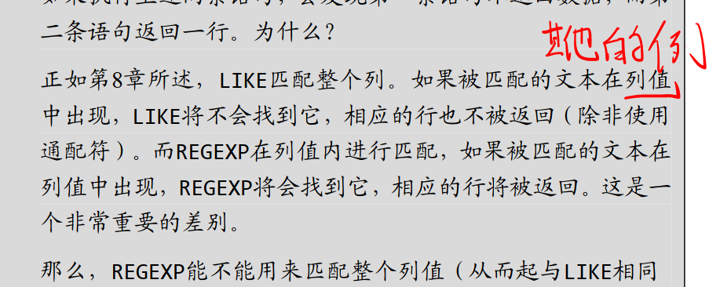

---

####  4.3. <a name='OR'></a> 代替OR进行过滤 
   1. ```C++
           WHERE prod_name REGEXP '1000|2000' 
      ```

---

####  4.4. <a name='OR-1'></a> 匹配几个字符 变相的OR 语句
   1. ```C++
        WHERE prod_name REGEXP '[123] Ton' //[123]代表从123 中选取一个进行匹配,
      ```
---

####  4.5. <a name='-1'></a> 匹配特殊字符
   1. ```C++
      WHERE vend_name REGEXP '\\.' // 在正则表达式中 '\\'用于表示元字符 
      ```
---

####  4.6. <a name='-1'></a> 匹配字符类
   1. 为了方便
      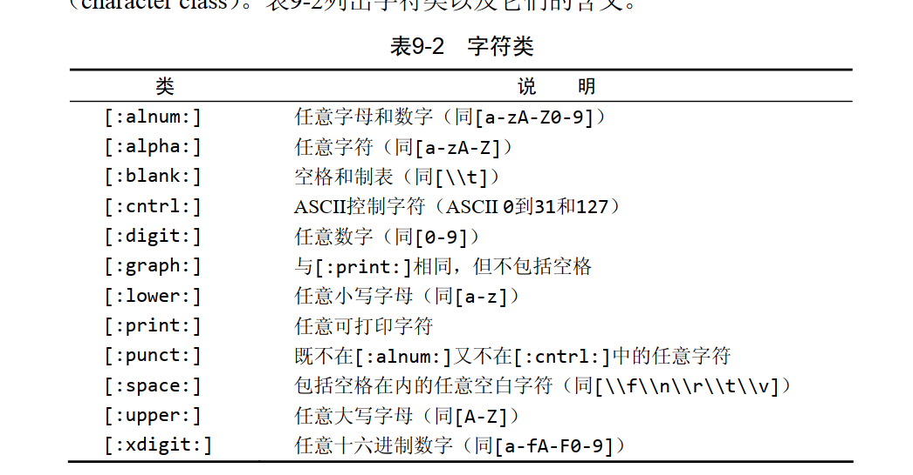

---

####  4.7. <a name='-1'></a> 匹配多个重复字符 使用元字符
    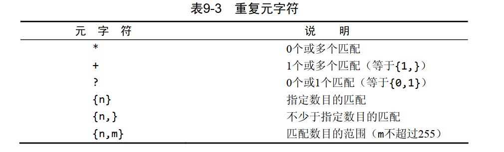

   ```C++
   WHERE prod_name REGEXP '\\([0-9] sticks?\\)'
   WHERE prod_name REGEXP '[[:digit:]]{4}'

   ```

---
####  4.8. <a name='-1'></a> 定位符号
    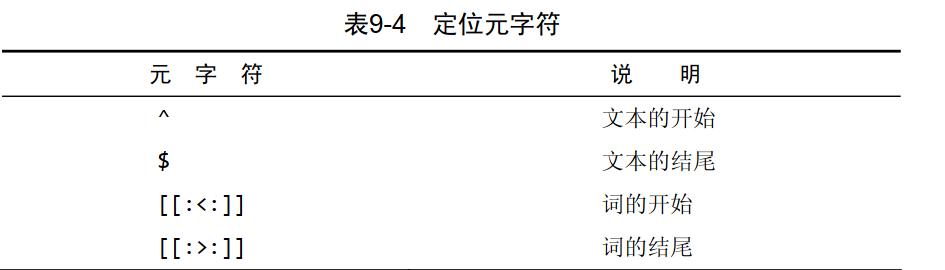

```C++
WHERE prod_name REGEXP '^[0-9\\.]'
```


---
##  5. <a name='-1'></a>第十章创建计算字段
比如我们想要输出 这种格式 小王+张家界永定区+联系电话:13755555555 数据库只有这些单个数据,所有我们要把他拼接起来, 同时<span style="color:red"> 这个拼接而成的字段是在SELECT语句创建时完成的,因此他在客服机上完成的,但是在服务器上完成更快!</span>
####  5.1. <a name='-1'></a> 注意
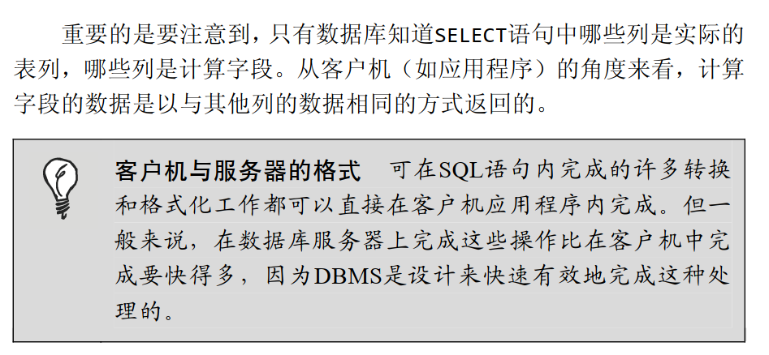

---

####  5.2. <a name='Concat'></a> Concat()函数 用于字符段拼接
   ```C++
      SELECT Concat(vend_name,'(',vend_country,')')  //为什么写在SELECT中上面提到过
   ```
---

####  5.3. <a name='RTrim'></a>  RTrim()函数 删除多余空格    
   ```C++
   SELECT Concat(RTrim(vend_name),'(',RTrim(vend_country),')')
   ```

---

####  5.4. <a name='ASAS'></a> AS关键字用于别名,上面拼接的字符串没有一个列名 ,AS创建一个列名
   ```C++
      SELECT Concat(RTrim(vend_name),'(',RTrim(vend_country),')') AS vend_title
      ```
   1. 区别
      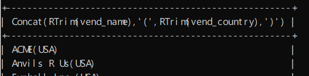
      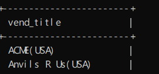

   2. 也可以用于数据计算,AS把重新计算的数据命名在独立的一行, 我们把quantity *item_price 计算到另一行.
   ```C++
   SELECT prod_id,
          quantity,
          item_price,
          quantity *item_price AS expanded_price
   ```
   

---

## 第11章 使用数据处理函数 (这些函数会降低运算的性能)
### 这些函数在DMBS内部 不同的sql语言都有可能不同
####  文本处理 利用Upper() 将文字转为大写
   ```C++
   SELECT vend_name,Upper(vend_name) AS vend_name_upcase
   ```
    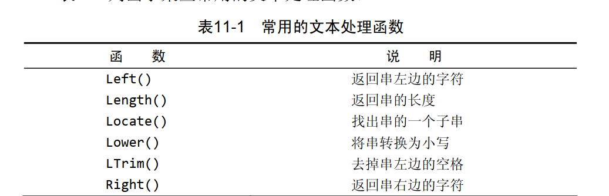
    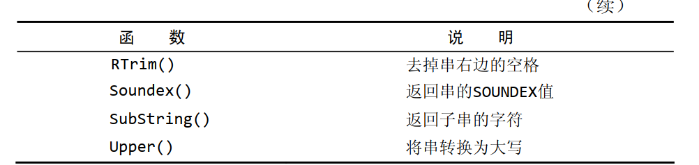

#### 日期和时间处理函数
   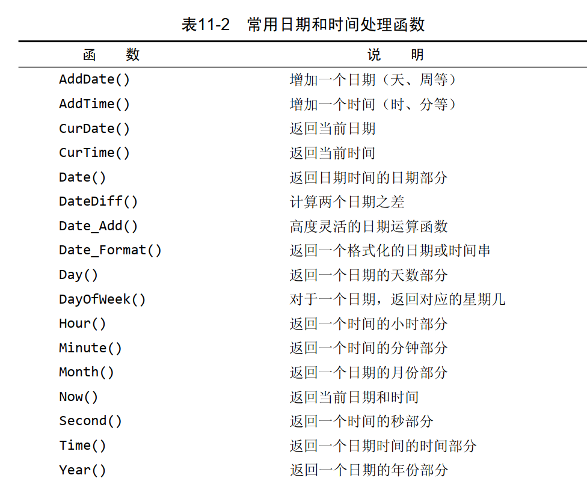
   1. 这里值得注意的是如果我们用数据库存储的时间,有可能order_date存储的是'2005-09-01 11:12:16'这种带有具体时间的
   2. ```C++
      WHERE order_date ='2005-09-01' //就会出现不匹配的情况
      ```

   3. 解决方法<span style ="color:red">这是一个好习惯</span>
      ```C++
      WHERE Date(order_date) ='2005-09-01'//这个Date函数取出单独的时间
      ```

####  数据处理函数
   1. 在DBMS中是最统一的函数
   2. 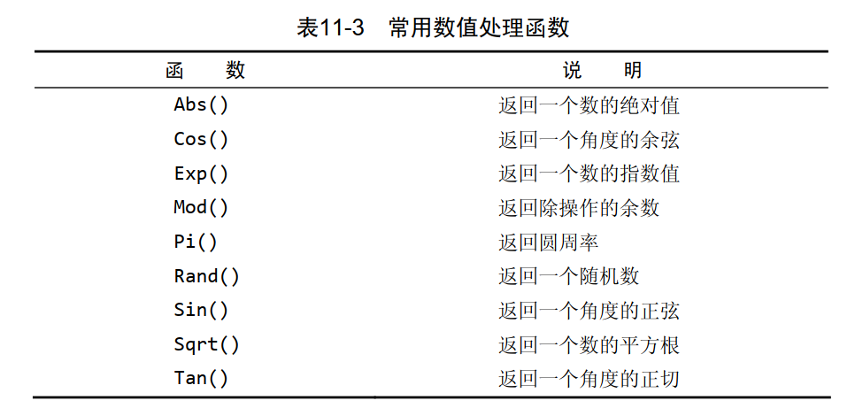

## 第12章 汇总数据
我们前面利用AS 把我们相加以后的数据从存储在单独一行或者我们直接利用WHERE过滤来计算出最大值,这个时候我们只想要汇总后的数据,而不是数据库的单独数据,所以我们可以利用数据库提供的函数,完成我们需要的汇总数据,这样我们就不会返回我们不需要的数据,减少数据传送带宽.
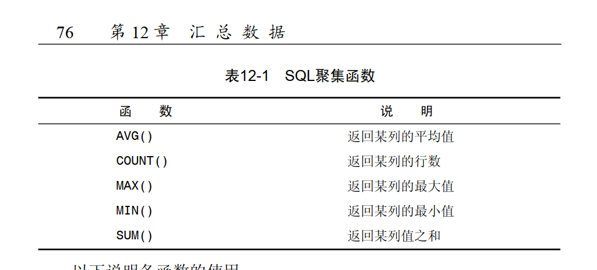
####  AVG(prod_number)函数返回一列的平均值
   ```C++
   SELECT AVG(prod_price) AS avg_price
   ```
   ---

####  COUNT()函数
   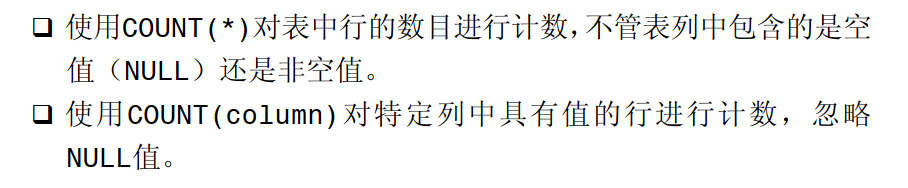
   ```C++
   SELECT COUNT(*) AS num_cust  //返回所有行

   SELECT COUNT(cust_email) AS num_cust
   ```
---

####  MAX()和MIN() 
   1. MAX()返回指定列中最大值,必须指出列名
   ```C++
   SELECT MAX(prod_price) AS max_price
   ```
   2. MIN()最小值
---

####  SUM()返回指定列的和
   ```C++
   SELECT SUM(quantity) AS items_ordered
   FROM orderitems
   WHERE order_num =20005; //计算只有order_num 等于20005的数
   ```
---

####  DISTINCT 表示不同的值
   ```C++
   SELECT AVG(DISTINCT prod_price) AS avg_price  //把 不同的prod_price(价格)计算 
   ```
   ---

####  如何把不同函数组合起来
   ```C++
   SELECT COUNT(*) AS num_items,
          MIN(prod_price)  AS price_min,
          MAX(prod_price)  AS price_MAX,
          AVG(prod_price)  AS price_avg
            
   ```
   ---
