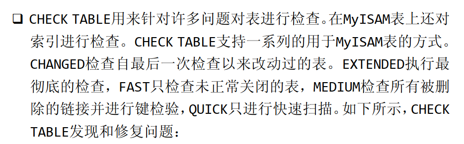

<!-- vscode-markdown-toc -->
*  [第22章 使用视图](#22)
	* 1.1. [简化复杂的联结](#)
	* 1.2. [视图重新格式化检索数据](#-1)
	* 1.3. [也可以使用视图计算字段](#-1)
* [第23章 使用存储过程](#23)
	* 2.1. [执行存储过程](#-1)
	* 2.2. [创建存储过程](#-1)
	* 2.3. [删除存储过程](#-1)
	* 2.4. [传递参数](#-1)
	* 2.5. [调用参数](#-1)
	* 2.6. [智能存储过程](#-1)
	* 2.7. [查看存储过程](#-1)
*  [第24章 使用游标](#24)
	* 3.1. [使用游标的步骤](#-1)
*  [第25章 使用触发器](#25)
	* 4.1. [创建触发器](#-1)
	* 4.2. [删除触发器](#-1)
	* 4.3. [INSERT触发器](#INSERT)
	* 4.4. [DELETE触发器](#DELETE)
	* 4.5. [UPDATE触发器](#UPDATE)
* [第26章 管理事务处理](#26)
	* 5.1. [用途](#-1)
	* 5.2. [控制事物](#-1)
		* 5.2.1. [使用ROLLBACK](#ROLLBACK)
		* 5.2.2. [使用COMMIT](#COMMIT)
		* 5.2.3. [使用保留点](#-1)
*  [第27章 全球化和本地化](#27)
	* 6.1. [查看可以使用的字符集](#-1)
*  [第28章 安全管理](#28)
	* 7.1. [管理账户](#-1)
	* 7.2. [创建用户账户](#-1)
	* 7.3. [删除用户账号](#-1)
	* 7.4. [设置访问权限](#-1)
	* 7.5. [更改账户口令](#-1)
*  [第29章 数据库维护](#29)
	* 8.1. [备份数据](#-1)
	* 8.2. [进行数据库维护](#-1)
	* 8.3. [诊断启动问题](#-1)
	* 8.4. [查看日志文件](#-1)
*  [第30章 改善性能](#30)

<!-- vscode-markdown-toc-config
	numbering=true
	autoSave=true
	/vscode-markdown-toc-config -->
<!-- /vscode-markdown-toc -->##  1. <a name='22'></a>第22章 使用视图
+ 视图的主要还是用在数据检索上面.(核心所在)
+ 视图可以用于减少大量重复的操作和一些重复的写法
###  1.1. <a name=''></a>简化复杂的联结   
```C++
CREATE VIEW productcustomers AS // 这是我们视图的语法, CREATE VIEW  视图的名字是唯一的,跟表一样 + AS
SELECT cust_name, cust_contact,prod_id
FROM customers,orders,orderitems
WHERE customers.cust_id =orders.cust_id
    AND orderitems.order_num =orders.order_num;   //这里的视图已经把我们想要的表的联结 建立起了

SELECT cust_name,cust_contact  //上面写的SELECT 中显示三个 数据,而这里只输出两个,这样的目的是为了减少视图的重复去写
FROM productcustomers   // 我感觉这里视图相当于一种SQL语句的替换
WHERE prod_id ='TNT2';


```

###  1.2. <a name='-1'></a>视图重新格式化检索数据
```C++
CREATE VIEW vendorlocations AS
SELECT Concat(RTrim(vend_name),'(',RTrim(vend_country),')' )
AS vend_title
FROM vendors
ORDER BY vend_name;

SELECT *
FROM vendorlocations;

```

###  1.3. <a name='-1'></a>也可以使用视图计算字段


+ 视图尽量用在刷新数据


<br>
<br><br><br>

---


##  2. <a name='23'></a>第23章 使用存储过程
+ 我们的一个表可以认为是一个仓库,需要多次对于表中的数据操作,这样我们需要书写多条逻辑
+ 存储过程可以写一些基础的逻辑,同时他别单条的SQL语句要快
+ 编写存储过程和访问存储过程分开,在MySQ中就是这样逻辑
+ 你是访问者,你可能不能编写存储过程,但是你可以使用

###  2.1. <a name='-1'></a>执行存储过程
+ 这个操作又称为调用
>CALL productPricing(@ pricelow,@pricehigh,@priceaverage);


###  2.2. <a name='-1'></a>创建存储过程
```C++
CREATE PROCEDURE productpricing()
BEGIN
     SELECT Avg(prod_price)  AS priceaverage
     FROM products; //这里出现了两个分隔符; 会报错,所以我们利用下面代码

END;
```

<br>

```C++
DELIMITER //                         //让命令行认为下面的存储过程这是一个整体
CREATE PROCEDURE productpricing()
BEGIN
     SELECT Avg(prod_price)  AS priceaverage
     FROM products;

END;
DELIMITER;  //   只有加上这个//才表示技术


```

###  2.3. <a name='-1'></a>删除存储过程
> DROP PROCEDURE productpricing;

###  2.4. <a name='-1'></a>传递参数
```C++
CREATE PROCEDURE productpricing(
OUT pl DEDIMAL(8,2),   //OUT 代表从存储过程传出, IN 代表从存储过程传入,INOUT(传入和传出)
OUT ph DECIMAL(8,2),
OUT pa DECIMAL(8,2)
)

BEGIN
     SELECT Min(prod_price)
     INTO pl      //上面的参数不是在表明从存储过程存储吗,这里INTO配合SELECT 结果输出到PL中去
     FROM products;

     SELECT Max(prod_price)
     INTO ph
     FROM products;  //每次都要指明导入的表
END;


```


###  2.5. <a name='-1'></a>调用参数
```C++
CALL productpricing(@prcielow,
                    @pricehigh,
                    @priceaverage          
                               );
// 调用前面的存储过程 保存到这些参数中

SELECT @prciehigh,@pricelow,@priceaverage;  //打印他们

CREATE PROCEDURE  ordertotal(
IN onumber INT,
OUT ototal DECIMAL(8,2)
)

// leave out


CALL ordertotal(20005,@total);
```


###  2.6. <a name='-1'></a>智能存储过程
+ 其实此时我们已经获得了存储编写基础逻辑的能力了
+ MySQL的IF语句
```C++
CREATE RPOCEDURE ordertotal(
IN onumber INT,
IN taxable BOOLEAN,
OUT ototal DECIMAL(8,2)
)


IF taxable THEN
    SELECT total+(total/100*taxrate) INTO total //你看我们很多计算赋值操作 很多都完成在SELECT
END IF;


```


###  2.7. <a name='-1'></a>查看存储过程
> SHOW CREATE PROCEDURE ordertotal;


<br>
<br><br><br>

---


##  3. <a name='24'></a>第24章 使用游标
+ 游标是检索出来的结果集
+ 有时候我们想知道SELECT 返回这一行的下一行, 我们就得通过游标,这个就是游标的作用,
+ 所以游标不是一条 SELECT 语句


###  3.1. <a name='-1'></a>使用游标的步骤


+ 定义 游标
```C++
CREATE PROCEDURE processorders()
BEGIN
    DECLARE ordernumbers CURSOR   //定义游标        
    FOR
    SELECT order_num FROM orders;
END;


OPEN ordernumbers ;      //打开游标

CLOSE ordernumbers;      //关闭游标


FEITCH                   //检索当前行


```

<br>
<br>
<br>
<br>
<br>

---

##  4. <a name='25'></a>第25章 使用触发器
+ 你想要某条语句在事件发生时自动执行
+ 例如每当订购一个产品的时候,都从库存数量减去订购数量  太麻烦了

+ 位于 BEGIN 和END 之间
1. DELETE
2. INSERT
3. UPDATE

###  4.1. <a name='-1'></a>创建触发器
+ 视图不支持触发器


```C++
CREATE TRIGGER newproduct AFTER INSERT ON products
FOR EACH ROW SELECT 'Product added'

// TRIGGER - trigger 触发 
// CREATE TRIGGER 创建一个触发器
// AFTER INSERT  - after 触发条件 在INSERT之后
// ON products 作用在 products 表上, 触发器必须依赖于表 
// FOR EACH ROW SELECT 'product added' 按照前面逻辑,完成我插入一次后 ,表格中就会有一行的状态是插入状态,就会执行 下面的插入信息操作,而不是对于所有行都插入这个,如果一次插入多行,这个就会发挥作用
```


###  4.2. <a name='-1'></a>删除触发器
> DROP TRIGGER newproduct 

###  4.3. <a name='INSERT'></a>INSERT触发器

```C++
CREATE TRIGGER newproduct AFTER INSERT ON orders
FOR EACH ROW SELECT NEW.order_num //我们通过NEW这个虚拟表来访问我们最新数据

//如果是
CREATE TRIGGER newproduct BEFORE INSERT ON orders
// BEFORE 代表我们插入之前,那肯定拿不到插入后的数据,也就是最新数据
```

###  4.4. <a name='DELETE'></a>DELETE触发器
+ DELETE触发器中你可以通过OLD虚拟表来访问删除的行
+ OLD 值都是只读的.不能更新.

```C++
CREATE TRIGGER newproduct BEFORE DELET ON orders
FOR EACH ROW
BEGIN
    INSERT INTO archive_orders(order_num,order_date,cust_id)
    VALUES (OLD.order_num,OLD.order_date,OLD.cust_id);
// 这里我们的想法是把删除的数据保存在一个表中
```

###  4.5. <a name='UPDATE'></a>UPDATE触发器
  
```C++
// 保证州的名称大写
CREATE TRIGGER updatevendor BEFORE UPDATE ON vendors
FOR EACH ROW SET NEW.vend_state =Upper(NEW.vend_state);

```

<br>
<br>
<br>
<br>


---


##  5. <a name='26'></a>第26章 管理事务处理
+ InnoDB 支持事务处理 而MyISAM 不支持

###  5.1. <a name='-1'></a>用途
+ 他让一段SQL语句完成类似于锁的功能,  我们经常遇到添加数据中,有一步存在问题,导致添加信息错误.

+ 相关术语


###  5.2. <a name='-1'></a>控制事物
+ 所以事物核心用点在于明确数据什么时候应该后退


####  5.2.1. <a name='ROLLBACK'></a>使用ROLLBACK
+ 只能回退INSERT UPDATE 和DELETE语句,不能回退SELECT语句,因为没有什么意义
```C++
SELECT * FROM ordertotals;
DELETE FROM ordertotals;
ROLLBACK;


```


####  5.2.2. <a name='COMMIT'></a>使用COMMIT
+ SQL 所有的语句都是sql系统自动提交,所以你不知道什么时候提交,COMMIT 指明提交
```C++
START TRANSACTION;
DELETE FROM orderitems WHERE order_num =20010;
DELETE FROM orders WHERE order_num =20010;
COMMIT; //涉及两个表,事务保证只有两条删除同时完成,才会提交上去


```

####  5.2.3. <a name='-1'></a>使用保留点
> SAVEPOINT delete1;
> ROLLBACK TO delte1;

####
+ sql 中默认是自动提交命令,autocommit设置为0代表不提交直到他为1是
> SET autocommit =0;

<br>
<br>
<br>
<br>
<br>


---
##  6. <a name='27'></a>第27章 全球化和本地化

\
###  6.1. <a name='-1'></a>查看可以使用的字符集
> SHOW CHARACTER SET;  

>SHOW COLLATION;


+ 查阅文档吧


<br>
<br>
<br>
<br>
<br>

---
##  7. <a name='28'></a>第28章 安全管理
+ 请不要使用root账户进行登录,他的权限太高了

###  7.1. <a name='-1'></a>管理账户
```C++
USE mysql;  //所以这个mysql表中就是存放管理员和访问员信息
SELECT user FORM user;


```
+ 这是我的sql 人员


###  7.2. <a name='-1'></a>创建用户账户
> CREATE USER ben IDENTIFIED //identified BY '1' //密码
> RENAME USER ben TO bforta; 


###  7.3. <a name='-1'></a>删除用户账号
> DROP USER songge;

###  7.4. <a name='-1'></a>设置访问权限
+ 查看用户权限 SHOW GRANTS FOR
+ 没有任何权限 


+ 权限设置步骤
  
```C++
GRANR SELECT ON crashcourse.8 TO songge;

```

+ 撤销权限
> REVOKE SELECT ON crashcourse.* FROM songge;
+ 使用GRANT和REVOKE来配合下面的命令来完成.


###  7.5. <a name='-1'></a>更改账户口令
> SET PASSWORD FOR songge=Password('12');
> SET PASSWORD =Password('12'); //设置当前登录用户的密码  例如root


<br>
<br>
<br>
<br>

---

##  8. <a name='29'></a>第29章 数据库维护
###  8.1. <a name='-1'></a>备份数据


###  8.2. <a name='-1'></a>进行数据库维护
+ 检查表键是否正确
> ANALYZE TABLE orders;
+ CHECK TABLE 发现和修复问题
> CHECK TABLE orders,orderitems;



###  8.3. <a name='-1'></a>诊断启动问题


###  8.4. <a name='-1'></a>查看日志文件


##  9. <a name='30'></a>第30章 改善性能
+ 看书


