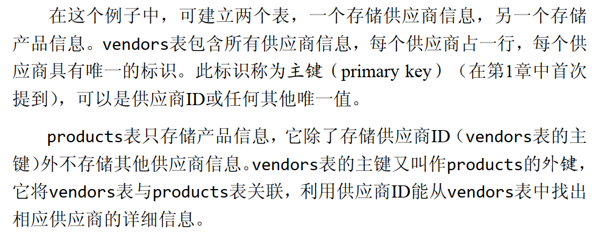

<!-- vscode-markdown-toc -->
* [第13章 分组数据](#13)
	* 1.1. [问题](#)
	* 1.2. [GROUP BY创建一个分组](#GROUPBY)
	* 1.3. [过滤分组](#-1)
		* 1.3.1. [HAVING和WHERE的区别](#HAVINGWHERE)
		* 1.3.2. [两次过滤](#-1)
		* 1.3.3. [分组GROUP 和排序ORDER区别](#GROUPORDER)
		* 1.3.4. [针对行还是总数区分](#-1)
<br>

*  [第十四章 使用子查询](#-1)
	* 2.1. [利用子查询来过滤](#-1)
	* 2.2. [作为计算字段使用子查询](#-1)
		* 2.2.1. [相关子查询(涉及外部表的查询)](#-1)
		* 2.2.2. [计算单元查询](#-1)
<br>

* [第15章 联结表  (这一章也是再说内部联结)](#15)
	* 3.1. [如何利用联结来解决信息重复问题](#-1)
	* 3.2. [具体解决手法](#-1)
	* 3.3. [如何用单条SELECT语句来检索多个表的数据](#SELECT)
	* 3.4. [创建联结 需要 FROM 和WHERE](#FROMWHERE)
	* 3.5. [联结的发生时态](#-1)
	* 3.6. [笛卡儿积](#-1)
	* 3.7. [使用其他写法来实现联结 (推荐这种写法)](#-1)
	* 3.8. [联结多个表](#-1)
	* 3.9. [子查询并不是最高效的,使用联结可以代替](#-1)
<br>

* [第十六章 创建高级联结](#-1)
	* 4.1. [利用AS 给表起别名](#AS)
	* 4.2. [自然联结( 如果不是自然联结容易多次返回相同的列)](#-1)
	* 4.3. [外部联结](#-1)
<br>

* [第十七章 结合查询](#-1)
	* 5.1. [创建组合查询](#-1)
	* 5.2. [UNION 使用的规则](#UNION)
	* 5.3. [UNION 默认返回不重复的行,如果想全部返回使用 UNION ALL](#UNIONUNIONALL)
	* 5.4. [查询结果排序](#-1)
<br>

* [第十八章 全文本搜索](#-1)
	* 6.1. [创建全文本搜索](#-1)
	* 6.2. [进行全文本搜索](#-1)
	* 6.3. [全文本搜索返回优先级高的结果](#-1)
	* 6.4. [使用查询扩展](#-1)
	* 6.5. [布尔文本搜索](#-1)
<br>

*  [第19章插入数据](#19)
	* 7.1. [INSERT INTO 非常吃性能](#INSERTINTO)
	* 7.2. [插入多行](#-1)
	* 7.3. [我们推荐直接从一个文件导出插入到表中](#-1)
<br>

*  [第20章 更新和删除数据](#20)
	* 8.1. [更新数据 (UPDATE)](#UPDATE)
	* 8.2. [删除数据](#-1)
		* 8.2.1. [从表中删除特定行](#-1)
		* 8.2.2. [删除指定列](#-1)
		* 8.2.3. [删除所有行](#-1)
<br>

*  [第21章 创建和操作表](#21)
	* 9.1. [创建表](#-1)
		* 9.1.1. [IF NOT EXISTS 防止创建覆盖](#IFNOTEXISTS)
		* 9.1.2. [表格值的状态](#-1)
		* 9.1.3. [PRIMARY KEY 指定主键](#PRIMARYKEY)
		* 9.1.4. [AUTO_INCREMENT自动生成主键ID](#AUTO_INCREMENTID)
		* 9.1.5. [DEFAULT 生成默认值](#DEFAULT)
		* 9.1.6. [引擎类型](#-1)
		* 9.1.7. [更新表](#-1)
		* 9.1.8. [重命名表](#-1)

<!-- vscode-markdown-toc-config
	numbering=true
	autoSave=true
	/vscode-markdown-toc-config -->
<!-- /vscode-markdown-toc -->##  1. <a name='13'></a>第13章 分组数据
###  1.1. <a name=''></a>问题
+ 前面提到的COUNT函数只能返回某一个产品商总数 ,例如下面我们写的你只能计算1003 产品商拥有的产品数,如果你想把所有ID产品商列出来,看下面的
```C++
SELECT COUNT(*) AS num_prods
FROM products
WHERE vend_id =1003; //我们返回 id 1003 的总数
```
###  1.2. <a name='GROUPBY'></a>GROUP BY创建一个分组
+ 让 vend_id 进行分组来输出 ,每个产品商的ID 都会列出来,
  ```C++
  SELECT vend_id,COUNT(*) AS num_prods
  FROM products
  GROUP BY vend_id //我们计算num_prods数量,再用vend_id分组
  ```
+ 具体细节
  

###  1.3. <a name='-1'></a>过滤分组 
+ WHERE 不能完成任务,WHERE过滤的是行而不是分组
+ HAVING 非常类似WHERE,WHERE所以语句都可以使用他来提,HAVING过滤分组
```C++
SELECT cust_id,COUNT(*) AS orders
FROM orders
GROOP BY cust_id
HAVING COUNT(*) >=2 //为什么这里不采用 cust_id>2来进行过滤呢? 接着往后看,HAVING基于组来操作的 
```
####  1.3.1. <a name='HAVINGWHERE'></a>HAVING和WHERE的区别


####  1.3.2. <a name='-1'></a>两次过滤
+ WHERE必须写在HAVING前面.HAVING的过滤基于总数也就是配合COUNT等函数使用
```C++
SELECT cust_id,COUNT(*) AS orders
FROM orders
WHERE prod_price >=10            //增加一道过滤
GROOP BY cust_id
HAVING COUNT(*) >=2;
```

####  1.3.3. <a name='GROUPORDER'></a>分组GROUP 和排序ORDER区别
+ GROUP 需要用在ORDER 前面


```C++
SELECT order_num ,SUM(quantity * item_price) AS ordertotal
FROM orderitems
GROUP BY order_num
HAVING SUM(quantity * item_price) >=50  //这个针对总数
ORDER BY ordertotal;      //这个针对行
```

####  1.3.4. <a name='-1'></a>针对行还是总数区分


<br>
<br>
<br>
<br>
<br>


---
##  2. <a name='-1'></a>第十四章 使用子查询
###  2.1. <a name='-1'></a>利用子查询来过滤
+ 我们需要 第一个id为TNT2的物品找出order_num信息,再根据订单order_num找出用户的id,前面的式子可以称为子查询,但我们可以把他们写在一起.
```C++
SELECT cust_id
FROM orders
WHERE order_num IN (SELECT order_num 
                    FROM orderitems
                    WHERE prod_id ='TNT2'    //这个返回一个20005和20007
                    );
};
```
###  2.2. <a name='-1'></a>作为计算字段使用子查询
####  2.2.1. <a name='-1'></a>相关子查询(涉及外部表的查询)
>FROM order
> WHERE order.cust_id =customers.cust_id //这个中间我们查询了custormers表中信息

####  2.2.2. <a name='-1'></a>计算单元查询
```C++
SELECT cust_name,
       cust_state,
       (SELECT COUNT(*)
       FROM orders
       WHERE order.cust_id =customers.cust_id) AS orders
FROM customers
OREDR BY cust_name;   
```
<br>
<br>
<br>
<br>


---
##  3. <a name='15'></a>第15章 联结表  (这一章也是再说内部联结)
+ SQL 最强大的功能之一就是能在数据检索查询中执行中结联表,利用SQL的SELECT能执行的最重要的操作.

###  3.1. <a name='-1'></a>如何利用联结来解决信息重复问题
+ 我们经常会面临一些问题,重复的信息存储,如果简单的只是存储起来,浪费时间和空间.
+ 例如我们需要存储 产品和产品信息,我们就可以建立两个表,一个表中存储供应商,第二个表我们存储产品,如果我们只使用一个表,我们每存放一个产品的时候,我们就需要产品就需要填写一下供应商,这样信息大量重复,

###  3.2. <a name='-1'></a>具体解决手法


###  3.3. <a name='SELECT'></a>如何用单条SELECT语句来检索多个表的数据
使用联结 ,他的作用,如果我们在产品表中,插入一个不在供应商表中的ID信息,那么这个产品表中就会报错.

###  3.4. <a name='FROMWHERE'></a>创建联结 需要 FROM 和WHERE
```java
SELECT vend_name,prod_name,prod_price //我们注意到vend_name 来自于不同的表
FROM vendors,products   //把这两个表联结起来
WHERE vendors.vend_id =products.vend_id  //这两个表通过vend_id来联结
```

###  3.5. <a name='-1'></a>联结的发生时态


###  3.6. <a name='-1'></a>笛卡儿积
+ 没有写联结将会出现第一个表的行数与第二个表中的行数相乘的笛卡尔积情况
  
###  3.7. <a name='-1'></a>使用其他写法来实现联结 (推荐这种写法)
+ 以INNER JOIN来指定,ON 与前面的WHERE 传递的值相同
+ 我们前面实现的操作都叫做内联 ,所以刚好与INNER 单词意思对应
  ```C++
  FROM vendors INNER JOIN products
  ON vendors.vend_id =products.vend_id;
  ```


###  3.8. <a name='-1'></a>联结多个表
```C++
FROM orderitems ,products,vendors
WHERE products.vend_id=vendors.vend_id
      AND orderitems.prod_id =products.prod_id
      AND order_num =20005;
```

###  3.9. <a name='-1'></a>子查询并不是最高效的,使用联结可以代替


<br>
<br>
<br>
<br>
<br>

---
##  4. <a name='-1'></a>第十六章 创建高级联结

###  4.1. <a name='AS'></a>利用AS 给表起别名
+ 如何方便看下面
```C++
SELECT cust_name,cust_contact
FROM customers AS c, orders AS o, orderitems AS oi
WHERE c.cust_id=o.cust_id
      AND oi.order_num=o.order_num
      AND prod_id='TNT2'
```

###  4.2. <a name='-1'></a>自然联结( 如果不是自然联结容易多次返回相同的列)
+ 内部联结就是自然联结,这个可以避免同一个列多次出现

###  4.3. <a name='-1'></a>外部联结
+ 语法与内部联结相似,在使用OUTER JOIN时候,应该使用RIGHT 和LEFT
```C++
SELECT customers.cust_id ,order.ordre_num
FROM customers RIGHT OUTHR JOIN orders
ON orders.cust_id =customers.cust_id;


```


<br>
<br>
<br>
<br>
<br>
 
 ---
##  5. <a name='-1'></a>第十七章 结合查询询
+ 我们前面写的都是 一条SELECT 但是MYSQL 允许

###  5.1. <a name='-1'></a>创建组合查询
+ 使用UNION 组合两个SELECT
```C++
SELECT vend_id ,prod_id ,prod_price
FROM products
WHERE prod_price <= 5
UNION            //把表SELECT 语句联起来,同时在一个表中输出来
SELECT vend_id ,prod_id ,prod_price
FROM  products
WHERE vend_id IN (1001,1002)
```


###  5.2. <a name='UNION'></a>UNION 使用的规则


###  5.3. <a name='UNIONUNIONALL'></a>UNION 默认返回不重复的行,如果想全部返回使用 UNION ALL
```C++
SELECT vend_id ,prod_id ,prod_price
FROM products
WHERE prod_price <= 5
UNION ALL  //返回全部       
SELECT vend_id ,prod_id ,prod_price
FROM  products
WHERE vend_id IN (1001,1002)
```

###  5.4. <a name='-1'></a>查询结果排序
+ ORDER BY对于所有进行排序
```C++
  SELECT vend_id ,prod_id ,prod_price
FROM products
WHERE prod_price <= 5
UNION ALL  //返回全部       
SELECT vend_id ,prod_id ,prod_price
FROM  products
WHERE vend_id IN (1001,1002)
ORDER BY vend_id,prod_price; //看似是对第二个SELECT排序,实际上是对全部

```

<br>
<br>
<br>
<br>

---

##  6. <a name='-1'></a>第十八章 全文本搜索
+ 不是所有的SQL都支持这个操作
+ LIKE和正则表达式都需要给出精确匹配,性能也非常耗时
+ 匹配返回的值都存在一个优先级

###  6.1. <a name='-1'></a>创建全文本搜索
+ 在创建表的时候启用全文本搜索.


###  6.2. <a name='-1'></a>进行全文本搜索
+ 使用Match()和Against()
```C++
WHERE Match(note_text) Against('rabbit); //Match针对列进行搜索而Against 指定词rabbit 作为搜索文本
```
###  6.3. <a name='-1'></a>全文本搜索返回优先级高的结果
```C++
SELECT note_text,
       Match(note_text) Against('rabbit') AS rank
FROM productnotes;
```


###  6.4. <a name='-1'></a>使用查询扩展
+ avile这个词查找不到,但是我们想要找到其他的词来匹配我们想要找到的段落意思,全文本搜索的作用将发挥出来.

###  6.5. <a name='-1'></a>布尔文本搜索
+ 特殊符号来表示把某些单词排除

```C++
SELECT note_text
FROM productnotes
WHERE Match(note_text)  Against('havey -rope *' IN BOOLEAN MODE);
// 匹配havey 排除rope开头的任意单词
```

<br>
<br>
<br>
<br>
<br>


---

##  7. <a name='19'></a>第19章插入数据
+ INSERT INTO
```C++
  INSERT INTO customers(cust_name,  // 首先指出需要插入的列,如果你把表中的使用列的写出来,不就算作插入一行了.
  cust_address,
  cust_city,
  cust_state,
  cust_zip,
  cust_country
  )
VALUES ('Pep E . LaPew',              //对于不同的列插入值
'100 Main Street' , 
NULL                   // 而且每个列都必须给出一个值, 即使你不想给 出,                                      也得写NULL
// 等等
)


```

###  7.1. <a name='INSERTINTO'></a>INSERT INTO 非常吃性能
+ 我们在INSERT 和INTO 之间加上关键词 LOW_PRIORITY,降低处理的优先级,让那些需要运算的优先级(操作系统中的后台程序优先级变相提高),INSERT 肯定读写内存,所以我们把它认为是前台程序.

###  7.2. <a name='-1'></a>插入多行
```C++
INSERT INTO customers(cust_name,  
  cust_address,
  cust_city,
  cust_state,
  cust_zip,
  cust_country
  )
  VALUES ('Pep E . LaPew',            
'100 Main Street' , 
NULL      
('Pep E . LaPew',              // 使用了两个括号,这样就算插入了两行
'100 Main Street' , 
NULL      
```

###  7.3. <a name='-1'></a>我们推荐直接从一个文件导出插入到表中
+ INSERT 配合SELECT 来使用
```C++
  INSERT INTO customers(cust_name,  
  cust_address,
  cust_city,
  cust_state,
  cust_zip,
  cust_country
  )
SELECT cust_name,  
  cust_address,
  cust_city,
  cust_state,
  cust_zip,
  cust_country
  FROM custnew;  //从custnew 来导入数据到我们需要插入到的表中.
  ```


##  8. <a name='20'></a>第20章 更新和删除数据数据
###  8.1. <a name='UPDATE'></a>更新数据 (UPDATE)
+ UPDATE
+ 一定要指定
  1. 更新表中特定行  如果没有WHERE 子句结束就更新所有行
```C++
UPDATE customers //你要更新的表
SET cust_name ='The Fudds',
    cust_eamil -'elmer@fudd.com'   // SET 你要刷新的列, 设置 cust_name 为 'The Fudds'相当于直接设置,你也可以不直接设置,而刷新, 
WHERE cust_id =10005;   // 刷新 10005用户这一行,
```
  2. 更新表中所有行
> WHERE cust_id =10005;   // 你不写WHERE 刷新所有的行.

###  8.2. <a name='-1'></a>删除数据
+ DELETE (删除的是表中行,而不是这个表)
####  8.2.1. <a name='-1'></a>从表中删除特定行定行
```C++
DEKETE FROM customers //删除 数据的表
WHERE cust_id=10006;   //删除10006这一行
```
####  8.2.2. <a name='-1'></a>删除指定列定列
+ 我们用UPDATE 指定列

####  8.2.3. <a name='-1'></a>删除所有行有行
> 不写WHERE 删除全部
> 我们不推荐使用DELETE 来删除所有行,使用TRUNCATE TABLE 


##  9. <a name='21'></a>第21章 创建和操作表

###  9.1. <a name='-1'></a>创建表

```C++
CREATE TABLE customers  //表名字必须不存在,不然会直接覆盖原有表, 如果你不想出现覆盖问题可以使用IF NOT EXISTS 来创建
(
cust_id    int       NOT NULL AUTO_INCREMENT,  //后面介绍
cust_name  char(50)  NOT NULL ,
cust_address char(50)  NULL ,
cust_city    char(50)  NULL ,
cust_state   char(5)   NULL ,
cust_zip     char(10)  NULL ,
cust_country char(50)  NULL ,
cust_contact char(50)  NULL ,
cust_email   char(255) NULL ,
PRIMARY KEY  (cust_id)  //primay key 指定主键.
)ENGINE=InnoDB;

```
####  9.1.1. <a name='IFNOTEXISTS'></a>IF NOT EXISTS 防止创建覆盖

####  9.1.2. <a name='-1'></a>表格值的状态
+ 我们在上面创建的一个表中, 我们可以看到在列 数值的后面我们给出了,插入数据的性质 NOT NULL
+ 表格中列的值,只有 NOT NULL 和NULL两种状态.


####  9.1.3. <a name='PRIMARYKEY'></a>PRIMARY KEY 指定主键
>PRIMARY KEY  (cust_id)

####  9.1.4. <a name='AUTO_INCREMENTID'></a>AUTO_INCREMENT自动生成主键ID 
+ 主键ID 如果我们在SELECT 一个个添加十分耗性能.
+ 所以 AUTO_INCREMENT自动加一直接帮你生成ID
+ 如果你想要指定一个独特的ID 只要不冲突就可以直接INSERT
+ AUTO_INCREMENT 只能使用一次
>  利用SELECT last_insert_id()函数来 看到自动生成的 AUTO_INCREMENT的值

####  9.1.5. <a name='DEFAULT'></a>DEFAULT 生成默认值
+ quantity int NOT NULL DEFAULT 1, //在没有给出数据的情况下默认值为1


####  9.1.6. <a name='-1'></a>引擎类型
+ MySQL有多个引擎,不同引擎可以获得良好的功能和灵活性.
> ENGING=InnoDB //指定引擎


####  9.1.7. <a name='-1'></a>更新表
+ ALTER TABLE +表名 //更新表
> ALTER TABLE vendors

##### 增加一个列
> ALTER TABLE vendors
> ADD vend_phone CHAR(20); //必须给出数据类型

##### 删除一个列
> ALTER TABLE vendors
> DROP COLUMN vend_phone;


####  9.1.8. <a name='-1'></a>重命名表
+ 使用 RENAME TABLE 
  > RNAME TABLE customers2 TO customers,
  >RNAME TABLE customers3 TO customers4; /还可以重命名多个表


