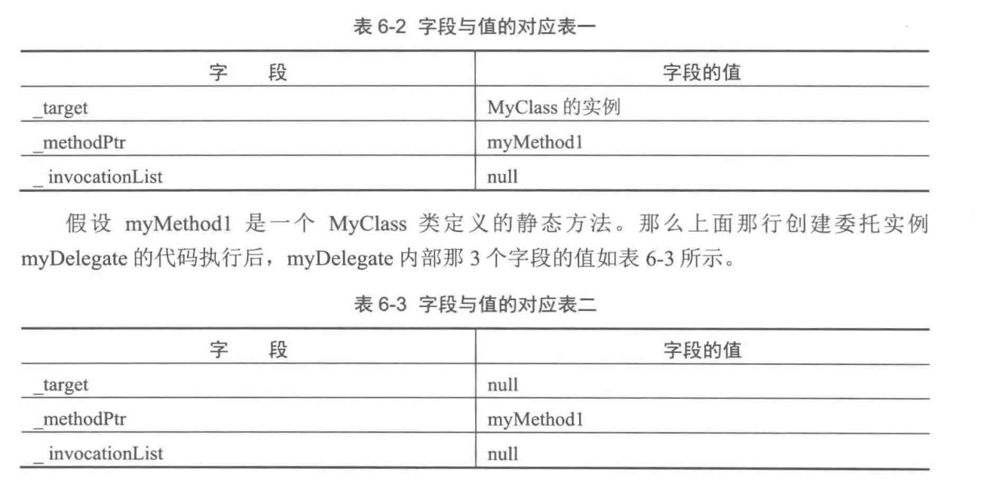
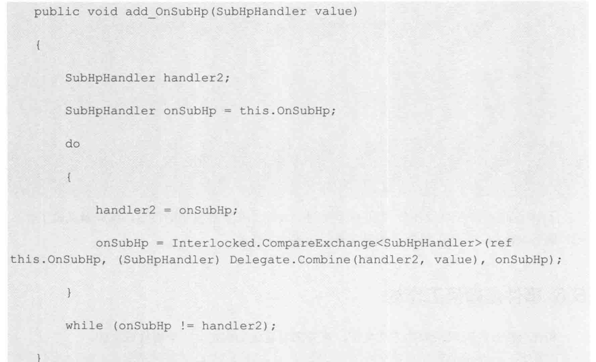

+ 委托是一个类,所以他才叫类型,他才可以new ,方法能够new 吗
+ 当我们定义委托,mon 帮我们做了很多事(下面的三个基础类型)
  + _target 指向的是委托默认构造的类实例, 其他的执行方法和存储方法
  + unity 的委托继承自 MulticastDelegate ,这个类就有这些变量, 他又继承自unity Delegate
  + 委托两种调用 Make(value) 实际上就是在调用 Make.invoke(vlaue) 默认转换的.
  


+ 事件引用委托的机制,每个时间存在一个委托链条,这里猜测的
  + 但是从下面的情况我们可以大致分析,this.OnSubHp 这里传入委托链条, 系统生成了add_事件名称函数,然后传入一个委托,再把两个委托,使用do  while配合CompareExchange 完成线程安全的方式,进行,事件的订阅.
  + 所以事件会维护一个委托链,没有的时候null
  +  
+  事件就是一个观察者:
   + 你想一个观察者的好处: 观察者用于分析观察数据变换, 他只要观察数据的具体变化,而做出反应, 具体到如何扣血 这个交给你自己去实现,我只负责观看你是否收到了伤害,  数据基本分开降低了耦合,我非常喜欢
```C#
+ 这个就是所谓的观察者技术,太简单了
    private void RemoveListner()
    {// 事件订阅就像委托那样订阅,不在需要自己invoke 爽歪歪,为啥还要事件,这里就是鲜明例子 ,我伤害数值和受到伤害
     // 想要分开写在不同的类中,如果你直接在受到伤害调用显示,需要在受到伤害类中使用-显示类.方法,造成了耦合
        this.eventAttack.OnSubHpEvent -= this.CallbackOnSubHp;
    }


EventAttack.cs

using System.Runtime.ConstrainedExecution;
using System.Collections;
using System.Collections.Generic;
using UnityEngine;


public enum DamegeType
{
    Normal,  //普通伤害
    Critical  //暴击伤害
}
public enum HpshowType
{
    Null,   //不显示
    Damage, // 伤害
    Miss// 闪躲
}
public class EventAttack
: MonoBehaviour
{
    /// <summary>
    ///  总类定义一个虚方法,这个虚方法中调用 触发伤害事件,而各个 不想干的类去订阅这个事件,达到扣血的效果,扣血和伤害分开
    /// </summary>
    /// // Start is called before the first frame update
    public delegate void SubHpHandler(EventAttack source, float subHp, DamegeType damegeType, HpshowType hpshowType);
    public event SubHpHandler OnSubHpEvent;


// 伤害受到的开始 只要别人调用它
    public void BeAttacked()
    {
        float possibilitly = UnityEngine.Random.value;
        bool isCritical = UnityEngine.Random.value > 0.5f;
        bool isMiss = UnityEngine.Random.value > 0.5f;
        float harmNumber = 10000f;
        OnBeAttacked(harmNumber, isCritical, isMiss);
    }

    //伤害类型的传递
    protected virtual void OnBeAttacked(float harmNumber, bool isCirtical, bool Miss)
    {
        DamegeType damegeType = DamegeType.Normal;
        HpshowType showType = HpshowType.Damage;
        if (isCirtical)
            damegeType = DamegeType.Critical;
        if (Miss)
            showType = HpshowType.Miss;
        if (OnSubHpEvent != null)
        // 监听这技术
            OnSubHpEvent(this, harmNumber, damegeType, showType);

    }
    public bool IsHero
    {
        get
        {
            return true;
        }
    }


}


-------------------------------------------------------------------------------------------------------------
BattleInfomationComponent.cs


public class BattleInfomationComponent : MonoBehaviour
{
    public EventAttack eventAttack;


    void Start()
    {
        this.eventAttack = GetComponent<EventAttack>();
        this.AddListener();
    }
    private void AddListener()
    {
        this.eventAttack.OnSubHpEvent += this.CallbackOnSubHp;
    }
    private void RemoveListner()
    {// 事件订阅就像委托那样订阅,不在需要自己invoke 爽歪歪,为啥还要事件,这里就是鲜明例子 ,我伤害数值和受到伤害
     // 想要分开写在不同的类中,如果你直接在受到伤害调用显示,需要在受到伤害类中使用-显示类.方法,造成了耦合
        this.eventAttack.OnSubHpEvent -= this.CallbackOnSubHp;
    }


    private void CallbackOnSubHp(EventAttack source, float subHp, DamegeType damegeType, HpshowType showtype)
    {
        string unitName = string.Empty;
        string missStr = "闪避";
        string damageTypeStr = string.Empty;
        string damageHp = string.Empty;
        if (showtype == HpshowType.Miss)
        {
            Debug.Log(missStr);
            return;
        }
        if (source.IsHero)
            unitName = "英雄";
        else
            unitName = "士兵";
        damageTypeStr = damegeType == DamegeType.Critical ? "暴击" : "普通攻击";
        damageHp = subHp.ToString();
        Debug.Log(unitName + damageTypeStr + damageHp);

    }


}


```