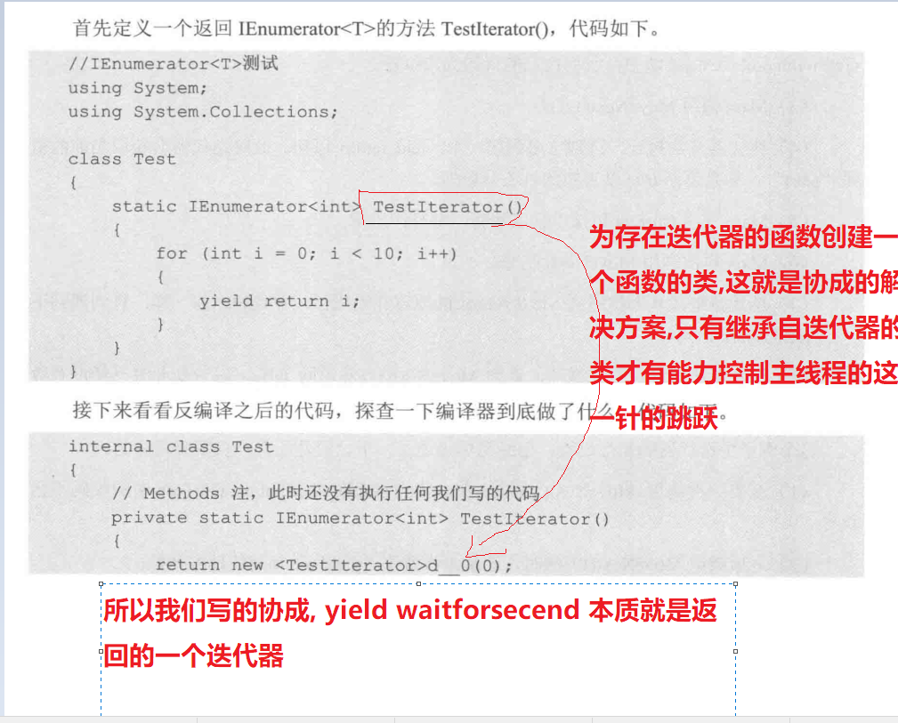
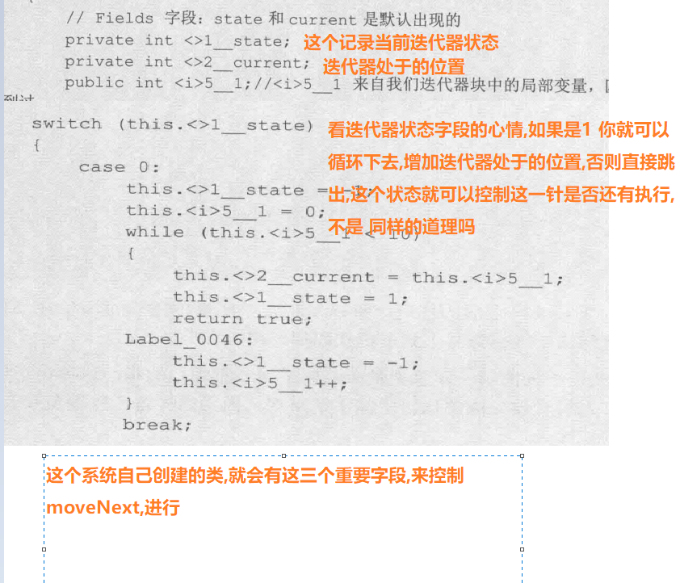
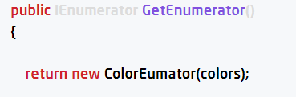

+ 协成的本质:迭代器(只有迭代器才有那么大的能力)
    + 第一张图片,最后写的是返回创建一个继承自迭代器的函数名的类
  
  + 协成创建的迭代器类(iEnumerator)的内部情况
  + 
+ 还记不记得GetEnumertor()方法:
  + 这里和我们上面一样,是自定义迭代器ColorEumator,在里面实现MoveNext 具体运转,而我们写的协成是他自己帮我创建了一个函数名称的迭代器,实现了运转.所以getenumerator的行为也是官方模仿的行为.
   