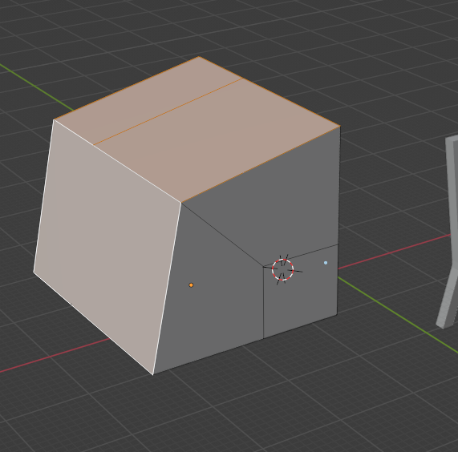
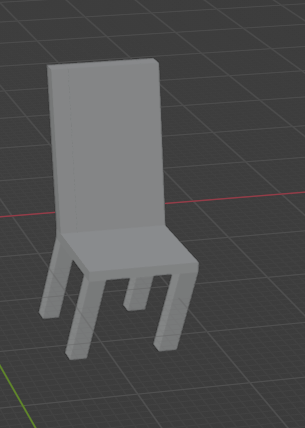

## 进入Modeling 模型编辑界面
+ 切换到Edit Mode 形式 
+ 每次挤压完成以后 可以使用 g S 等放大缩小的操作 来对挤压出来的模型,进一步编辑.
### 挤出操作核心
+ 1. 根据一个面挤出新的一个面
+ 2. 不在创建一个新的面扩展 旧的体积
+ 3. 根据你选择的几个面他们共同的法线来挤出图形
+ 4. 根据每个面的独立的法线挤出面
+ 5. 跟随鼠标挤出面

#### 第一
+ 每次挤压都创建出一个新的面

+ 这个骚操作就是 首先选中加号不放手 然后点击右键 取消你的选择挤压,就相当于在同一个平面上创建了两个面 然后使用放大缩小上面的面,再次挤压就可以了.

#### 第二
+ 没有创建新的面

####  第三
+ 朝向一个方面挤出 基于他们共同法线,好像是物体扩展

#### 第四

### 多边形绘制编辑器
+ 这个编辑器只能操作点 绘制(同时他不是在一个物体上再次绘制)
+ 每次点击一个E键开始绘制 ,左键确定位置
+ 是在空的物体 正交视图下绘制 ,
+ 当你点完点以后 ,使用F 就可以填充一个面
+ 选中 你的面的边就可拖拽 ,按 shift 拖出三角形.
