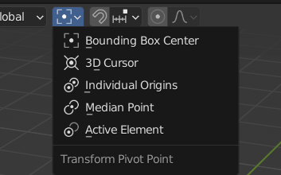
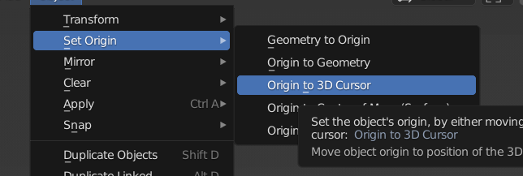

### 区别

+ 第一个中心点位计算类似于2D动画中为3D物体整一个框 这个框的中心
+ 第三个 也就是 在多个物体中 他们以自己的中心为点位,最明显的表现是 旋转他们绕着自己的中心旋转
+ 第四个 是依靠多个物体的自身中心点 来计算出一个中心点位
+ 第五个 使用激活物体的中心点为中心点 ,可以在一群对象中选择一个物体激活他,让大家围绕他转动.
+ 第二个 操作就是 ,利用 3DCursor 来定位一个点,然后使用下面操作让定位点移动3D Cursor 中去

