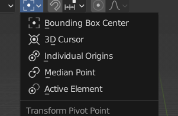
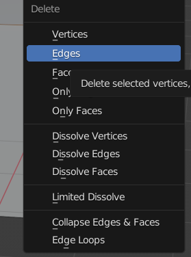

+ T 左边工具栏调出 shift+space  
  +  使用W切换不同的选择工具
  +  先按下B 在暗shift 就反选.
  +  G 开启运动 按下x轴沿着x轴移动(这个是使用世界坐标(世界坐标不会改变) )    在按下x 切换到物体的自身坐标 后面的旋转和操作同理   (alt +G 撤销)
  +  按下R键 开启旋转 通过x 和y 来充当uinty 的x轴手动旋转.(alt +R 撤销)
  +  S 键开启 物体的缩放  (Alt +S撤销)
+ Control Pgup 和pgon 切换页面
+ n调出右边的控制面板
+ shift+ 右键 移动光标定位  shift +s 开启3D坐标的饼状选择菜单 
   + 他的作用 可以让物体围绕3D坐标进行旋转和移动 , 让物体瞬间移动到我们的3D坐标
   + 进行旋转和移动 请设置 3D Curos 以3D坐标为中心.
   + 

+ shift+D +A 复制 和新建
+ 同一个工作区下 Edit Modle 和Object Modle 使用 Tab 键

+ Contol +L 做到快速全选
+ 在模型编辑窗口下
   + 选中一个点 或线 按下 x 可以激活删除 工具  
   + 
   + 其中 Limited dissovle 可以融合多余的线 ,让一个很多线的物体 只用几条线组成(关联性优化)
   + Edge Loops 删除 循环的线.
   + 

+ Control+p 添加父子关系  Control +P 结束父子关系(在界面中编辑调整两者关系)
+ shift+B 复制选择

+ control+Tab 切换编辑页面

+ shift+s对标点进行操作

+ control+A 在你缩放一个物体以后,他的缩放数值会变化,此时你使用这个应用缩放,物体的缩放比例就会变成1:1:1,方便后续操作.

+ 按下esc下面的那个键位你可以选择观看的角度(有点时候你按不出来,是因为你在)