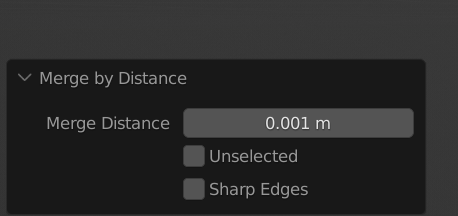
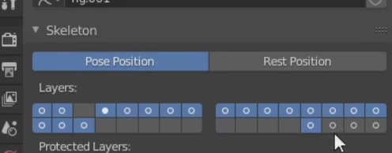
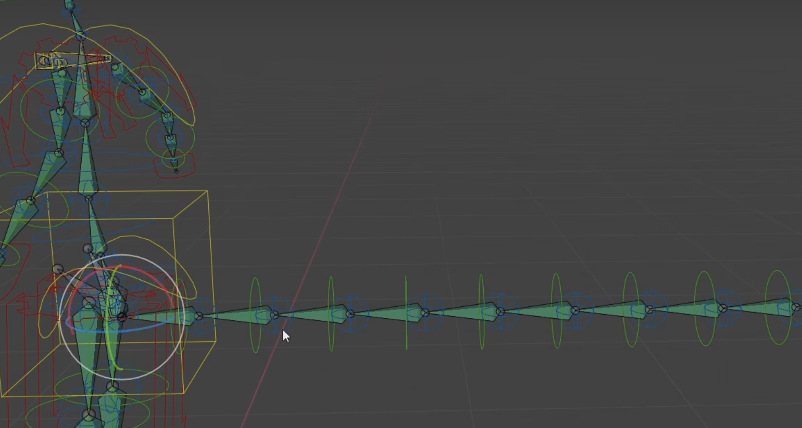
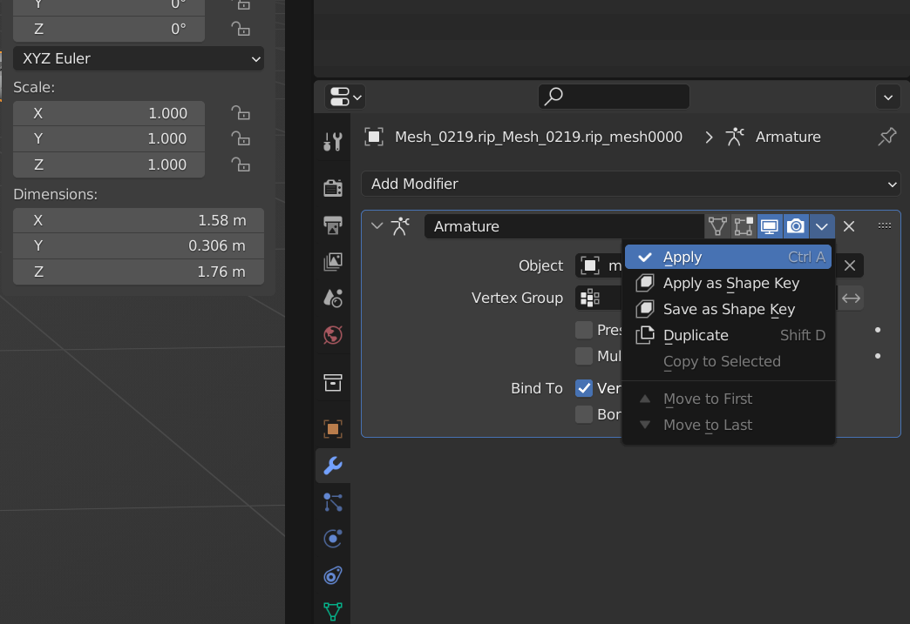
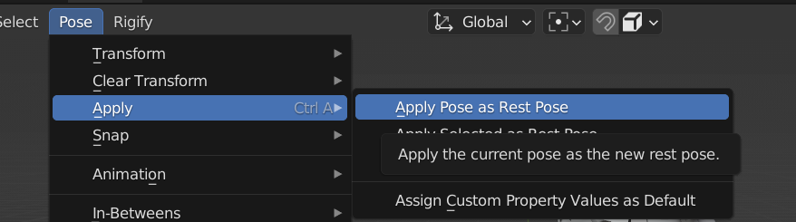

+ 错误:bone heat weighting failed to find solution for one or more bones
  +  自动权重失败,这个错误意思表面的点出现了重合或者物体的面太多了,需要调整一下
  +  解决思路 :https://blog.csdn.net/weixin_42430021/article/details/122247119
  +  按照文章中的增加一项,缩小merge distance就行
  

+ 我们在使用rigify插件生成控制器以后往往看不到生成的骨骼,而不是原来骨骼,点击图片中的鼠标所在的图层,将会看到绿色骨骼

### 如何修改人物姿态为T-pose姿态
+ rigify创建基础骨骼,然后进入pose模式调整人物姿态为T-pose姿态,
+ 进入物体选择模式,选择人物模型,(复制一个出来)

+ 再选择第一个点击应用
+ 此时再进入pose模式,把此时姿态复制到静态姿势(就完成了)

教学视频: https://www.bilibili.com/video/BV15u411D7c4/?spm_id_from=333.337.search-card.all.click&vd_source=d018df40edbb612f39981f41f2e7f5b5