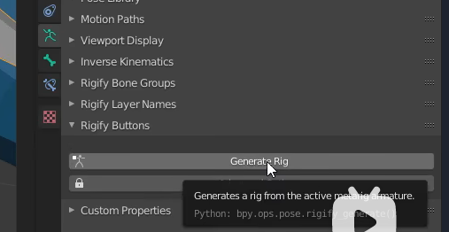

## 人物模型
+ 当我们生成控制器的时候可以 点击 rig生成控制器

+ 往往生成的控制器会大一圈,这是因为你的骨骼模型比例scale不是1比1,所以你首先要应用缩放(避免下面的情况)

### 科学怪物模型
+ 为了方便镜像复制,我们需要对一段骨骼重命名,才能使用骨骼的镜像复制,可以给这一条骨骼使用.L结尾,使用blender的批量重命名

+ 选择骨骼,然后set Name ,在选择suffix 末尾增加

+ 误区和正确的流程:
  + 图片中我们看到了这个人他是具有猫耳朵和尾巴的, 你肯定想把人和猫的部分骨骼结合起来,再利用rigify插件生成控制体,在产生控制体的时候,往往会出现错误,也可能不会,但是正确的做法是利用人类骨骼,衍生出来新的骨骼
  + 例如我们的耳朵运动会让嘴巴也运动,这个往往是骨骼的父级不对,control+P 重新关系父级,keep offset
  + 多余的小骨骼是可以删除的,但是大骨骼建议不要动.

+ control+p 清除两个骨骼之间的连线,也就是他们之间的父子关系,在他们没有关系的时候,也可以keep offset 连接他们的关系
+ 集体重命名

### rigif 插件选项分析
+ 一个完整的腿部骨键,有一个根骨头,这个骨头他有绑定的属性,以这个骨头出发的其他骨头,则没有属性,也就是说只要一个骨头,rigify就可以识别绑定的物体
+ 这个需要在Tpose模式下 查看骨头的属性  

+ Edit模式下 

### 依照上面的解释(我们就可以利用rigify绑定万物)
+ 每个腿部的骨头不能动
+ 如果是类似于触手的部件使用(tentacle 触手骨骼,这个骨骼可以增加到100多个)
+ 如果是支持骨架,可以使用super.copy这个骨骼,没有什么具体意义,

+ 使用自定义骨骼(经常遇见的问题)
  +  图片中的neck骨骼表示 你的骨骼没有和脊柱链接,使用control +P 选择 keep offset 就可以连接两个骨骼解决问题,一定不要使用connect ,没有啥作用

+ 颈部骨骼记得勾选下面
