### 骨骼的图层和颜色是bone group和layer names
+ 这两个部分他管理的是rigify生成的控制器颜色和形状,例如人体骨骼控制器的颜色就是它搞的
+ 具体思路,是bone group选择你想要生成的颜色,layer names 选择颜色,利用提供的插件,首选给骨骼进行分组,也就是可以看到和隐藏的分组
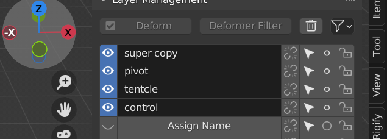
+ 分好组后,layer names 会显示,但是缺少名字,给他添加名字 ,然后最后选项添加颜色组
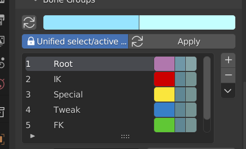
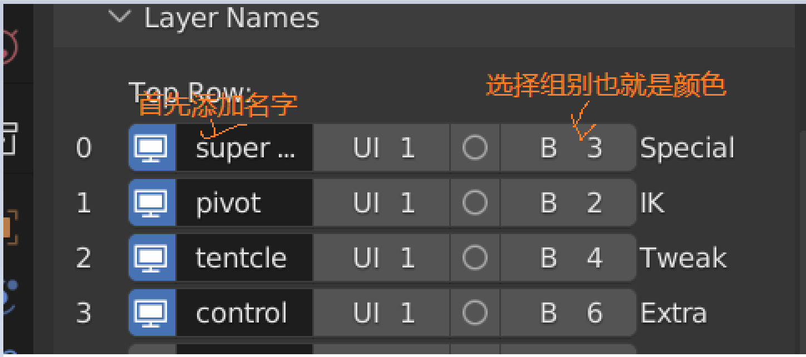

### 图层绑定的进阶方式
+ 通过分配不同的颜色和图层,可以做到非常干净的摆放人物姿势.
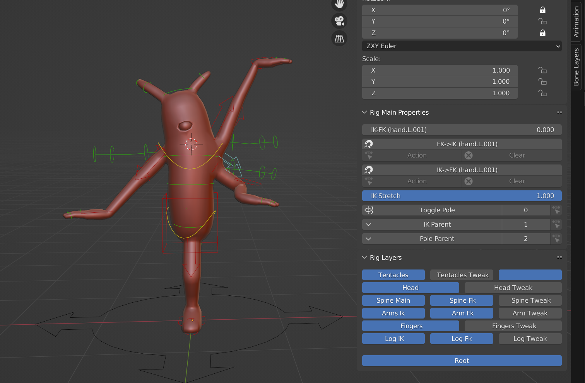
+ 理解下面的各种不同类型的骨骼就可以理解我们怎样去分层了.
+ 对于这个外星人的骨骼我们从上往下进行处理,分为了头上的触手,头部,手臂,躯干,腿部,指头,为什么会有这些分类,其实你也清楚,我们在构造整个骨骼的时候就是按照这种方式构造的.
+ 具体的步骤:
1. 首先我们要给你的骨骼进行分层处理,你可以看到第一层骨骼也就是头顶的两个触角在layer 0,但是为什么下面那个是空的呢,实际上他是存放了 触角特殊的骨骼属性,也就是触角Tweak形变骨骼,一条完整的骨骼他每个骨骼都有不同的属性,对于案例中的骨骼而言,他就有Tweak骨骼,
1. 首先我们要给你的骨骼进行分层处理,你可以看到第一层骨骼也就是头顶的两个触角在layer 0,但是为什么下面那个是空的呢,实际上他是存放了 触角特殊的骨骼属性,也就是触角Tweak形变骨骼,一条完整的骨骼他每个骨骼都有不同的属性,对于案例中的骨骼而言,他就有Tweak骨骼,
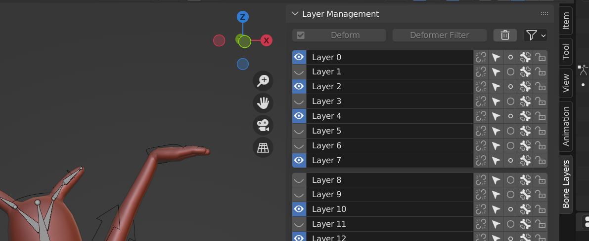
+ 在这里Tpose模式下,我们这里把它分配到第二层中,这就解释了layer1为啥是空的,是我们分配的layer0中Tweak骨骼,这里插件无法分配,所以你要点击这个第二蓝色方块分配,这里的蓝色方块也和插件的位置是同样的,如果一条骨骼链中,多个骨骼分配错误,你要一一重新分配到合适位置
  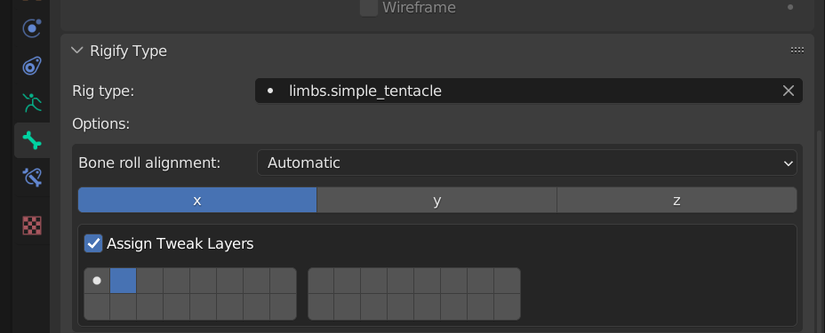
2. 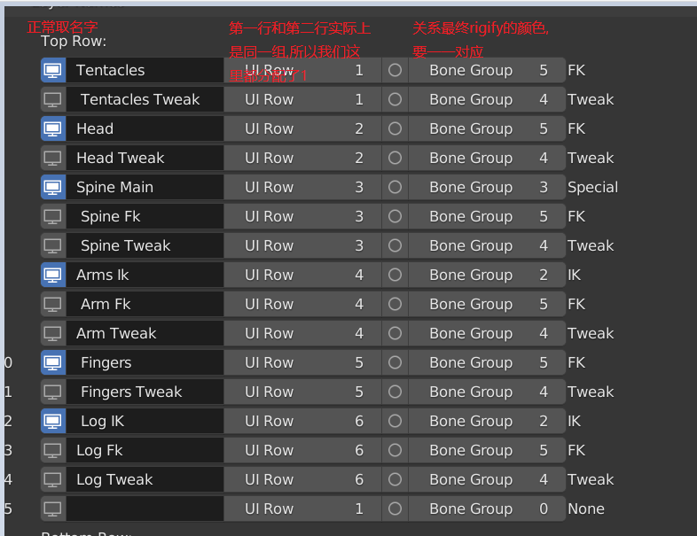
## 不同骨骼的区别
+ IK
+ FK
+ TWeak骨骼
### IK骨骼
1.  IK(反向控制骨骼,红色控制骨骼)
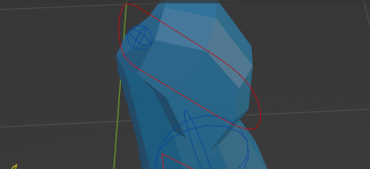
1. IK控制的面板属性
    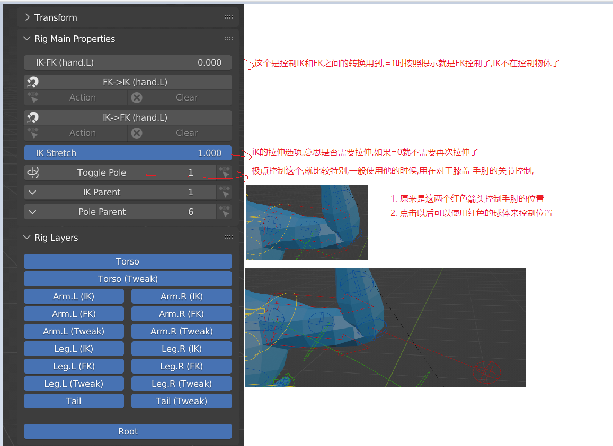
+ 因为IK他是将一个点固定在了一个空间的位置,所以,当你手的位置定下来以后,无论如何移动躯干,手的位置是不动的,这是跟IK默认设置有关,默认下IK Parent 值是root ,所以手不会跟随移动,但是你可以让手的parent选择躯体,就可以跟随移动,这就是blender解决躯体移动的问题.
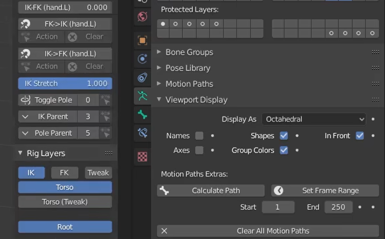
### FK骨骼(绿色骨骼)
+ 第一个选项可以理解为是否让物体的动作绝对位置,还是跟着人物去运动
+ 第三个选项,就是当我们使用IK模式下,你可以看到FK他的绿色控制线条并没有移动,可以点击这个选项,让他吸附到手臂的位置上
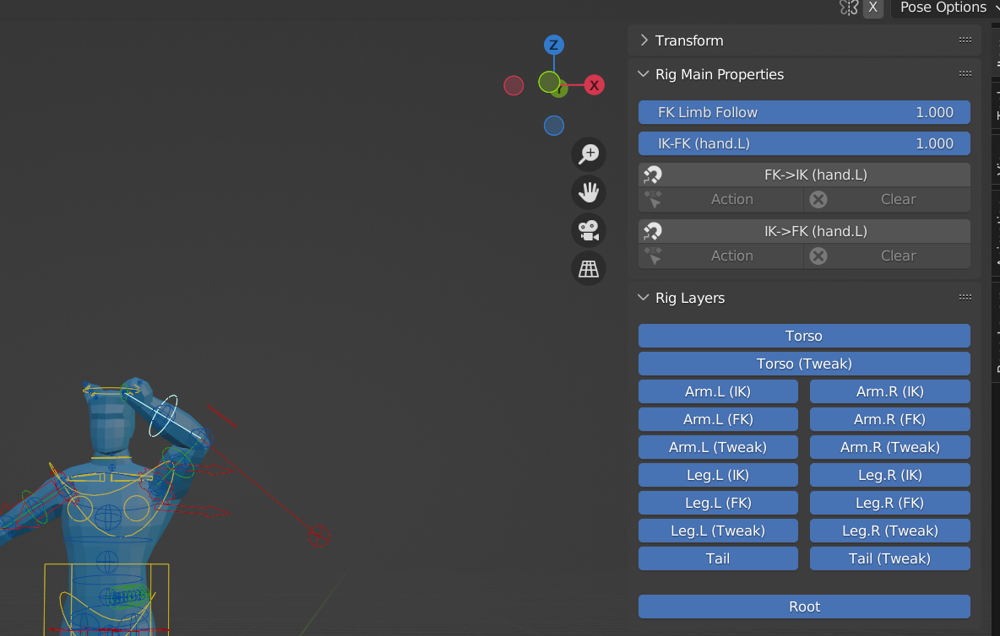
