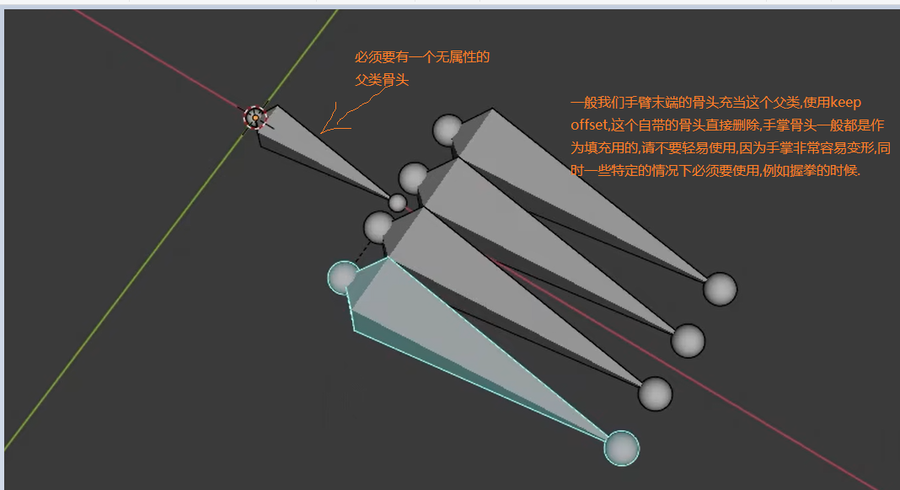

### super_copy骨骼
+ 用于支撑物体的作用,例如盆骨的两个骨头
+ control 用于是否控制骨头,一般在支撑骨头我们不使用这个选项,是否创建控制的小部件
+ widget 是否让骨头控制变成四边形
+ deform 是否让想要的地方产生形变

### basic_chain
+ 至少要几个骨骼构成,别的没啥区别.

### limb_leg骨骼
+ 腿部骨骼
+ 腿部要轻微弯曲,有助于rigify找出膝盖的位置
+ 后根骨,也就是脚后跟那个骨骼,与地面对其,宽度要个脚宽一样.
+ 腿部的骨骼有围绕脚踝ankle 和脚趾 Toe的旋转,这里一般我们保持默认就行,这样就很好了,当你需要简化的控制器的时候再考虑

### limb_arm
+ 同样手关节位置需要稍微弯曲

### limb_paw(动物爪子)
+ 跟人腿部骨骼一样,四个骨骼

### finger(手指骨骼)

+ 骨骼一般的设置你可以使用自动,如果错误你就需要设置了.

+ 开启IK control就会有下面的IK控制器
  

### super_finger
+ 非常多的控制选项

### 多个骨骼共同的属性
+ limb_leg limb_arm limb_paw finger 他们都有共同的属性
+ B-Bone-segments 可以设置骨骼的段数,在display as设置成柔性骨骼就可以看见了

+ Custom IK Pivot(可以产生类似十字架的装置,他只能够产生旋转,不能移动骨骼,当你移动这个到一定位置时,你就可以把它当做点围绕这个点旋转),这个就和编辑模式下的custom pivot点非常相似
+ Rotation Axis 旋转的轴,可以让骨骼围绕某个轴旋转,一般Automatic就是最好的选择

+ Limb-segments 对于这个骨骼他的作用和B-Bone Segemnts只对于柔性骨骼)的效果不同,这个是让骨骼分段,每个骨骼在rigify下生成多个控制器 ,
  + 这个设置就关系到了圆形控制器数量的设置,因为一个骨骼就有一个圆形控制器   

### super_palm

+ 几个常用的旋转轴

+ Both sides ,一般手掌都是跟随这个其他骨骼变动,开启它以后可以让每个骨骼都有一个控制器,自我移动

### limbs_simple_tentacle
+ 使用最广泛的触手骨骼,开启图片中的x轴,在x轴自动旋转的时候将会,让触手自动弯曲,而不是直直的旋转

### basic_spine骨骼
+ privot_postion作用

+ custom pivot Control创建类似十字架的控制器

### super_head
+ 我们可以从图片中发现,随着我们绑定的骨骼越多,颈部部分骨骼的控制器也在急速增长.

+ Connect chain 选项,当你的头部骨骼和脊椎骨骼他们直接并不是连在一起的时候,请不要勾选,只有两个完美重合的时候,你需要勾选,同时勾选他以后有一个效果就是运动颈部,它将会对最靠近颈部的那个脊柱骨头产生效果.

### basic_tail
+ 尾巴骨骼和其他骨骼功能相似.

### super_spine
+ 自动化轻松创建尾巴到头部的骨骼,建议不要自己创建骨骼,把它属性设置成super_spine,而是直接add_bone里面直接创建super_spine,super_spine已经是一个过时的东西,所以rigify把它拆分成几个不同的骨骼.

### super_face
+ 最复杂的骨骼类型,建议直接创建,不要一个手动拼凑
+ 不要尝试拆分面部和移动骨骼,容易rigify报错,你移动一个骨骼的时候,记得和他连接的骨骼要同时移动
+ 狗的面骨和猫,人的面骨他们都是一样的,只是拉伸了不同的形状,让他们看起来像人或猫

+ 面部骨骼绑定的技巧
+ 首先开启吸附到表面的功能,这样骨骼就可以贴到面部的皮肤

+ 面部骨骼往往会多个骨骼点重合到一起,先不要选择骨骼点,使用c键,然后使用鼠标左键点击,此时选中,再按下鼠标右键,结束选择,使用G键移动骨骼

+ 对于牙齿和舌头这种特殊骨骼,单独绑定的办法是,先在object界面选中舌头,然后在pose模式下,选择嘴巴的控制器,使用bone骨骼绑定到控制器,这里不是要绑定最开始的骨骼,也不是rigify第29层绿色的骨骼,单纯的控制器
+ 对于舌头部分,up主是直接让舌头成为脑袋的子组件,然后整体自动权重就行.
+ 对于眼睛使用倒数第二个图层,那个会有绿色骨骼可以让你绑定.

### super_chain
+ 非常适合绳子绑定,所以弓箭类物品的绑定可以使用他
