1. 首先模型导入blender ,运用贴图,是否能够还原贴图,如果不能舍弃模型,同时对模型各个部件进行合并by distance(这个问题解决模型奇怪拉扯,因为模型看起是连在一起的,实际上是分割的,然后这个选项是按距离合并,非常方便),导出模型
   + 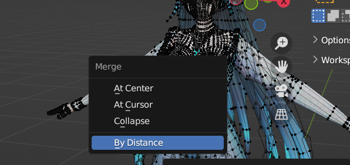

2. 骨骼绑定首先我们使用 ActorCore AccuRig 专用的骨骼插件进行快速绑定,将绑定好的骨骼导入到blender里面
 + 绑定骨骼右边有一个 附着在网格体还是,表面,建议绑定手部动作首先是从底部视角调整快很多

3. 使用blender 的cc/c pipeli插件导入模型,普通的blender 导入会出问题,这种导入会有骨骼附带模型的方便,导入之后缩放1 ,你懂得
  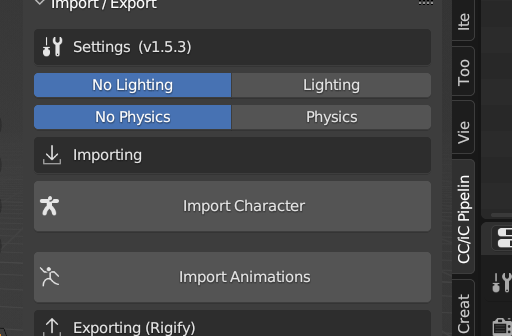 
  + 这个插件会生成rigify 骨骼, 但是是标准骨骼,你想要添加头发,附
  + 件骨骼请使用Advance 选项,旁边的Quik意思快速生成默认rigify骨骼,Advance 你就可以提交rigify额外骨骼了,生成以后点下面第二个选项,搞好骨骼以后,在自动权重,这是因为,我们在accrig中生成的骨骼已经绑定好了权重,如果头发是单独部件一开始就有其他的顶点组,直接删除头发的顶点组,在自动权重非常好!
  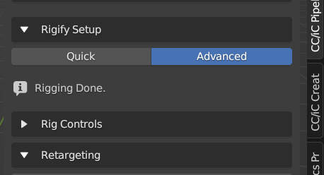

4. 动画绑定(下面的操作可以导出干净的动画)
   + 前面完成了动画的骨骼绑定,然后动画的模拟import animation,然后选中源动画,在点击模拟就行,稍微调整刻入动画,blender 的Dope sheet ,action editor ,new一个动画,然后选中刻入就行了
   + 动画整理,Nonlinner Anmation编辑界面,首先创建一个T-Pose 人形状,然后我们在action editor 选中我们需要的动画,然后 push Down 就推入了非线性动画编辑界面-Nonlinner Anmation,搞完以后准备导出
  
5. 动画导出(你不好好设置就会导致各种问题)
   + 骨骼导出我们会选择选中的物体导出,所以你需要选中三个物体,这里我们需要两种类型的骨骼,第一种就是第二张图片中变形骨骼(19层骨骼),不需要的是rigify的骨骼控制器,那个会让unity骨骼过于复杂化了,还有就是(18层骨骼)位置控制平面骨骼,我一般把它当做根骨骼使用非常好用.还要整个人物模型
   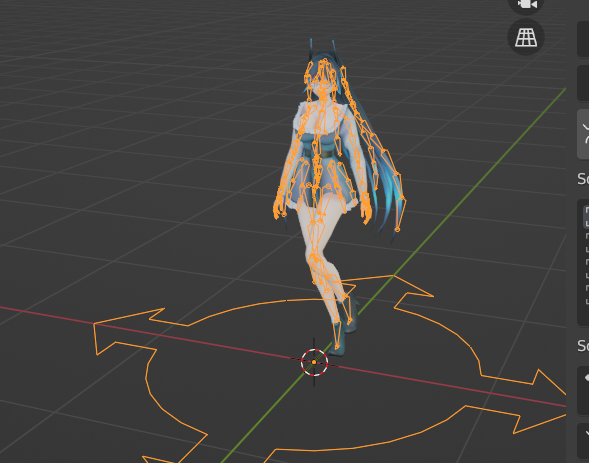
   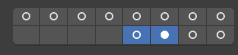

6. 导出设置(一定要安装这样设置)
   + 基础设置
   + 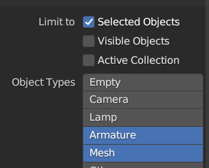
   + 应用缩放,我们已经将骨骼在最开始scale 1了所以添加上,同时z轴向前,unity左手法则
   + 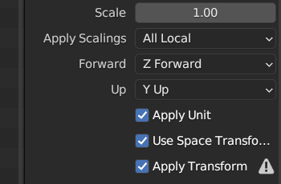
   + 只要变形骨骼,和前的骨骼选择相匹配了,不要leaf 骨骼,手指会有杂余骨骼
   + 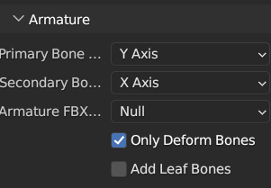
   + 减少动画插值设置0.1
   + 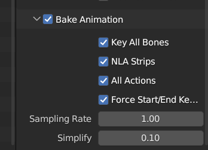

7. unity 设置导入,然后材质贴图,这些不用说了简单易懂
8. 选中骨骼然后点击animation rigging 他可以很方便的显示我们的骨骼
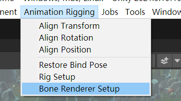
9. magic cloth 衣服晃动插件 ,大体思路magic cloth 的预制件放进场景,然后给我们的游戏对象添加要晃动的骨骼,如果发生穿模,就设置碰撞就行,不能写入动画,我觉得太可惜了,不过你所有的运动都是应用,反过来非常方便.
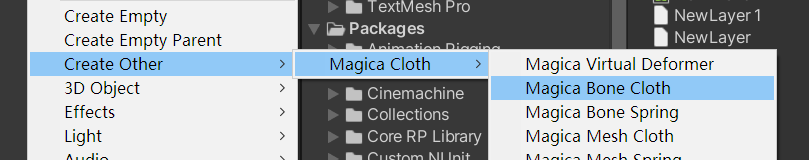
10. 到此完整填坑,你可以完成你所有需要的动画了,