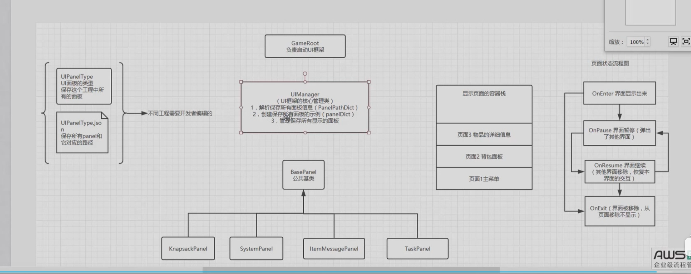

+ 使用到的技术 LitJson(这个的确比JsonUnity好用)  unityTest 框架
+ 
    1. 创建每个自己需要的UI面板预制件,把整个Ui的图形界面制造好
    2. 该思路中首先定义两个文件 Uitype.json 保存预制件的名称和路径, 然后定义一个枚举Uitype 类,分别用来存储UI预制件类
    3. 创建一个UIManger 用来处理整个逻辑框架的运行
        + 首先使用字典保存解析json的文件 (LitJson)
        + 这里因为需要保存Panel预制件的实例,这里引入一个基类构建作为父类,每个Panel预制件手底下有一个放着这个子类,然后利用父类作为指向子类的,利用这个来存储实例化的预制件(这个容器是管理已经实例化过后的预制件)
        + 使用一个栈来管理页面的交互,这里他和网页的逻辑是一样的,
        + 最后在父类中 自定义面板四种状态,用来自管理页面的状态,例如主界面的基础上添加一个新的页面,那么主界面关闭交互,子界面在关闭时还要 设置isactive