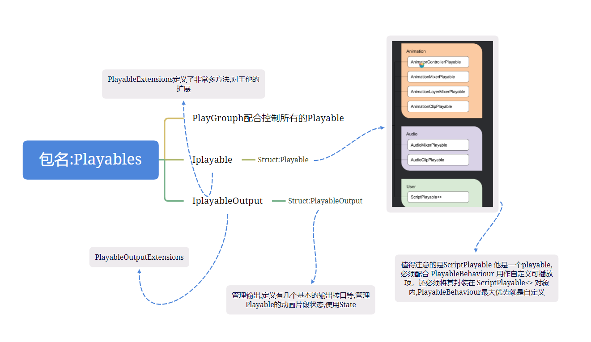
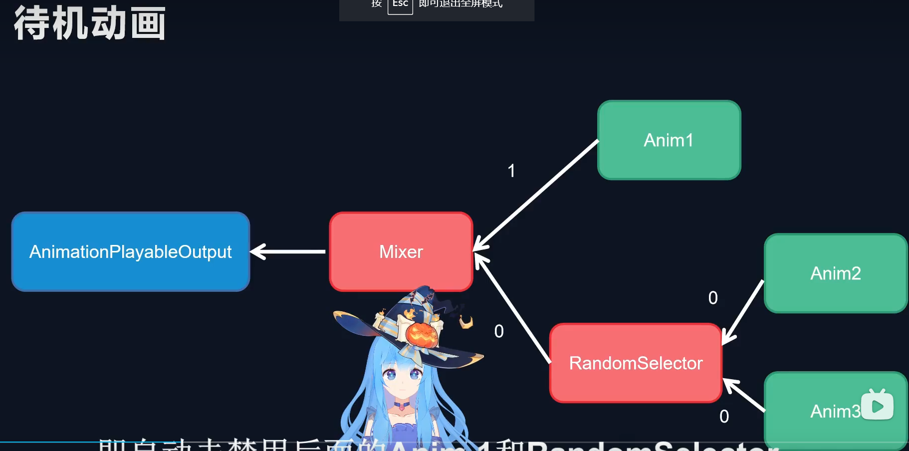
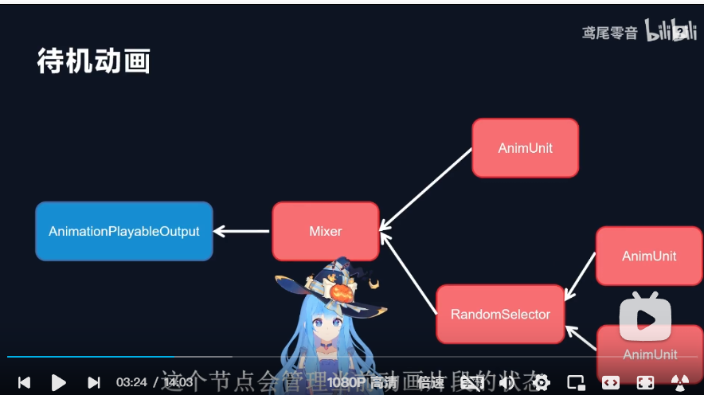
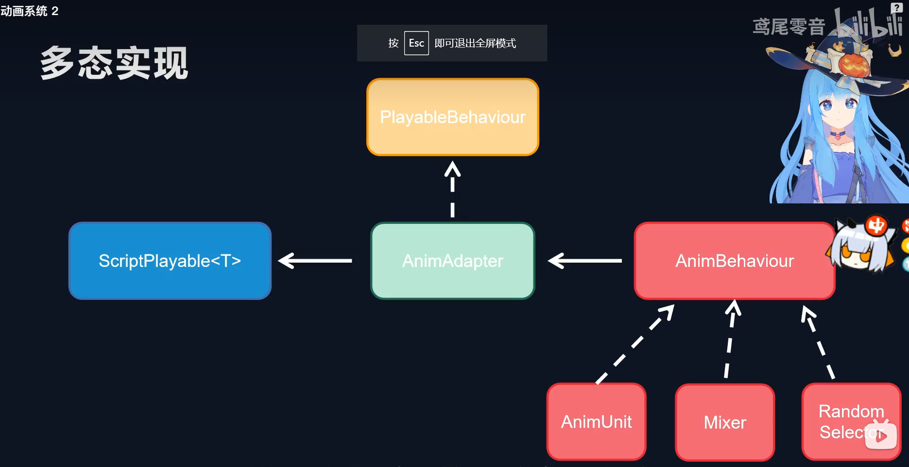

+ 官方文档 :https://docs.unity3d.com/cn/current/Manual/Playables-ScriptPlayable.html

+ 练习项目 :https://www.bilibili.com/video/BV1SP4y177YQ/?spm_id_from=333.337.search-card.all.click&vd_source=d018df40edbb612f39981f41f2e7f5b5
+ 包关系:
  +  

+ 文档unity学习项目:TimeLineAcquaintance

+ 为什么 AniamtionPlayerOutput 需要一个Animator ,PlayerGraph 负责运算,output输出,Animator 负责表现,这就是output作为最后一个输出需要Animator作为参数,每个存在于PlayerGraph Player节点每一帧运算都会回调都有PrePareFrame函数,完成这个节点的一次采样,然后准备下一次

+ TimeLine和Playables api 本质:
    + 我们自然知道TimeLine 自定义脚本 分成PlayTrack就是前面那个条, 往往他复制逻辑 继承自Playablebehaviour ,所以可以认为, Timeline 前面的那个条其实就是Players中 特殊PlayerScriput<Playablebehaviour> ,如果单纯写脚本我们会使用AnimationClipPlayer节点来控制资源,而在TimeLine 中使用继承自PlayableAsset这个clip控制资源,所以你自定义的PlayableAssest 就可以拖动到轨道上,
   + PlayableAssest 往往需要控制物体吗,也就是轨道上的clip往往代表物体,我们一般不太好获取,使用这种写法:Resolve(playable.GetGraph().GetResolver());相当于方便的获取物体
```C#
ExposedReference<Transform> lookTarget; //相当于Transform
在使用自身 lookTarget.Resove(Graph.GetRsolver());即可
```
 

+ 项目
+ 类型结构分析
  + 三个类 mixer aninUnit RandomSelector
  + 利用多态,然后总类呈现在graph中, AnimAdapter中存放一个虚类Animbehaviour
  + 这里浅谈一下我们的理解,为什么animAdapter不是虚类,这样会大大增加animAdapter的复杂性,animAdapter存在了两个主要功能,当做graph的一个节点,第二又有面对其他的节点的混合,所以,只需要管理一个徐磊,animAdapter就可以把这两个功能wan
  

