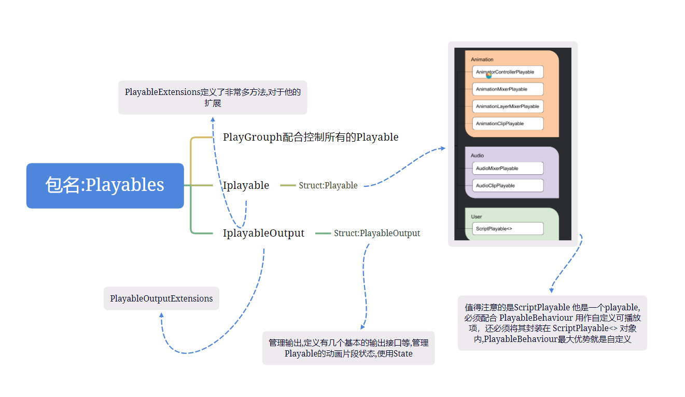

+ 官方文档 :https://docs.unity3d.com/cn/current/Manual/Playables-ScriptPlayable.html

+ 练习项目 :https://www.bilibili.com/video/BV1SP4y177YQ/?spm_id_from=333.337.search-card.all.click&vd_source=d018df40edbb612f39981f41f2e7f5b5
+ 包关系:
  +  

+ 文档unity学习项目:TimeLineAcquaintance

+ 项目
+ 类型结构分析
  + 三个类 mixer aninUnit RandomSelector
  + 利用多态,然后总类呈现在graph中, AnimAdapter中存放一个虚类Animbehaviour
  + 这里浅谈一下我们的理解,为什么animAdapter不是虚类,这样会大大增加animAdapter的复杂性,animAdapter存在了两个主要功能,当做graph的一个节点,第二又有面对其他的节点的混合,所以,只需要管理一个徐磊,animAdapter就可以把这两个功能wan
  

