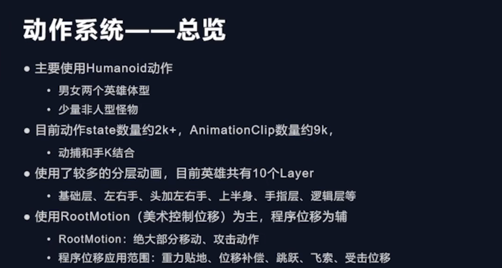
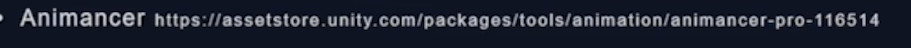
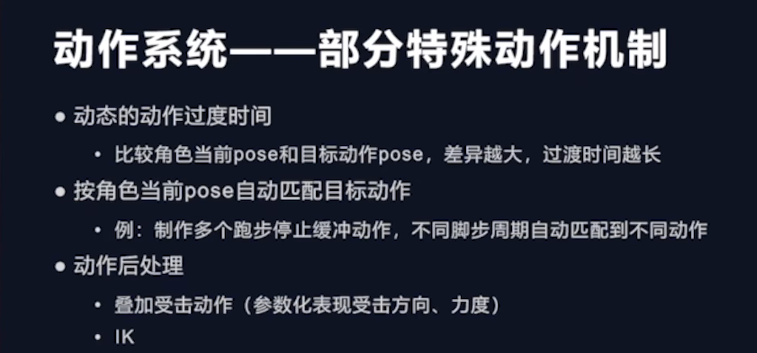
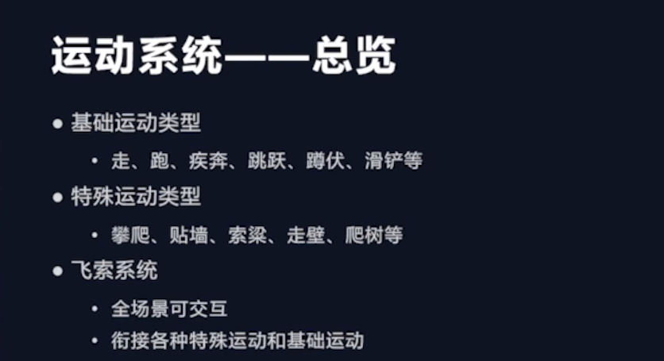
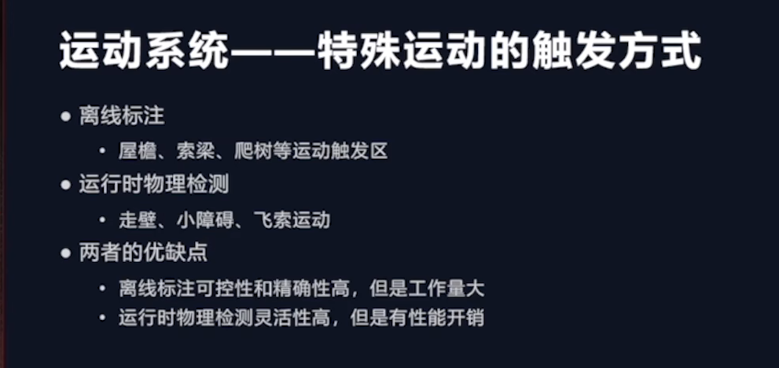
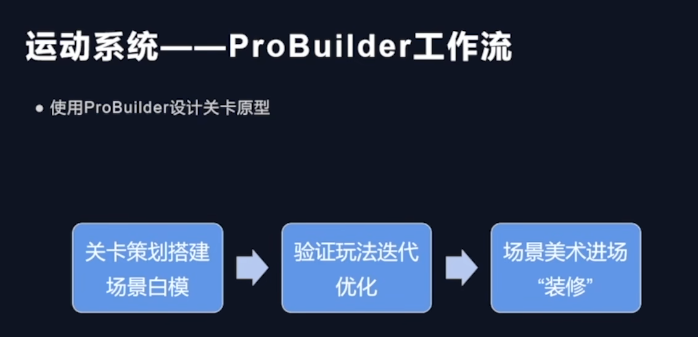
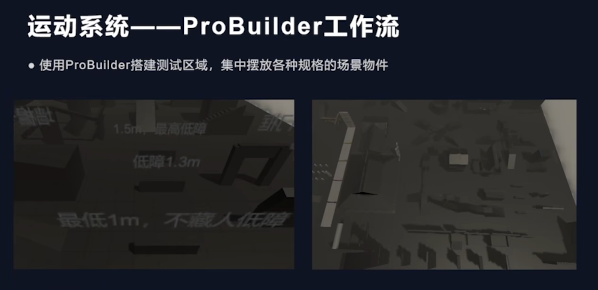
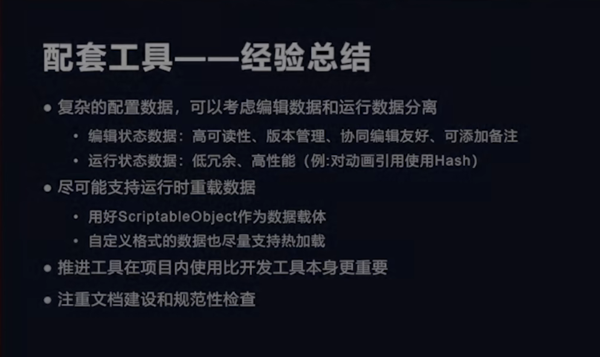

+ 动作实现的具体框架
  

+ 推荐文档Animancer

+ Tag优化方案:Unity 原有的Tag是并列,而永劫无间实现了树状Tag ,非常容易归类

+ 动作系统的优化(依然可以模仿motion Matching 完成动作)

+ 以动作系统为基础上去做运动系统

+ Pro Builder 搭建基础白膜 ,Pro Builder 可以轻松选择点线面,然后通过辅助开发,实现离线标记功能
   
   

+ 物理引擎的检测:
.png)

+ 物理系统:加载策略 将preFab原始模型在editor 放在一起, 一旦运行

+ 帧数录制,记录每一帧的动画,权重等信息,配合Timeline定位,方便我们去回看动画内容

