# 3D 太空射击游戏

## 1. 游戏规则射击

### 1.1 总介

* 规则：打飞机得分，没有关卡，玩家飞船被击落则 Game over
* 平台：PC或手机
* 操作：
    1. PC键盘：上下左右键控制方向，空格射击
    2. PC鼠标：右键控制方向，左键射击
    3. 手机：点击屏幕

### 1.2 主角和敌人

* 主角：3层护甲，挨打一下掉一层，到0 game over
* 初级敌人：装甲弱，撞机攻击，弧线飞行
* 高级敌人：装甲强，可发子弹，直线飞行

### 1.3 UI

* 显示装甲及得分
* 游戏结束：显示 “游戏结束”、“再试一次”

## 2. 导入素材

1. 新建项目 PlaneShooting，选择 3d 项目模板
2. 在项目窗口的 assets 下，新建文件夹 airplane
3. 在 airplane 上点击右键 -> 导入新资源 ，选中课本资源库 \rawdata\airplane 下所有文件，导入

## 3. 创建 场景 (scene)

### 3.1 创建火星背景和星空动画

1. 新建 level1 scene:  
    老版本的 Unity 需要自己新建 scene ,新版的项目模板中，都会自带一个 SampleScene ，用这个就可以，其中还包含一个 Main Camera （主摄像），这个 scene 会存放在 /Assets/Scenes 下，将其重命名为 level1（第一关）

2. 新建平面游戏对象：  
   菜单栏 游戏对象（GameObject）-> 3D 对象（3D Object）-> 平面 （Plane）,创建平面游戏对象作为火星背景模型，并将其重命名为 Mars

3. 创建材质球并贴图：  
   项目（project）窗口里，在 Assets 下新建文件夹，命名为 Materials(材质)，在其上点右键 -> 创建 -> 材质(Material) ，命名为 Background （背景）; 选中这个 Background ，将 /Assets/airplane/mars 这个2d素材作为贴图，拖拽到 Background 材质球 属性配置窗口（Inspector）中 MainMaps 下 反射率（Albedo）前的方框中；或者点击 反射率（Albedo）前 的圆点按钮，选择指定素材作为贴图，并将 Rendering Mode 设置为 Cutout
   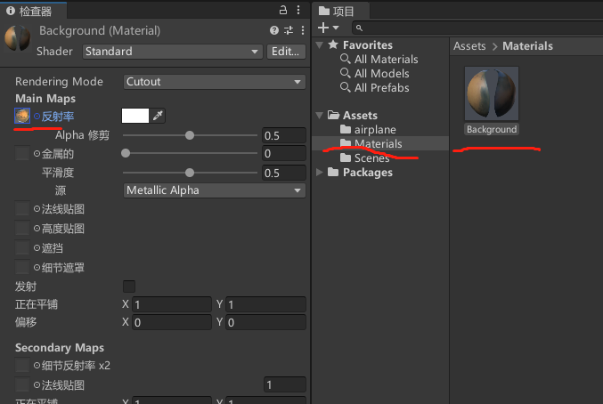

4. 应用材质球到 Mars 平面游戏对象:  
   在层级(Hierarchy)窗口中，选中 Mars 对象，在检查器（Inspector）窗口中，将 Materials（素材）下的 元素0（element 0 ）配置为上一步中创建的 Background 材质球，用拖拽或选择的方式都可以
   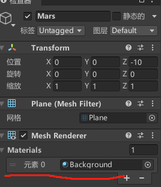

5. 创建星空背景游戏对象：  
   * 首先再新建一个平面游戏对象，命名为 Stars，将其放在 Mars 之后，并扩大，作为火星背后的星空背景
   * 再新建一个材质球，命名为 stars ，更改其 shader 为 Unlit/Texture , 并 在 Base 右侧的材质选择中，将 /Assets/airplane/star 设置为星空背景材质
   * 将 Stars 游戏对象的 Materials 中的 元素 0 设置为 材质球 stars
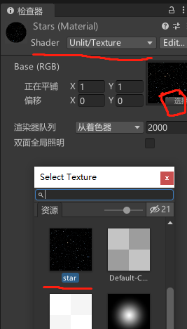

6. 创建动画并加入星空背景对象：  
   * 在 Assets 中新建 Animations （动画）文件夹，并打开 动画 窗口；
   * 选中 Stars 对象，在 动画 窗口中，点击 创建 按钮，新建一个 stars.anim 并保存在 /Assets/Animations 下。
    > 这个步骤，除了创建一个 stars 动画素材之外，还会创建一个同名的 动画控制器 ，并将素材和游戏对象关联，在 Stars 对象属性窗口中，会增加一个 Animator 组件，其中已经绑定自动生成的 Stars 动画控制器

    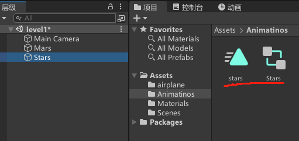
    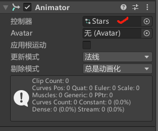
   * 在动画窗口中，为 star 动画 添加属性 -> Mesh Render -> Material._Main Tex_ST 
   * 点坐上角红色按钮，启动 关键帧记录模式
   * 右侧填入最后一帧帧数（游戏设置一秒多少帧就填多少，我的是 60）
   * 将最后一帧的 Meterial._Main Tex_ST.w 设置为 -1
    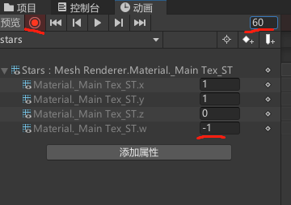
   * 再点一次红色按钮，关闭  关键帧记录模式 ，预览动画

### 3.2 设置摄像机和灯光

#### 3.2.1 设置摄像机

> 摄像机就是包含 Camera 组件的游戏对象，可以移动、旋转，可以用脚本控制，用来当做我们观看游戏世界的眼睛。

1. 调整场景中视角角度垂直正对着背景
2. 在层级窗口中，选择 Main Camera ，菜单栏 游戏对象（Game Object）-> 对齐视图（Align with View）,是摄像机视角与当前视图一样

#### 3.2.2 设置灯光

> 因版本不同，这里跟教材上步骤不一样，需要注意，在 2021.1 版本中，光源的设置已经变得比较复杂，暂时不在这一节中说明

3. 创建点光源：
   菜单中 游戏对象 -> 灯光 -> 点光源，添加一个点光源在当前场景中，让其位置垂直于背景，在背景之上，调整范围和强度到适合数值

    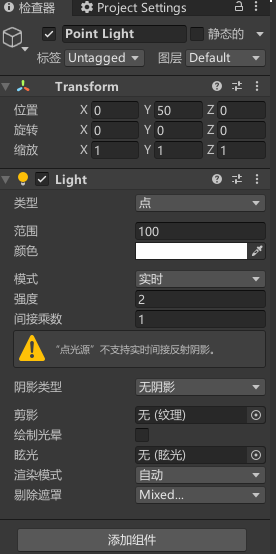

## 4. 创建玩家飞船

> 飞船本身是导入的 3D 素材，如果想操纵它移动射击，则需要添加脚本组件，所以 玩家飞船游戏对象 = 素材组件 + 脚本组件

### 4.1 创建并控制飞船

1. 将 /Assets/airplane/Player.fbx （3d 素材）拖入层级窗口，当前场景下，会生成一个新的 Player 游戏对象
2. 在 Assets 下新建文件夹 Scripts，在其中新建一个 Player 脚本（右键点击 Scripts 文件夹 -> 创建 -> C# 脚本 -> 重命名脚本为 Player）
3. 将Player脚本添加为 Player 游戏对象的组件（选中 层级窗口中的 Player 对象，在右侧的 检查器 窗口中，点击 添加组件按钮，并选中 Player.cs 脚本）
4. 双击Player脚本，会启动关联的 vs 编译器，在其中编辑代码如下：
``` C#
using System.Collections;
using System.Collections.Generic;
using UnityEngine;

public class Player : MonoBehaviour
{
    // 飞行速度属性
    public float m_speed = 1;
    // 第一帧 更新前，会调用 Start 方法
    void Start()
    {
        
    }

    // Update is called once per frame
    // 每帧都会调用 Update 方法
    void Update()
    {
        // 纵向移动距离
        float movev = 0;
        // 水平移动距离
        float moveh = 0;
        
        // 按 ↑ Z 方向递增
        if (Input.GetKey(KeyCode.UpArrow)) {
            movev += m_speed * Time.deltaTime;
        }
        // 按 ↓ 键 Z 方向递减
        if (Input.GetKey(KeyCode.DownArrow))
        {
            movev -= m_speed * Time.deltaTime;
        }
        // 按 ← 键 X 方向递减
        if (Input.GetKey(KeyCode.UpArrow))
        {
            moveh -= m_speed * Time.deltaTime;
        }
        // 按 → Z 方向递增
        if (Input.GetKey(KeyCode.DownArrow))
        {
            moveh += m_speed * Time.deltaTime;
        }

        //移动
        this.transform.Translate(new Vector3(moveh, 0, movev));
    }
}
```
5. 运行并测试
6. 选中 层级窗口中的 Player ，在右侧的检查器中，可以直接更改 Player 脚本中的速度，将其改为 6 ，再测试

### 4.2 创建并发射子弹

1. 创建子弹游戏对象：  
   将项目窗口中的  rocket.fbx 模型拖到 层级 窗口的 场景下，创建子弹游戏对象
2. 创建子弹脚本，并指定脚本给子弹游戏对象：  
   在项目窗口中，/Assets/Scripts 下，新建 Rocket.cs 脚本，并将其拖入子弹游戏对象的检查器窗口中，为子弹游戏对象添加脚本组件  
   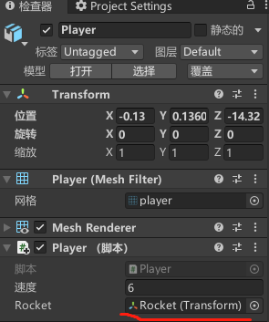
3. 编辑脚本代码如下：
``` C#
using System.Collections;
using System.Collections.Generic;
using UnityEngine;

public class Rocket : MonoBehaviour
{
    public float m_speed = 10; // 子弹飞行速度
    public float m_power = 1.0f; // 子弹攻击力

    //看不到时，删除
    private void OnBecameInvisible()
    {
        //通过判断是否处于激活状态防止重复删除
        if (this.enabled) {
            //当离开屏幕后销毁当前游戏对象，清空所占用内存资源
            Destroy(this.gameObject);
        }
    }
    // Start is called before the first frame update
    void Start()
    {
        
    }

    // Update is called once per frame
    void Update()
    {
        // 向前（z 方向）移动
        transform.Translate(new Vector3(0, 0, m_speed * Time.deltaTime));
    }
}

```
4. 运行游戏，测试

### 4.3 创建子弹 Prefab

> 游戏中，要多次重复使用的游戏对象，最好将其制作为 预制体（预制件）Prefab

1. 新建预制件：  
   在项目窗口中，Assets 文件夹下，新建文件夹 Prefabs，并在其中新建一个 预制件 Prefab ，将其命名为 Rocket
2. 游戏对象添加到预制件：  
   将层级窗口下的 rocket 游戏对象拖拽到 Rocket 预制件上，完成预制件的制作
3. 删除原来的 rocket 游戏对象

### 4.4 发射子弹：  
   
1. 关联 Player 游戏对象和子弹预制件：  
   打开 Player.cs 脚本，添加一个 Transform 属性，
``` C#
 public Transform m_rocket; // 子弹预制件的 Transform
```

    然后查看 Player 对象的 检查器（属性）窗口，会发现在 Player 脚本组件下，新增加了一项 Rocket，将 Rocket 预制件拖拽到其后面的框中，这样，Player 对象就可以

2. 更改 Player.cs 脚本，使其具备发射子弹的功能：

``` C#
using System.Collections;
using System.Collections.Generic;
using UnityEngine;

public class Player : MonoBehaviour
{
    // 飞行速度属性
    public float m_speed = 1;
    public Transform m_rocket; // 用于获取子弹预制件的变形对象 Transform

    Transform m_transform;
    // 用于控制发射频率
    float m_rocketTimer = 0;
    // 第一帧 更新前，会调用 Start 方法
    void Start()
    {
        m_transform = this.transform;
    }

    // Update is called once per frame
    // 每帧都会调用 Update 方法
    void Update()
    {
        //移动飞机
        MovePlane();
        //发子弹
        ShotRocket();

    }

    // 移动飞机
    void MovePlane() {
        // 纵向移动距离
        float movev = 0;
        // 水平移动距离
        float moveh = 0;

        // 按 ↑ Z 方向递增
        if (Input.GetKey(KeyCode.UpArrow))
        {
            movev += m_speed * Time.deltaTime;
        }
        // 按 ↓ 键 Z 方向递减
        if (Input.GetKey(KeyCode.DownArrow))
        {
            movev -= m_speed * Time.deltaTime;
        }
        // 按 ← 键 X 方向递减
        if (Input.GetKey(KeyCode.LeftArrow))
        {
            moveh -= m_speed * Time.deltaTime;
        }
        // 按 → Z 方向递增
        if (Input.GetKey(KeyCode.RightArrow))
        {
            moveh += m_speed * Time.deltaTime;
        }

        //移动
        this.transform.Translate(new Vector3(moveh, 0, movev));
    }

    // 发子弹
    void ShotRocket() {
        m_rocketTimer -= Time.deltaTime;
        if (m_rocketTimer <= 0) {
            // 子弹只能最快间隔 0.1 秒发射一次
            m_rocketTimer = 0.1f;
            //用空格键、鼠标左键发射子弹
            if (Input.GetKeyDown(KeyCode.Space) || Input.GetMouseButton(0)) {
                Instantiate(m_rocket, m_transform.position, m_transform.rotation);
            }
        }
    }
}

```
3. 运行游戏，测试效果

## 5. 创建敌人

> 游戏中一共有两种敌人，初级、高级，在这里先创建初级敌人

### 5.1 初级敌人

> 基本创建方式跟子弹类似

#### 5.1.1 创建

1. 创建初级敌人预制件：  
   将Enemy.fbx文件拖拽到场景中，创建enemy游戏对象，新建 Enemy.cs 脚本在 /Assets/Scripts 下，将脚本拖拽到游戏对象上，为游戏对象添加脚本组件；  
   新建Enemy 预制件在 /Assets/Prefabs 下，将 enemy 游戏对象拖拽到预制件中，替换
2. 编辑脚本如下：
``` C#
using System;
using System.Collections;
using System.Collections.Generic;
using UnityEngine;

//敌人脚本
public class Enemy : MonoBehaviour
{
    //速度
    public float m_speed = 1;
    //生命
    public int m_life = 10;
    //旋转速度
    protected float m_rotSpeed = 30;

    // Start is called before the first frame update
    void Start()
    {
        
    }

    // Update is called once per frame
    void Update()
    {
        //调用移动方法
        UpdateMove();
    }

    //为了将来扩展功能，将 UpdateMove 方法设置为虚的
    protected virtual void UpdateMove()
    {
        // 左右移动
        float rx = Mathf.Sin(Time.time) * Time.deltaTime;
        // 前进 （-z 方向）
        transform.Translate(new Vector3(rx, 0, -m_speed * Time.deltaTime));
    }

    //看不到时，删除
    private void OnBecameInvisible()
    {
        //通过判断是否处于激活状态防止重复删除
        if (this.enabled)
        {
            //当离开屏幕后销毁当前游戏对象，清空所占用内存资源
            Destroy(this.gameObject);
        }
    }
}

```
3. 添加多个初级敌人游戏对象到场景中：  
   拖拽 Enemy 预制件到场景中，然后按 Ctrl + D 复制多个，放在玩家飞船前面的不同位置
4. 运行游戏，测试效果

#### 5.1.2 物理碰撞

> 为前面的三种游戏对象添加碰撞体，刚体，和相关逻辑，使其互相能够交互

##### 5.1.2.1 添加组件

1. 添加盒装碰撞器组件 Box Collider
    * 为 Player 游戏对象添加碰撞体组件：在层级窗口中，选中 Player 对象，在 检查器中，点击 “添加组件” 按钮，在其中搜索 “盒装碰撞器”，并添加；然后将 “是否触发器”复选框选中
    * 为 Enemy 和 Rocket 预制件做同样操作；
2. 添加刚体组件 Rigidbody：  
    * 为 Player 游戏对象添加刚体组件：在层级窗口中，选中 Player 对象，在 检查器中，点击 “添加组件” 按钮，在其中搜索 “刚体”，并添加；然后将 “使用重力” 复选框取消，“Is Kinematic”复选框选中
    * 为 Enemy 和 Rocket 预制件做同样操作；

>注意：  
>* 教材上的方式是先更改游戏对象，然后覆盖回预制件，这里我们使用的是另一种方式，如果先更改预制件，会将更改后的所有改变，直接应用到游戏里，使用该预制件的所有游戏对象。根据你自己的需求跟习惯，来选择操作方式。Unity 中，要实现一个目标，通常都会有多种不同方式，需要大家灵活掌握。
>*  Is Kinematic 属性可以让刚体摆脱物理引擎的控制，并允许通过脚本以运动学方式来移动刚体。

##### 5.1.2.2 触发碰撞

> 即使添加了碰撞体组件和刚体组件，运行游戏仍看不到任何对象间交互，这需要用代码来实现最终效果

1. 添加标签 Tag:  
   在菜单中选择 编辑（Edit） -> Project Settings (项目设置) -> 标签和图层(Tags and Layers) 点击标签列表下的 + ，添加标签 “PlayerRocket” 和 “Enemy”
   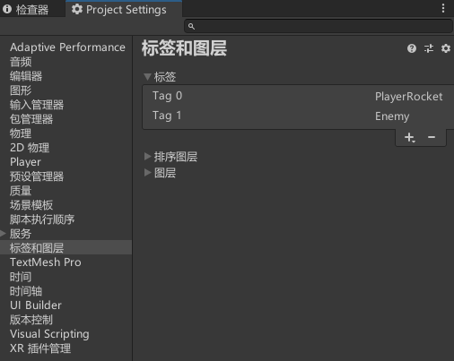
2. 为预制件设置标签：  
   在预制件的检查器窗口中，找到 标签 项，Rocket 预制件标签设置为 PlayerRocket，将 Enemy 预制件标签设置为 Enemy
3. 设置 Player 对象标签：  
   设置 Player 对象标签为 Player ，此为游戏内置标签
4. 更改 Enemy.cs 如下：
``` c#
using System;
using System.Collections;
using System.Collections.Generic;
using UnityEngine;

//敌人脚本
public class Enemy : MonoBehaviour
{
    //速度
    public float m_speed = 1;
    //生命
    public int m_life = 10;
    //旋转速度
    protected float m_rotSpeed = 30;

    internal Renderer m_renderer;
    internal bool m_isActive = false;

    // Start is called before the first frame update
    void Start()
    {
        m_renderer = this.GetComponent<Renderer>();
    }

    // Update is called once per frame
    void Update()
    {
        //调用移动方法
        UpdateMove();
        //如果移动到屏幕外，则销毁
        if (m_isActive && !this.m_renderer.isVisible) {
            Destroy(this.gameObject);
        }
    }

    //为了将来扩展功能，将 UpdateMove 方法设置为虚的
    protected virtual void UpdateMove()
    {
        // 左右移动
        float rx = Mathf.Sin(Time.time) * Time.deltaTime;
        // 前进 （-z 方向）
        transform.Translate(new Vector3(rx, 0, -m_speed * Time.deltaTime));
    }
    private void OnBecameVisible()
    {
        m_isActive = true;
    }
    //看不到时，删除
    private void OnBecameInvisible()
    {
        //通过判断是否处于激活状态防止重复删除
        if (this.enabled)
        {
            //当离开屏幕后销毁当前游戏对象，清空所占用内存资源
            Destroy(this.gameObject);
        }
    }

    // MonoBehaviour 类对象回调函数（事件方法），在碰撞体互相接触时触发
    private void OnTriggerEnter(Collider other)
    {
        if (other.tag == "PlayerRocket")
        {
            Rocket rocket = other.GetComponent<Rocket>();
            if (rocket != null)
            {
                m_life -= rocket.m_power;
                if (m_life <= 0)
                {
                    Destroy(this.gameObject);
                }
            }
        }
        else if (other.tag == "Player") {
            m_life = 0;
            Destroy(this.gameObject);
        }
    }
}

```
5. 更改 Player.cs 代码如下：
``` C# 
using System.Collections;
using System.Collections.Generic;
using UnityEngine;

public class Player : MonoBehaviour
{
    // 飞行速度属性
    public float m_speed = 1;
    public Transform m_rocket; // 子弹预制件的 Transform
    public int m_life = 3;

    Transform m_transform;
    // 用于控制发射频率
    float m_rocketTimer = 0;
    // 第一帧 更新前，会调用 Start 方法
    void Start()
    {
        m_transform = this.transform;
    }

    // Update is called once per frame
    // 每帧都会调用 Update 方法
    void Update()
    {
        //移动飞机
        MovePlane();
        //发子弹
        ShotRocket();

    }

    // 移动飞机
    void MovePlane() {
        // 纵向移动距离
        float movev = 0;
        // 水平移动距离
        float moveh = 0;

        // 按 ↑ Z 方向递增
        if (Input.GetKey(KeyCode.UpArrow))
        {
            movev += m_speed * Time.deltaTime;
        }
        // 按 ↓ 键 Z 方向递减
        if (Input.GetKey(KeyCode.DownArrow))
        {
            movev -= m_speed * Time.deltaTime;
        }
        // 按 ← 键 X 方向递减
        if (Input.GetKey(KeyCode.LeftArrow))
        {
            moveh -= m_speed * Time.deltaTime;
        }
        // 按 → Z 方向递增
        if (Input.GetKey(KeyCode.RightArrow))
        {
            moveh += m_speed * Time.deltaTime;
        }

        //移动
        this.transform.Translate(new Vector3(moveh, 0, movev));
    }

    // 发子弹
    void ShotRocket() {
        m_rocketTimer -= Time.deltaTime;
        if (m_rocketTimer <= 0) {
            // 子弹只能最快间隔 0.1 秒发射一次
            m_rocketTimer = 0.1f;
            //用空格键、鼠标左键发射子弹
            if (Input.GetKeyDown(KeyCode.Space) || Input.GetMouseButton(0)) {
                Instantiate(m_rocket, m_transform.position, m_transform.rotation);
            }
        }
    }

    private void OnTriggerEnter(Collider other)
    {
        if (other.tag != "PlayerRocket") {
            m_life -= 1;
            if (m_life <= 0) {
                Destroy(this.gameObject);
            }
        }
    }
}
```
6. 更改 Rocket.cs 代码如下：
``` C# 
using System.Collections;
using System.Collections.Generic;
using UnityEngine;

public class Rocket : MonoBehaviour
{
    public float m_speed = 10; // 子弹飞行速度
    public int m_power = 1; // 子弹攻击力


    //看不到时，删除
    private void OnBecameInvisible()
    {
        //通过判断是否处于激活状态防止重复删除
        if (this.enabled) {
            //当离开屏幕后销毁当前游戏对象，清空所占用内存资源
            Destroy(this.gameObject);
        }
    }
    // Start is called before the first frame update
    void Start()
    {
        
    }

    // Update is called once per frame
    void Update()
    {
        // 向前（z 方向）移动
        transform.Translate(new Vector3(0, 0, m_speed * Time.deltaTime));
    }

    private void OnTriggerEnter(Collider other)
    {
        if (other.tag != "Enemy") {
            return;
        }
        Destroy(this.gameObject);
    }
}

```
7. 运行游戏，测试结果

> 注意：  
> 因为这个游戏设置的 3D 的，x 轴为横向，z 轴为纵向，y 轴为 垂直屏幕的方向，所以，如果游戏对象的 y 轴数值不等的话，就相当于不在一个层面上，永远不会碰撞，所以必须将 Player、Enemy、Rocket 的 位置属性 y 的值都设置为 0  
> 当前游戏，位置属性 y 值越大，越处于上层，所以可以将 Mars 的 Y 设置为 -1 ，Stars 的 Y 设置为 -2 ，则互相遮盖效果正是我们需要的

[Unity 中的碰撞和触发](https://www.shangmayuan.com/a/9739cc62719145829835f728.html)

### 5.2 添加高级敌人

> 增加游戏可玩性，添加会发子弹、血更厚的大飞机

1. 创建大飞机预制件:  
   * /Assets/airplane/Enemy.fbx 模型制作为 SuperEnemy 预制件
   * 为预制件设置刚体和碰撞体，并调整属性
   * 更改 tag 为 Enemy
   * 新建脚本 /Assets/Scripts/SuperEnemy.cs，并将其添加为预制件的脚本组件，代码如下，然后可以在检查器中，设置打飞机的生命为50：
```C#
using System.Collections;
using System.Collections.Generic;
using UnityEngine;

public class SuperEnemy : Enemy
{
    public Transform m_rocket;
    protected float m_fireTime = 2;
    protected Transform m_player;
    protected override void UpdateMove()
    {
        m_fireTime -= Time.deltaTime;

        if (m_fireTime <= 0) {
            m_fireTime = 2;
            if (m_player != null)
            {
                // 获取指向玩家飞机的向量（目标位置-自身位置）
                Vector3 relativePos = m_player.position - transform.position;
                //从当前位置，向指定方向发子弹
                Instantiate(m_rocket, transform.position, Quaternion.LookRotation(relativePos));
            }
            else {
                GameObject obj = GameObject.FindGameObjectWithTag("Player");
                if (obj != null) {
                    m_player = obj.transform;
                }
            }
        }
        //前进 ( 负z 轴方向 )
        transform.Translate(new Vector3(0, 0, -m_speed * Time.deltaTime));
    }
}

```

2. 设置敌人的子弹：  
   * 创建 EnemyRocket 预制件：使用 rocket.fbx 创建预制件 EnemyRocket；
   * 新建一个材质到 /Assets/Materials/rocket2，将其贴图指定为 /Assets/airplane/rocket2/ ；
   * 在 EnemyRocket 预制件的 Materials 组建中，将属性 元素0 设置为刚才创建的材质 rocket2 ，这样敌人子弹就变为绿色，可以跟玩家发射的区分开
   * 为预制件设置刚体和碰撞体，并调整属性，使其能碰撞；
   * 新建脚本 /Assets/Scripts/EnemyRocket.cs，并将其添加为预制件的脚本组件，代码如下：
```C#
using System.Collections;
using System.Collections.Generic;
using UnityEngine;

public class EnemyRocket : Rocket
{
    private void OnTriggerEnter(Collider other)
    {
        if (other.tag != "Player") {
            return;
        }
        Destroy(this.gameObject);
    }
}

```
3. 运行游戏，测试结果

## 6. 声音和特效

> 虽然已经可以进行基本操作，但缺少声音和特效，整个游戏缺乏真实性，没有任何反馈，感觉特别假。  
> 声音、特效是游戏组成的重要部分，做得好的话，能大幅度提升游戏可玩性

1. 导入声音特效素材包：  
   在 项目窗口中，右键点击 Assets 文件夹 -> 导入包 -> 自定义包 -> 选择 rawdata\package\ShootingFX.unitypackage 导入
2. 为 爆炸特效 预制件添加声音：  
   为 Assets\FX\Explosion.prefab 预制件添加 声音源 （Audio Source）组件，并将  Assets\FX\explosion.wav 声音文件拖拽到该组件的 AudioClip 后框体中，让下面 “唤醒时播放” 处于选中状态
3. 为 Player 对象 添加 声音源组件，并更改代码：  
   选中 Player 对象，为其添加 声音源（Audio Source）组件，更改代码如下：
``` C#
using System.Collections;
using System.Collections.Generic;
using UnityEngine;

public class Player : MonoBehaviour
{
    // 飞行速度属性
    public float m_speed = 1;
    public Transform m_rocket; // 子弹预制件的 Transform
    public int m_life = 3;

    public AudioClip m_shootAudoClip;
    protected AudioSource m_audioSource;
    public Transform m_explosionFX;

    Transform m_transform;
    // 用于控制发射频率
    float m_rocketTimer = 0;
    // 第一帧 更新前，会调用 Start 方法
    void Start()
    {
        m_transform = this.transform;
        m_audioSource = this.GetComponent<AudioSource>();
    }

    // Update is called once per frame
    // 每帧都会调用 Update 方法
    void Update()
    {
        //移动飞机
        MovePlane();
        //发子弹
        ShotRocket();

    }
    // 移动飞机
    void MovePlane() {
        // 纵向移动距离
        float movev = 0;
        // 水平移动距离
        float moveh = 0;

        // 按 ↑ Z 方向递增
        if (Input.GetKey(KeyCode.UpArrow))
        {
            movev += m_speed * Time.deltaTime;
        }
        // 按 ↓ 键 Z 方向递减
        if (Input.GetKey(KeyCode.DownArrow))
        {
            movev -= m_speed * Time.deltaTime;
        }
        // 按 ← 键 X 方向递减
        if (Input.GetKey(KeyCode.LeftArrow))
        {
            moveh -= m_speed * Time.deltaTime;
        }
        // 按 → Z 方向递增
        if (Input.GetKey(KeyCode.RightArrow))
        {
            moveh += m_speed * Time.deltaTime;
        }

        //移动
        this.transform.Translate(new Vector3(moveh, 0, movev));
    }

    // 发子弹
    void ShotRocket() {
        m_rocketTimer -= Time.deltaTime;
        if (m_rocketTimer <= 0) {
            // 子弹只能最快间隔 0.1 秒发射一次
            m_rocketTimer = 0.1f;
            //用空格键、鼠标左键发射子弹
            if (Input.GetKeyDown(KeyCode.Space) || Input.GetMouseButton(0)) {
                Instantiate(m_rocket, m_transform.position, m_transform.rotation);
                //播放射击声音
                this.m_audioSource.PlayOneShot(m_shootAudoClip);
            }
        }
    }

    private void OnTriggerEnter(Collider other)
    {
        if (other.tag != "PlayerRocket") {
            m_life -= 1;
            if (m_life <= 0) {

                //添加爆炸特效
                Instantiate(m_explosionFX, m_transform.position, Quaternion.identity);

                Destroy(this.gameObject);
            }
        }
    }
}

```
4. 配置 Player 脚本组件属性：  
   拖拽 Assets\FX\shoot.wav 到 m_shootAudoClip 属性；拖拽 Assets\FX\Explosion.prefab 到 m_explosionFX 属性
5. 为敌人也进行相应配置，添加声音和特效


## 7. 敌人生成器

> 前面的敌人是我们手动放入的，穿过屏幕或被消灭后，就没有了，这明显不符合需求，我们需要添加代码，来生成敌人

1. 创建 Gizmos 素材文件夹：  
   敌人生成器对象本身没有外观，但为了能在 Unity 中更方便的看见并操作该对象，需要给它配置一个只能在 Unity 中看到，游戏运行时又隐藏的外观，这就要用到 Gizmos 素材。  
   新建文件夹 \Assets\Gizmos （必须是 Gizmos），在资源管理器中，将 \Assets\airplane\item.png 复制到该文件夹内
2. 创建敌人生成器脚本：  
   新建 \Assets\Scripts\EnemySpawn.cs 脚本，代码如下：
``` C#
using System.Collections;
using UnityEngine;

public class EnemySpawn : MonoBehaviour
{
    public Transform m_enemyPrefeb;

    // Start is called before the first frame update
    void Start()
    {
        //执行协程方法
        StartCoroutine(SpawnEnemy());
    }

    IEnumerator SpawnEnemy()
    {
        while (true) {
            yield return new WaitForSeconds(Random.Range(5, 15));
            Instantiate(m_enemyPrefeb, transform.position, Quaternion.identity);
        }
    }

    // Update is called once per frame
    void Update()
    {
        
    }

    // 让本没有外观的游戏对象，在Unity中显示指定图标
    // 游戏运行时不会显示
    private void OnDrawGizmos()
    {
        Gizmos.DrawIcon(transform.position, "item.png", true);
    }
}
```
3. 创建普通敌人生成器： 
   在层级窗口中，创建空的游戏对象，命名为 EnemySpawn，将上面的 Enemy.cs 脚本添加为其组件，并将 Enemy.prefab 拖拽到 脚本的 Enemy Prefab 属性上。这样就成功的创建了一个普通敌人生成器，将其位置 Y 一定要设置为 0 ，放场景上方，即 z 轴 正向最上方任意 x 位置，这样从该点就会源源不断生成普通敌人，并向 z 轴负方向移动。  
   选中这个敌人生成器对象，Ctrl + D ，复制出多个游戏对象，移动其位置到其他地方，这样就能在多点生成敌人了  

4. 创建高级敌人生成器:  
   跟普通敌人生成器方法类似，只不过将其命名为 SuperEnemySpawn，并将并将 SuperEnemy.prefab 拖拽到 脚本的 Enemy Prefab 属性上，这样生成的敌人，就是高级敌人了。
5. 运行游戏，测试效果

## 8. 游戏 UI 和 战斗管理

> UI（User Interface）用户界面，这个游戏的 UI 要显示当前得分、最高分、玩家生命值

### 8.1 UI 图层

UI 图层跟 3D 游戏图层不同，更像是传统的2D图层，在当前游戏中，横轴为 X ,而在纵轴并不是跟 3D 游戏图层相同的 Z ，而是 Y。

所以在操作 UI 图层时，需要将场景界面右上角坐标轴调整为 y 朝上，x 朝右，下面显示 Back 的状态，才能正确调整 UI 图层中的对象

### 8.2 创建数据界面

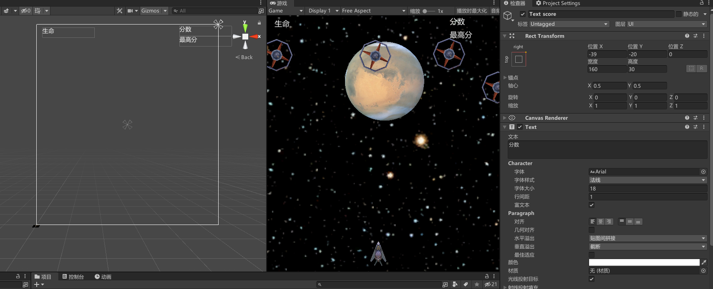

1. 创建画布（Canvas）游戏对象：  
   在层级窗口根目录中，创建游戏对象 UI -> 画布，重新命名为 DataUI  
2. 在画布游戏对象中添加文本显示子对象：  
   右键点击 DataUI 对象，创建 UI -> 文本，新建三个文本子对象，分别命名为 Text_life，将其文字改为 “生命”，更改颜色为白色，将其放置到 UI 图层左上角；第二个命名为 Text_score，将其文字改为 “分数”，更改颜色为白色，将其放置到 UI 图层右上角；第三个命名为 Text_best，文字改为“最高分”，白色，放置到 分数 下面

### 8.3 创建游戏失败界面

> 游戏失败后，要给用户相应的交互界面，接下来创建游戏失败UI

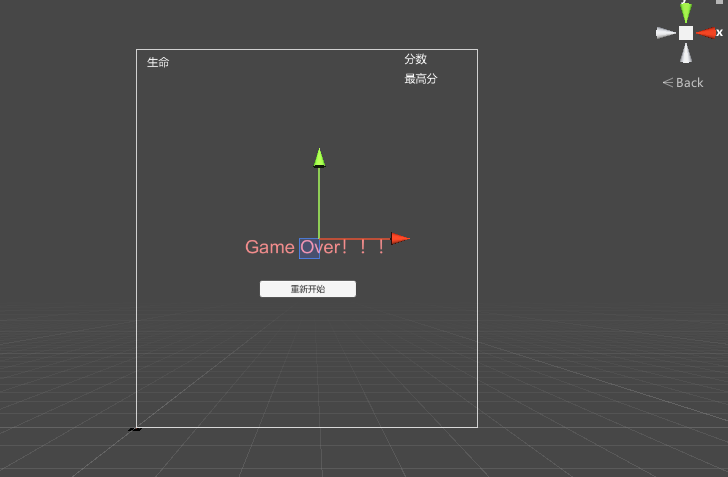
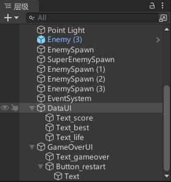

1. 创建游戏失败界面对象：  
   在层级窗口中，新建一个画布对象，命名为 GameOverUI 
2. 添加游戏失败提示UI  
   在 GameOverUI 中，添加一个文本对象，命名为 Text_gameover，调整颜色为红色，位置在中间，更改合适的字体大小，比如  30 ，更改矩形形变中的 宽度、高度，比如 300，,100
3. 添加重新开始按钮  
   在 GameOverUI中，添加一个按钮对象，命名为 Button_restart，调整其位置居中，更改其大小，打开对象，其中默认包含一个文本对象，将其中文字更改为 “重新开始”

### 8.4 创建游戏管理

> 上面的游戏UI对象，都是只有外观，现在还没有功能，需要通过脚本来添加

1. 创建 \Assets\Scripts\GameManager.cs 脚本，代码如下：
``` C#
using System.Collections;
using System.Collections.Generic;
using UnityEngine;
using UnityEngine.SceneManagement;
using UnityEngine.UI;

public class GameManager : MonoBehaviour
{
    public static GameManager Instance; //静态实例

    public Transform m_canvas_dataui;//游戏数据界面
    public Transform m_canvas_gamevoer;//游戏失败界面

    public Text m_text_score;
    public Text m_text_best;
    public Text m_text_life;

    protected int m_score = 0;
    public static int m_hiscore = 0;//最高分
    protected Player m_player; //玩家实例

    public AudioClip m_bgMusic; //背景音乐
    public AudioSource m_AudioSource; //声音源

     // Start is called before the first frame update
    void Start()
    {
        Instance = this;

        //播放音乐
        PlayBgMusic();
        //初始化UI
        InitUI();
    }

    //循环播放背景音乐
    void PlayBgMusic() {
        m_AudioSource = this.gameObject.AddComponent<AudioSource>();
        m_AudioSource.clip = m_bgMusic;
        m_AudioSource.loop = true;
        m_AudioSource.Play();
    }

    // 初始化 UI
    void InitUI (){
        //获取游戏对象
        m_player = GameObject.FindGameObjectWithTag("Player").GetComponent<Player>();
        m_text_score = m_canvas_dataui.transform.Find("Text_score").GetComponent<Text>();
        m_text_best = m_canvas_dataui.transform.Find("Text_best").GetComponent<Text>();
        m_text_life = m_canvas_dataui.transform.Find("Text_life").GetComponent<Text>();
        var restart_button = m_canvas_gamevoer.Find("Button_restart").GetComponent<Button>();

        //设置要显示的文本数据
        m_text_score.text = string.Format("分数  {0}", m_score);
        m_text_best.text = string.Format("最高分  {0}", m_hiscore);
        m_text_life.text = string.Format("生命  {0}", m_player.m_life);

        //为按钮添加事件监听
        restart_button.onClick.AddListener(delegate () {
            // 重新开始当前关卡
            SceneManager.LoadScene(SceneManager.GetActiveScene().name);
        });
        //隐藏游戏失败UI
        m_canvas_gamevoer.gameObject.SetActive(false);
    }

    //增加分数
    public void AddScore(int point) {
        m_score += point;
        if (m_hiscore < m_score) {
            m_hiscore = m_score;
        }
        m_text_score.text = string.Format("分数  {0}", m_score);
        m_text_best.text = string.Format("最高分  {0}", m_hiscore);
    }

    //更改生命
    public void ChangePlayerLife(int life) {
        m_text_life.text = string.Format("生命  {0}",life);
        if (life <= 0) {
            m_canvas_gamevoer.gameObject.SetActive(true);
        }
    }
}
```
2. 创建 GameManager 游戏对象：  
   在层级窗口中，创建空的游戏对象，命名为 GameManager ，并添加上面的脚本为其组件。然后将两个UI分别设置到组件属性中，并将\Assets\airplane\music.mp3 设置为背景音乐

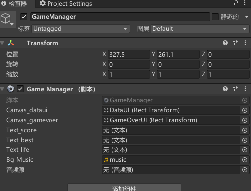

3. 更新 Enemy.cs 脚本：  
   添加分数属性，消灭敌人时，玩家得对应分数；并更新游戏UI
``` C#
    //添加分数属性
    public int m_point = 10;
    .....
    //更新UI
    private void OnTriggerEnter(Collider other)
    {
       .......//省略代码
                if (m_life <= 0)
                {
                    //更新 UI 上的分数
                    GameManager.Instance.AddScore(m_point);

                    //添加爆炸特效
                    Instantiate(m_explosionFx, this.transform.position, Quaternion.identity);
                    Destroy(this.gameObject);
                }
       .......
```
4. 可以将 SuperEnemy 预制件，对应脚本的 m_point 属性在检查器中，设置为 100，这样就能将普通敌人和高级敌人击败后的得分进行区分了
5. 更新 Play.cs 脚本：  
   添加更新 UI 中玩家生命的代码
``` C#
   private void OnTriggerEnter(Collider other)
    {
        if (other.tag != "PlayerRocket") {
            m_life -= 1;
            //主界面上更新生命显示
            GameManager.Instance.ChangePlayerLife(m_life);
            ......//下面省略
```
6. 运行游戏，测试效果

## 9. 关卡跳转

> 一般游戏打开时，会有一个起始界面，显示游戏名称之类的，接下来我们就来创建这个起始页场景，并进行场景（关卡）之间的跳转

1. 新建 start scene：  
   菜单栏 文件 -> 新建场景 -> 选择空白场景（其实选择 3D场景会更简单些，但这里要大家练习从零开始）-> 保存场景到 \Assets\Scenes 下，并命名为 start.unity
2. 新建 摄像机 MainCamera: 
   空场景中没有摄像机，需要自己新建，并重命名 
3. 新建脚本 TitleScreen.cs 并挂接到 MainCamera 对象下： 
``` C#
using UnityEngine;
using UnityEngine.SceneManagement;

public class TitleScreen : MonoBehaviour
{
    public void OnButtonGameStart() {
        SceneManager.LoadScene("level1");
    }
}

```
4. 新建 StartUI :  
   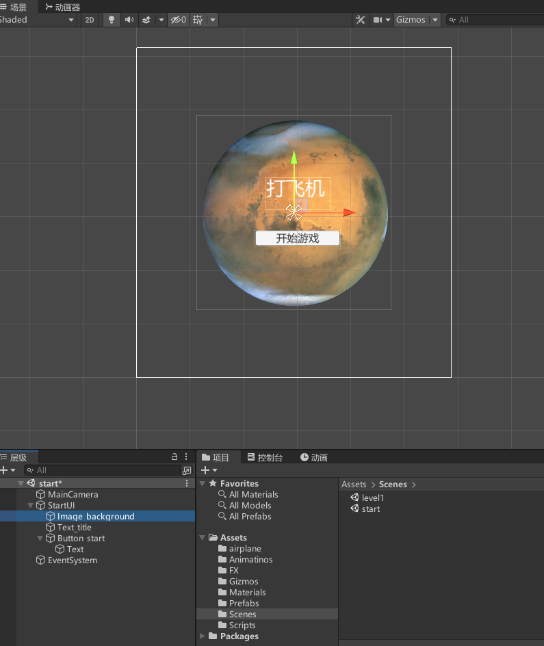
   整个起始关卡，起始主要就是这个起始UI，也是一个 UI 图层的画布，所以先新建一个画布，命名为 StartUI，然后向其中添加：
   * 背景图像：UI -> 图像，重命名为 Image_background ，在他的检查器窗口的 Image组件下，将 “源图像” 属性设置为 \Assets\airplane\mars，并调整到合适位置大小
   * 游戏标题：UI -> 文本，重命名为 Text_title，更改文本为 "太空大战"，更改颜色白色
   * 开始按钮：UI -> 按钮，重命名为 Button_start，更改其中包含的文本为“开始游戏”，并在 Button 组件的 鼠标单击 属性下，绑定 MainCamera 对象的 TitleScreen 脚本的 OnButtonGameStart 方发，当这个按钮被单击时，就会执行该方法 
   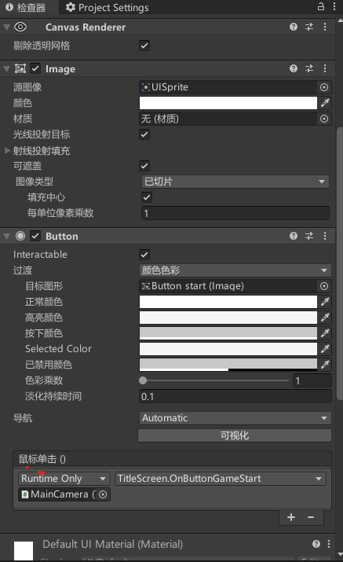

## 10. 鼠标控制

> PC 上，游戏基本上已经完工，但如果移植到手机上，没有键盘并不能正常操作飞船，所以需要添加鼠标操作功能；当移植到手机上时，鼠标操作会自动转换为触屏手势操作

> 鼠标移动本身只参照屏幕坐标，是一个二位平面，在 3D 游戏里，必须创造一个参照物，鼠标对比参照物移动，将 3D 转换为2D；这里就需要设置一个与游戏对象所在平面相同的面作为鼠标参照物，即该平面 Y 轴坐标为 0

1. 创建鼠标相对平面对象：  
   切换回 level1 场景，在其中创建 -> 3D 对象 -> 四边形 ，重命名为 Quad_MouseMoveRef

## 11. 精准碰撞

## 12. 自动创建 Prefab

## 13. 发布游戏

## 14. 对象池