## 需要安装外部组件才能使用
+ 注意组件的安装需要两个非常重要的子组件
+ 第一个必须安装
+ 第二 他是用于我们在选择模型时候显示高亮的作用
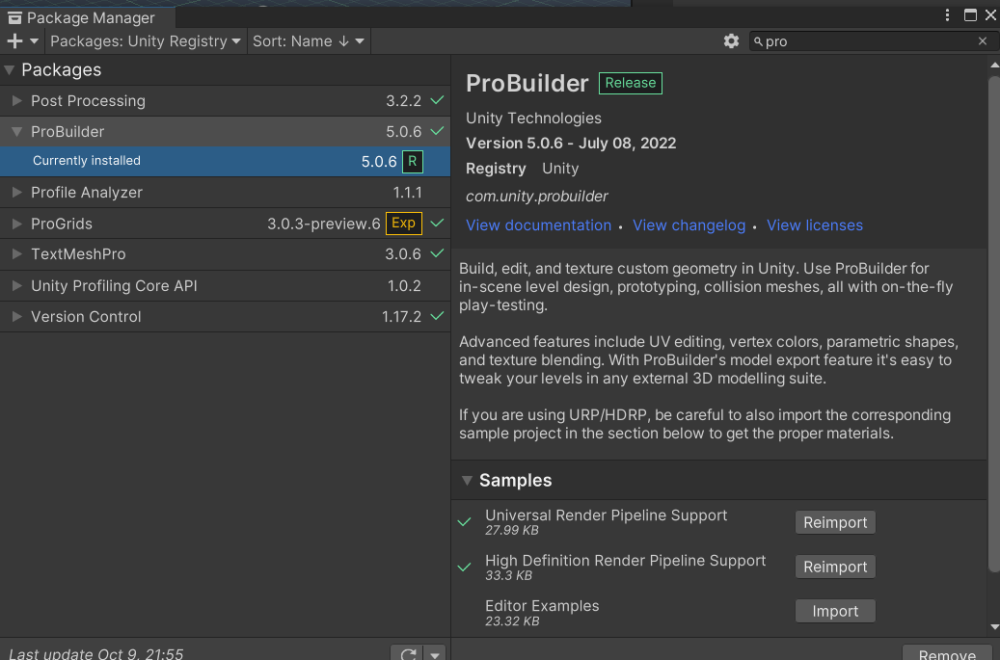

### 3种构建白盒的方式()
+ 推荐第三种,白盒也就是场景的初步盒子
+ 第一种 先画平面(使用第一张图片),  我们对平面的线切割然后让线围绕我们想要旋转的方向使用(挤压出别的线)
    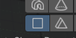
    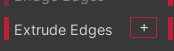 
     + 然后使用线构成的面 向上拉伸构造 立体图形
     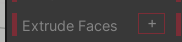
    + 最终效果  
   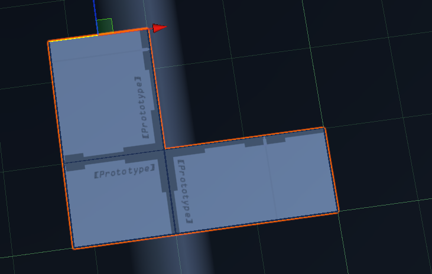

+ 第二种 方式 之间用一个立体图形 构建正方体 再次使用 分割线 切出他的四个墙壁
   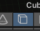
  + 小技巧 我们在切完以后就 使用面的挤压工具(记得把它设置成0)就可以单独移动面,而不是挤压
  + 围绕你选中的先画一个垂直线 这样就可以做到切割
  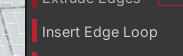
  + 最终效果
  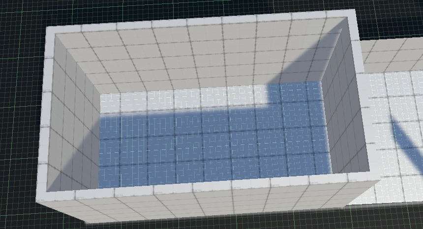

+ 第三种方式 也是我最推荐的 利用New Poly shape 构建一个不规则的模型
   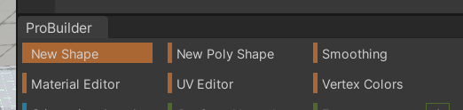
   + 同时使用Inspector 中 Flip Normals镂空,直接做到最快构建一个四周的墙壁
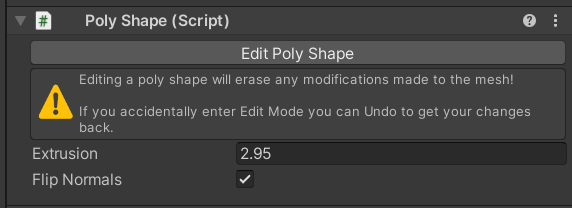
   + 最终效果
   + 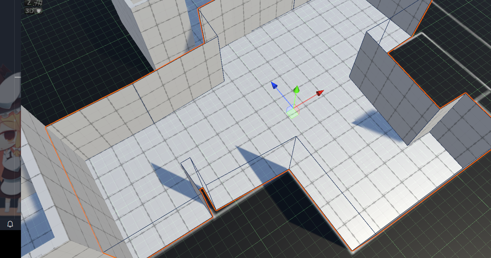
   