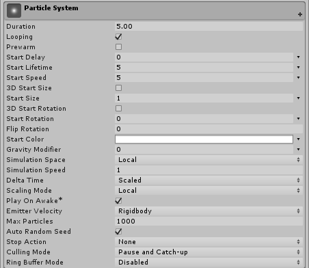
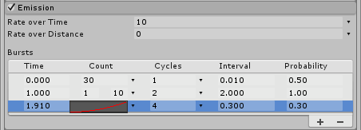
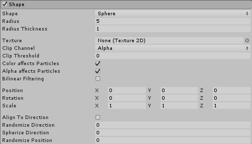
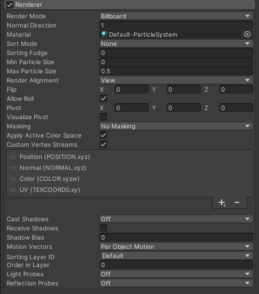

# 内置例子系统入门

## 1. 特效 VFX 概述

### VFX ： Visual Effects 视觉特效

视觉效果（有时缩写为VFX ）是在电影制作和视频制作中的真人镜头环境之外创建或操纵图像的过程。

游戏中的视觉特效从功能上可以分为两类：

* 环境影响旨在表示物理事件，例如火灾、雨水、薄雾或爆炸；当然，也可以延伸到非自然现象，例如魔法等。
* 游戏效果旨在增强或吸引对特定用户交互的关注。例如，您可以在选择对象时添加发光效果，或者在游戏内成就附带的庆祝效果，巫师三中的调查视角就是一个很好的例子。实际上这种特效，可以理解为对UI的增强。

常被用作各种特效动画、技能系统、以及一些视觉细节表示；能大幅度提升游戏的整体视觉效果，使游戏变得更加生动。2D、3D游戏中，都应该尽可能地去添加这些特效。

### 视觉特效艺术家

视觉特效艺术家通常负责任何移动但不是角色或动物的计算机生成图像 (CGI) 。

* 如果它不动（如树或建筑物），它可能是由 3D 艺术家制作的，包括 3D 建模师和纹理艺术家。
* 如果是动画角色，则可能是角色艺术家、装配艺术家或动画师的责任。

大多数 VFX 艺术家将在传统艺术原则（如颜色、纹理和构图）方面有基础。他们还将熟悉物理和流体动力学，以了解液体、布料类型或粒子在不同条件下的行为。

除了 Unity，VFX 艺术家可能会使用或熟悉其他软件程序，包括：

* 2D 图像编辑软件，例如Photoshop，用于创建 2D 纹理和粒子
* 3D 建模和动画软件，例如Maya，为某些效果创建 3D 形状
* 专门从事流体和粒子等程序模拟的软件，例如Houdini

## 2. Unity 特效系统

在 Unity 官方文档中，共列出5种特效分类：

| 功能     | 名称               | 描述                                                     |
| -------- | ------------------ | -------------------------------------------------------- |
| 粒子特效 | 粒子系统           | Unity 特效的核心实现模块，各种粒子效果。有老版和新版之分 |
| 后期光影 | 后期处理和全屏效果 | 设置和使用后期处理 和 Unity 中的其他全屏效果             |
| 后期光影 | 镜头光晕和光晕     | 创建镜头光晕和晕轮效应                                   |
| UI 增强  | 贴花和投影仪       | 创建贴花和投影仪效果                                     |
| UI 增强  | 线路、小径和广告牌 | 渲染线条、轨迹和广告牌                                   |

我们入门系列学习的核心是粒子系统

### 内置粒子系统和 VFX Graph

* 内置粒子系统：粒子系统是 Unity 默认的基于组件的系统，默认使用 CPU 运算。该解决方案允许通过 C# 脚本对系统及其包含的粒子进行完全的读/写访问。您可以使用粒子系统 API 为粒子系统创建自定义行为。
* VFX Graph 是一个更新的、基于节点的系统，它非常强大，默认使用 GPU 运算。该解决方案可以在 GPU 上运行以模拟数百万个粒子并创建大规模的视觉效果。Visual Effect Graph 还包含一个视觉图形编辑器，可帮助您创作可高度定制的视觉效果。

### 如何选择粒子系统

### 粒子系统用途

* 场景中：装饰场景
* 装备上：类似场景中，提升装备逼格
* 动画中：提升动画效果
* UI中：美化UI
* 技能中：实现炫酷技能效果
* ......

## 3. 内置粒子系统

粒子系统：模拟并渲染许多称为粒子的小图像或网格以产生视觉效果。系统中的每个粒子代表效果中的单个图形元素。系统共同模拟每个粒子以产生完整效果的印象。

需要创建诸如火、烟或液体之类的动态对象时，由于很难用单独的网格 (3D) 或精灵 (2D) 描绘这种对象，因此粒子系统非常有用。网格和精灵更适合于描绘诸如房屋或汽车之类的大的、独立的实体对象。

内置粒子系统，是 Unity 旧版的例子系统，默认使用 CPU 来进行运算处理。

优点：

* 可以使用 C#脚本与系统和其中的单个粒子相互作用
* 粒子系统可以使用 Unity 的底层物理系统，比如重力和碰撞

## 4. 粒子系统组件

粒子系统组件，应该是Unity中最复杂的组件。

拥有Unity所有组件中最多的属性，为方便起见，inspector 中，将它们组织成称为“模块”的可折叠部分。这些模块记录在单独的页面中。

内置粒子系统原理上其实很简单，由发射器（类似水枪）和粒子（类似水枪中喷出的水）组成，上面提到的那些属性，基本上都是用来描述这两个核心功能对象的

### 发射器 Emitter

用来将粒子发射出去的装置（或者说是生成粒子的装置），虽然不可见，但它还是存在的。比如粒子系统的第一个属性：Duration 时长，描述的就是发射器发射粒子的时间长度，在这个时间长度中，会一直发射粒子，然后停止粒子产出。

### 粒子 Particle

粒子系统中的可视部分，我们看到的效果，就是由这些一个个粒子组成的。

* 粒子本身形状：可以是3D mesh ，也可以是2D 的 Spirit 。但一个粒子系统中，只能使用同一种粒子形状。所以一个复杂的粒子效果，通常是多个粒子系统的组合。
* 描述粒子的其他属性：有很多个，分别分布在粒子系统的不同模块中，比如发射时的属性（每个粒子的生存时间、速度....）、是否发光（光照属性）、是否能碰撞（碰撞属性）...... 通过对这些属性的设置，可以获得各种不同的、纷繁炫丽的视觉效果

### 默认四核心组件

一般来说，添加一个粒子系统到场景中后，会默认开启四个模块，称为粒子系统的“四核心”模块：Particle System 主模块、Emission 发射模块、Shape 形状模块、Renderer 渲染器模块。但也不是每一种粒子特效都要包含这四个模块，在一些特殊情况下，有的模块也可以不要，比如，一些2D特效中，就可以去除 Emission 模块。

### 预览操作面板

在场景视图中，选中包含粒子系统组件的游戏对象，会打开粒子系统预览操作面板

### 4.1 主模块 main

粒子系统模块包含影响整个系统的全局属性。大多数这些属性控制新创建的粒子的初始状态。

主模块标题会显示为包含粒子系统的游戏对象名称

| 名称                          | 功能                                                                                                                                                                                                                                                                                                                                                                                                                                                                   |
| ----------------------------- | ---------------------------------------------------------------------------------------------------------------------------------------------------------------------------------------------------------------------------------------------------------------------------------------------------------------------------------------------------------------------------------------------------------------------------------------------------------------------- |
| Duration 发射器时长           | 粒子系统运行的时间长，即发射器发射粒子总时长度                                                                                                                                                                                                                                                                                                                                                                                                                         |
| Looping 循环                  | 是否循环播放                                                                                                                                                                                                                                                                                                                                                                                                                                                           |
| Prewarm 预热                  | 如果启用，系统将被初始化，就好像它已经完成了一个完整的周期（仅在也启用了循环时才有效）                                                                                                                                                                                                                                                                                                                                                                                 |
| Start Delay 启动延迟          | 粒子系统开始发射前的延迟（以秒为单位）                                                                                                                                                                                                                                                                                                                                                                                                                                 |
| Start Lifetime 启动生命周期   | 粒子的显示时长                                                                                                                                                                                                                                                                                                                                                                                                                                                         |
| Start Speed 启动速度          | 每个粒子在适当方向上的初始速度                                                                                                                                                                                                                                                                                                                                                                                                                                         |
| 3D Start Size 3D起始尺寸      | 想分别控制每个轴的大小，请启用此选项                                                                                                                                                                                                                                                                                                                                                                                                                                   |
| Start Size 起始尺寸           | 每个粒子初始大小                                                                                                                                                                                                                                                                                                                                                                                                                                                       |
| 3D Start Rotation 3D起始旋转  | 想分别控制每个轴的旋转，请启用此选项                                                                                                                                                                                                                                                                                                                                                                                                                                   |
| Start Rotation 起始旋转       | 每个粒子的初始旋转角度                                                                                                                                                                                                                                                                                                                                                                                                                                                 |
| Filp Rotation 翻转旋转        | 使一些粒子向相反方向旋转                                                                                                                                                                                                                                                                                                                                                                                                                                               |
| Start Color 起始颜色          | 每个粒子的初始颜色                                                                                                                                                                                                                                                                                                                                                                                                                                                     |
| Gravity Modifier 重力修改器   | 按比例缩放重力值，0会关闭重力，负值会产生反重力，即朝上飘 ；还可以设置为非固定值或随机值                                                                                                                                                                                                                                                                                                                                                                               |
| Simulation Space 模拟空间     | 控制粒子是否在父对象的本地空间（因此随父对象移动）、世界空间或相对于自定义对象（随您选择的自定义对象移动）进行动画处理                                                                                                                                                                                                                                                                                                                                                 |
| Simulation Speed 模拟速度     | 调整整个系统更新的速度                                                                                                                                                                                                                                                                                                                                                                                                                                                 |
| Delta Time 间隔时间           | 在Scaled和Unscaled之间进行选择，其中Scaled使用Time窗口中的Time Scale值，而Unscaled忽略它。例如，这对于出现在暂停菜单上的粒子系统很有用                                                                                                                                                                                                                                                                                                                                 |
| Scaling Mode 缩放模式         | 如何使用缩放。可选择项为：Hierarchy、Local或Shape。Local仅应用粒子系统变换比例，忽略任何父项。Shape模式将缩放应用于粒子的起始位置，但不影响它们的大小。                                                                                                                                                                                                                                                                                                                |
| Play On Awake 自动播放        | 如果启用，粒子系统会在创建对象时自动启动                                                                                                                                                                                                                                                                                                                                                                                                                               |
| Emitter Velocity 发射器速度   | 选择粒子系统如何计算继承速度和发射模块使用的速度。该系统可以计算速度使用刚体组件，如果存在，或通过跟踪的运动变换组件. 如果不存在 Rigidbody 组件，则系统默认使用其 Transform 组件                                                                                                                                                                                                                                                                                       |
| Max Particles 最大粒子数      | 一次系统中的最大粒子数。如果达到限制，则会移除一些粒子                                                                                                                                                                                                                                                                                                                                                                                                                 |
| Auto Random Seed 自动随机种子 | 如果启用，粒子系统在每次播放时看起来都不同。设置为 false 时，每次播放时系统完全相同                                                                                                                                                                                                                                                                                                                                                                                    |
| Random Seed 随机种子          | 禁用自动随机种子时，此值用于创建独特的可重复效果                                                                                                                                                                                                                                                                                                                                                                                                                       |
| Stop Action 停止动作          | 当属于系统的所有粒子都完成后，就可以使系统执行一个动作。当一个系统的所有粒子都死了，并且它的年龄超过了它的持续时间时，它就被确定为停止了。对于循环系统，仅当系统通过脚本停止时才会发生这种情况。可选择执行的动作有：禁用游戏对象、销毁游戏对象、执行回调事件                                                                                                                                                                                                           |
| Culling Mode 剔除模式         | 选择当粒子离开屏幕时是否暂停粒子系统模拟。可选择选项：  *  Automatic 自动 ：循环系统使用Pause，所有其他系统使用Always Simulate。 *  Pause And Catch-up 暂停并赶上 ： 系统在屏幕外停止模拟。当重新进入视图时，模拟会执行一个很大的步骤，以达到如果它没有暂停的点。在复杂系统中，此选项可能会导致性能峰值。*  Pause ：系统在屏幕外停止模拟 *  Always Simulate 始终模拟：系统在每一帧上处理它的模拟，不管它是否在屏幕上。                                                 |
| Ring Buffer Mode 环形缓冲模式 | 使粒子保持活动状态，直到它们达到最大粒子数，此时新粒子会提前回收最旧的粒子，而不是在粒子的生命周期结束时移除粒子。 可选择选项：  *   Disabled 禁用 ：禁用Ring Buffer Mode ；*  Pause Until Replaced ：在其生命周期结束时暂停旧粒子，直到达到最大粒子限制，此时系统会回收它们，因此它们会作为新粒子重新出现； *  Loop Until Replaced ：在其生命周期结束时，粒子会倒回到其生命周期的指定比例，直到达到最大粒子限制，此时系统会回收它们，因此它们会以新粒子的形式重新出现 |

> 注意：
> * 单次粒子系统显示时长 = Duration + Start Lifetime ； 即 发射器发射粒子的总时间长度+最后一个粒子的存活时间  
> * Gravity Modifier 是重力缩放比例，即 1 相当于 1倍重力，默认重力是 9.81 ，除非你在配置里更改了这个值
> * Simulation Space属性确定粒子是随粒子系统父对象、自定义对象移动还是在游戏世界中独立移动。即：局部坐标还是世界坐标。例如，云、软管和火焰喷射器等系统需要独立于其父游戏对象进行设置，因为即使产生它们的对象四处移动，它们也会在世界空间中留下持续存在的轨迹。如果模拟粒子在两个电极之间产生火花，则粒子应与父对象一起移动。当设置为自定义时，粒子不再相对于它们自己的变换组件移动。相反，它们都相对于指定的 Transform 组件的移动而移动。粒子系统使用自定义变换来计算发射器速度，发射器的继承速度模块和距离上的速率属性用于控制粒子速度和发射。

### 4.2 Emission 发射模块

此模块用来设置发射器的发射频率和时间

包含属性：

| 属性名                            | 功能                       |
| --------------------------------- | -------------------------- |
| Rate over Time 频率随时间变化     | 每秒发射的粒子数           |
| Rate over Distance 频率随距离变化 | 每移动单位距离发射的粒子数 |
| Bursts 突发、爆发                 | 爆发是产生粒子的事件       |

发射速率可以是恒定的，也可以根据曲线在系统的整个生命周期内变化。如果速率随距离模式处于活动状态，则父对象移动的每单位距离都会释放一定数量的粒子。这对于模拟物体运动实际产生的粒子非常有用（例如，泥土路上汽车车轮上的灰尘）。

如果Rate over Time处于活动状态，则无论父对象如何移动，每秒都会发射所需数量的粒子。此外，您可以添加在特定时间出现的额外粒子的爆发（例如，产生烟雾的蒸汽火车烟囱）。

### 4.3 Shape 形状模块

该模块定义了可以发射粒子的体积或表面，以及起始速度的方向。简单来说，Shape属性定义了发射器的形状。

所有形状（除了Mesh）都具有定义其尺寸的属性，例如Radius属性。也可以在场景中，直接使用编辑手柄拖拽，用以更改形状、大小。

形状的选择会影响可以发射粒子的区域，还会影响粒子的初始方向。

不同的形状有不同的属性设置，内容较多，就不再搬了，大家可以直接去看官方文档：https://docs.unity3d.com/2023.1/Documentation/Manual/PartSysShapeModule.html

### 4.4 Renderer 渲染器模块

渲染器模块的设置决定了一个粒子的图像（2D Sprite）或网格（3D Mesh）如何被变换、着色和绘制

详细属性设置，见官方文档：https://docs.unity3d.com/2023.1/Documentation/Manual/PartSysRendererModule.html

核心属性：

* Render Mode ： Unity 如何从图形图像（或网格）生成渲染图像。

* 广告牌渲染模式通常用于2D粒子素材，当您使用 2D 广告牌图形时，不同的渲染模式可以产生各种结果，使其适合特定用途：
  * 广告牌模式对于表示从任何方向（例如云）看起来相似的体积的粒子很有用。
  * 当粒子覆盖地面（例如目标指示器和魔法法术效果）或当它们是平行于地面飞行或漂浮的平面物体时，水平广告牌模式很有用。
  * 垂直广告牌模式使每个粒子保持直立并垂直于 XZ 平面，但允许它围绕其 y 轴旋转。当您使用正交相机并希望粒子大小保持一致时，这会很有帮助。
  * 拉伸广告牌模式以类似于传统动画师使用的“拉伸和挤压”技术的方式强调粒子的表观速度。请注意，在 Stretched Billboard 模式下，粒子被对齐以面向相机，并且还与它们的速度对齐。无论 Velocity Scale 值如何，都会发生这种对齐 - 即使 Velocity Scale 设置为 0，此模式下的粒子仍会与速度对齐。

> 注意：
> 使用广告牌渲染模式时，可以使用法线方向在平面矩形广告牌上创建球形阴影。如果使用将光照应用于粒子的材质，这有助于创建 3D 粒子的错觉。

## 5. 如何设计粒子特效？

1. 总体构思：构思画草图；
2. 时间分割：粒子特效是动态的，必须从时间上先分步骤
3. 空间分割：粒子特效通常是组合状态，所以也需要从空间划分成不同部分
4. 粒子素材：选择合适的素材充当为粒子
5. 轨迹：是否需要轨迹，如何运动
6. 物理系统：是否需要重力，是否需要碰撞等等
7. 编码：是否需要代码控制，考虑和其他对象交互的逻辑

 

 

配套视频教程：
[https://space.bilibili.com/43644141/channel/seriesdetail?sid=299912](https://space.bilibili.com/43644141/channel/seriesdetail?sid=299912)

文章也同时同步微信公众号，喜欢使用手机观看文章的可以关注

