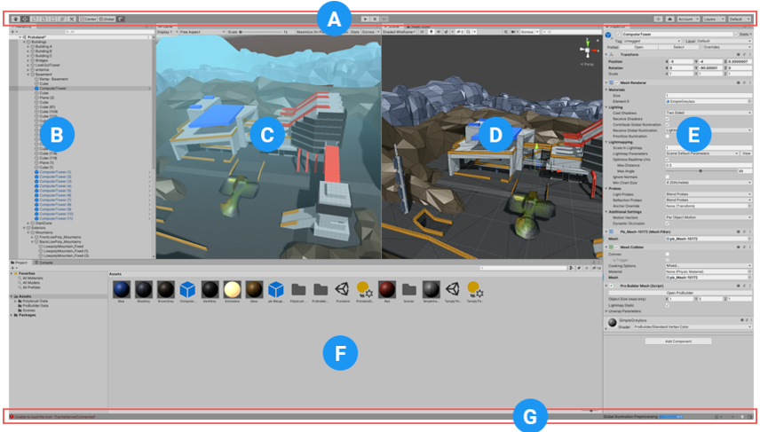

# 软件界面总体介绍

## 1. unity 界面 官方文档

[unity 界面 官方文档](https://docs.unity3d.com/cn/current/Manual/UsingTheEditor.html)

## 2. 界面总体介绍

Unity 软件界面组成 9 大金刚（）： 2+3+4：

### 2.1 2个视图：

* Scene 视图：编辑场景的地方，场景可以先简单认为是游戏中的每个关卡，基本上游戏中能看到的所有元素，都包含在场景，可以通过 scene 视图来编辑、操作
* Game 视图：游戏最终执行效果展示位置

### 2.2 3个窗口

unity 和很多功能强大的可视化窗口软件一样，每一组相关功能都会被设计制作为一个窗口，用户可以通过这个窗口来操作这一系列功能。

unity  菜单栏 window 中，包含了 Unity 中可以使用的功能窗口，在此，先介绍其中最重要的3个

* project 窗口 : 资源库
* Hierachy 窗口：[ˈhaɪərɑːrki] 层级窗口 ，游戏对象按层次展示在该窗口中，可以快速定位我们要操作的对象，并清晰展示对象间关系
* Inspector 窗口：检查窗口，也可以称为属性窗口，可以查看并配置选中对象的各个属性，选中的对象不同，布局和内容也不同

其他的窗口，等用到时，再介绍

> 注意：  
> 窗体可根据自己的项目需要进行增减，一般规则是：根据使用频率和内容布局来进行调整，用的多的就保持常开，用的少的可以除使用时，保持关闭（节省软件界面空间）
### 2.3 4个栏位

基本上每个 windows 标准视窗应用都包含的标准布局位置

* 标题栏：标题（图标-项目名称-项目默认打包方式-unity版本号-使用的可视化api）和控制按钮（最小化-窗口/全屏-关闭）
* 菜单栏：可以找到所有功能的地方
* 工具栏：常用的基本操作
* 状态栏：unity 信息反馈

## 3. 布局

除去4个栏位不能拖动，unity 中那 2个视图区域 + 3个窗口，以及其他的一些窗口，都可以自由布局，可根据自己的使用习惯，设置不同的布局，并且存储下来，随时可以还原。

配套视频教程：[https://space.bilibili.com/43644141/channel/seriesdetail?sid=299912](https://space.bilibili.com/43644141/channel/seriesdetail?sid=299912)

文章也同时同步微信公众号，喜欢使用手机观看文章的可以关注

