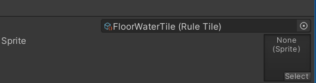
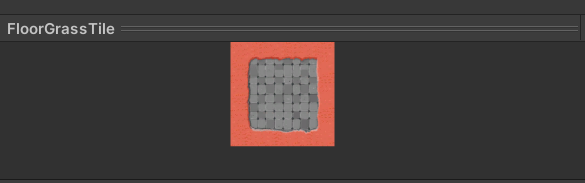
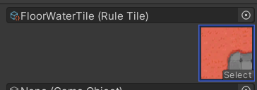
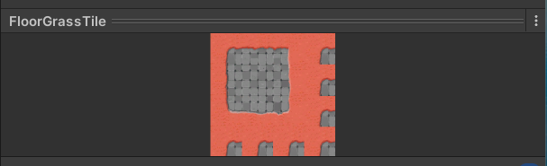
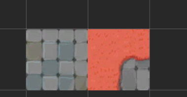
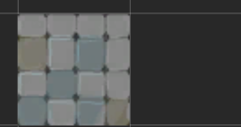

##  我们在创建ruleTile 瓦片集的时候发现
+ 在瓦片集中 Defalut Sprit 无法添加sprite 否则会使下方预览中出现错乱

+ 在添加sprit 以后,出现预览错误,在TileMap绘制中也会出错.

+ 为什么要添加Sprite 是因为我们想要在Thilepalte中看见

+ 否则会出现这样的现象 

+ 如何解决 实际上是可以选中的,只是他没有图片显示罢了