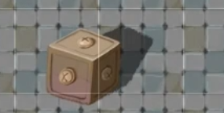
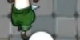
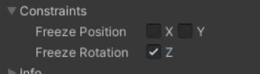
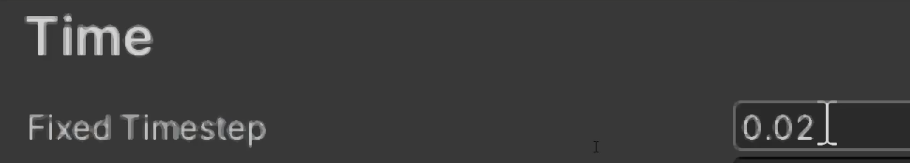
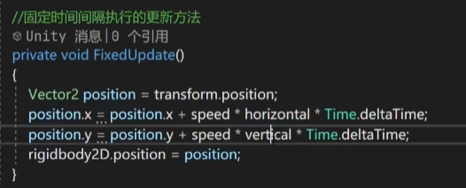
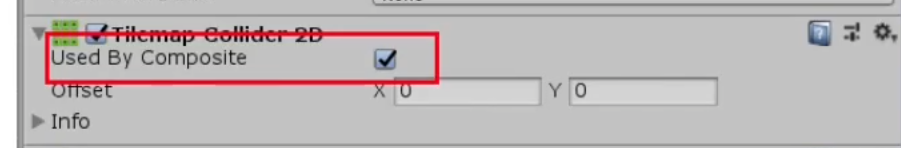
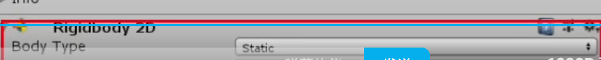
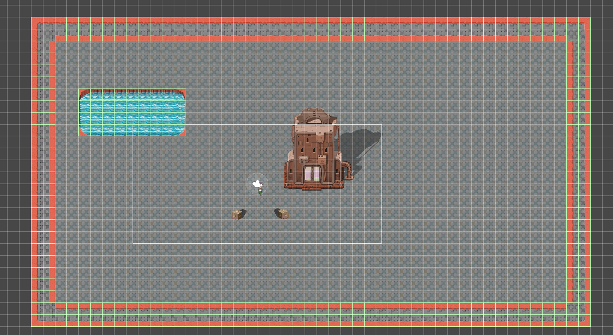

## 经验之谈
+ 关于碰撞区域的设置
  + 类似箱子之类的我们一般在2D中设置箱子的第一个面的碰撞范围
  + 人物我们设置下半身的碰撞区域
  + 
  + 
+ 人物和碰撞体接触时人物围绕箱子旋转 
  + 2D中只有xy轴,所以旋转的发生是绕着z轴旋转 冻结他的旋转就可以了
  + 
+ 人物和箱子接触时发生弹簧的抖动的效果
  + 这个是Rigidbody.position和Transform.position区别,如果您使用Rigidbody.position更改刚体的位置，则变换将在下一个物理模拟步骤后更新这比使用Transform.position更新位置更快，因为后者将导致所有附加的碰撞器重新计算它们相对于刚体的位置。
  + 刚体和sprite是连接在一起的,所以Rigidbody.position和Transform.position是同一个位置.
  + 上面的意思就是说,如果是Transform.position他会让刚体和sprite先动,在计算碰撞器的位置,所以使用Transform.position的时候,导致碰撞器重叠,卡Bug了,所以以后推荐使用Rigidbody.position.
  + 同时有关物理系统的需要使用FixedUpdate来更新,50次每秒调用update
  + 
  + 
+ 碰撞体的效果优化, 如果游戏中每个瓦片都计算独立碰撞体那么需要消耗大量的游戏资源
   + 要使用碰撞,首先添加TileMap的TileMap Coillder 2D 碰撞 
   + 瓦片连在一起,单独计算碰撞体,他们之间会有微小间隙,导致bug 使用Composite Collider 2D  勾选就行
   + 
   + 建议把物理系统改成static 减少资源的使用
   + 

## 碰撞区域查看(所以的线都可以这样操作)
+ 选中Grid网格组件
+ 然后 点击显示辅助区域图表,就可以看到看不到的线
+ 以此类推,都可以这样操作
+ 
+ 最终显示为:
+ 