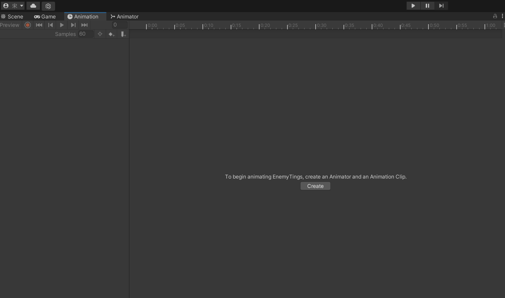
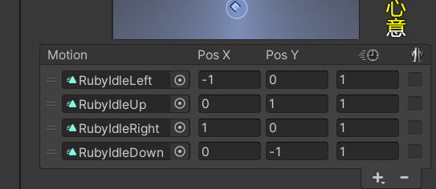
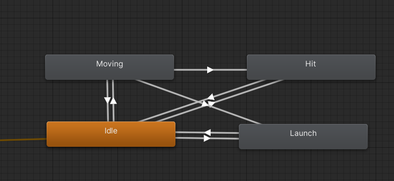

### Animator 和animation的区别和
+ 一个gameobject 绑定一个Animator ,你创建的animation动画可以添加到animator 编辑界面中去
+ animation 就是你存放一个个动画的地方,你需要先要选中Hierarchy中的一个对象,才能添加动画,目的是Unity为了实现动画播放的可预览性.

### animation编辑界面
+ 只有选中对象才会有Create 按钮的出现.


### Animator 界面
+ 我们利用BlendTree 来为一个角色的状态添加不同动画
  + 例如Rube四个跑动方向就可以集合在同一个BlendTree
  + 在右边的窗口中选择我们需要添加的动画 
  + 
+ Rube 拥有多个状态,待机和奔跑,他们之间我们设置转换状态,BlendTree 来连接
  


### 我们利用一个Vector2 来区分物体的不同状态
```C#

  /// <summary>
                /// Ruby的动画状态机不停的转换.
                /// 利用一个Vector2 带标识, _move的本质是一个向量,所以speed就是_move的长度,x和y一起决定_move的方向,
                /// Normalize 会将(-2,0)向量变成长度为1的向量规范化输出.
                /// 关于整个动画制作我们可以得出一个流程
                /// </summary>
                /// 
            float herizontal = Input.GetAxis("Horizontal");
            float vertical = Input.GetAxis("Vertical");
            
            Vector2 _move = new Vector2(herizontal, vertical);
            if (!Mathf.Approximately(_move.x, 0.0f) || !Mathf.Approximately(_move.y, 0.0f))
            {
                _lookDriaction.Set(_move.x, _move.y);
                _lookDriaction.Normalize();
            }
            
            _animator.SetFloat("Look X", _lookDriaction.x);
            _animator.SetFloat("Look Y", _lookDriaction.y);
            _animator.SetFloat("Speed", _move.magnitude);
```


### 整体的制作思路
+ 关于整个动画制作我们可以得出一个流程
   + 优先为一个物体创作出他的Animator ,整个Animator 管理有关于他所以动画
   + 制作出物体Animation 效果
   + 利用BlendTree 汇总一个状态的所有动画, 在连接各个状态BlendTree 的连线
   + 为各个BlendTree之间的转换设置参数,在SCript 中调整他们的转换条件
  