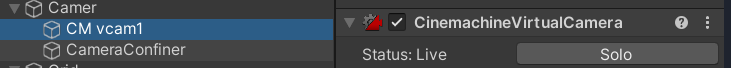
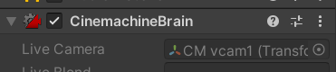
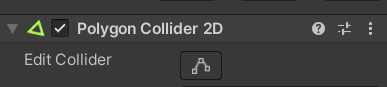
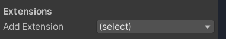
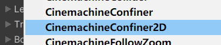
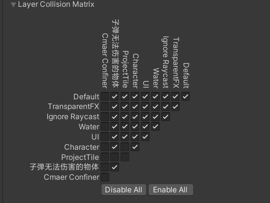

### 使用官方插件 cinemachine
+ 创建一个2D Camera 
+ Main Camera 提供主视角,所以我们利用这个插件创建的是虚拟相机,点击Solo,让Main Camera 换成虚拟相机

+ 主相机

### 我们需要限制相机的视野范围
+ 这个插件可以搞出几个点,然后让你限制范围.  //多边形碰撞2D

+ 在虚拟相机中选择 Add Extension 

+ 在上面插件中再次选择我们创建的多边形碰撞区域
  
### 这个时候你会发现人物直接站在了边缘上
+ 是因为人物被我们创建的相机视野碰撞出去了
+ 你可以全部都不选,这样好像值匡主相机.
