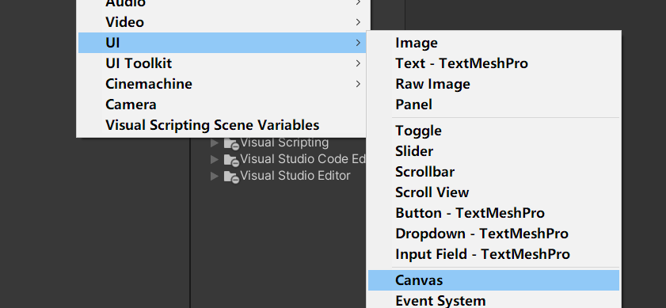
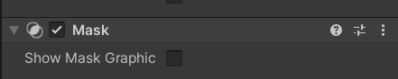
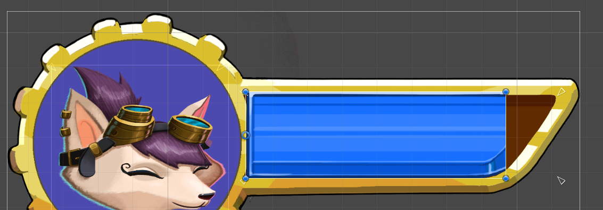

### 步骤
+ 首先添加一个画布,让我们UI 也就是Iamge类有个存放的地点

+ 添加Image以便我们图标等

### 血条的制作
+ 创建一个遮罩Mask同样是image类,不过这个类增加了mask组件
+ 他的作用可以让Image来透明 ,不就起到了遮罩作用.

+ 然后让完整的血条在mask子类中就可以实现了遮挡血条的效果

+ 细节:
  + 你需要设置Mask image 的中心点在左边,同样完整的血条也在左边.
  + 防止出现这样的效果


### 单独设置了一个类HealthBar 来控制血条
```C#

// 为什么会写一个静态类,血条只有一个,那么这个静态类如何得知我们的血条实例,所以awake  利用this ,所以我们只要在UIHealthBar 实例中添加这个Script就行.
    public static UIHealthBar _instance { get; private set; }
    public Image _mask;

    float _originlsize;
    // Start is called before the first frame update
    private void Awake()
    {
        _instance = this;
    }
    void Start()
    {
        // 获取原始Image 长度
        _originlsize = _mask.rectTransform.rect.width;
    }

    // Update is called once per frame
    public void SetVlaue(float vlaue)
    {
        //改变长度.
        _mask.rectTransform.SetSizeWithCurrentAnchors(RectTransform.Axis.Horizontal, _originlsize * vlaue);
    }
```