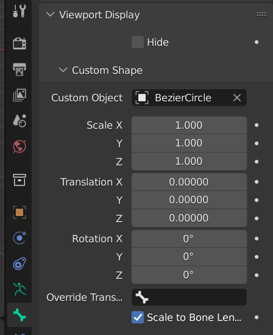
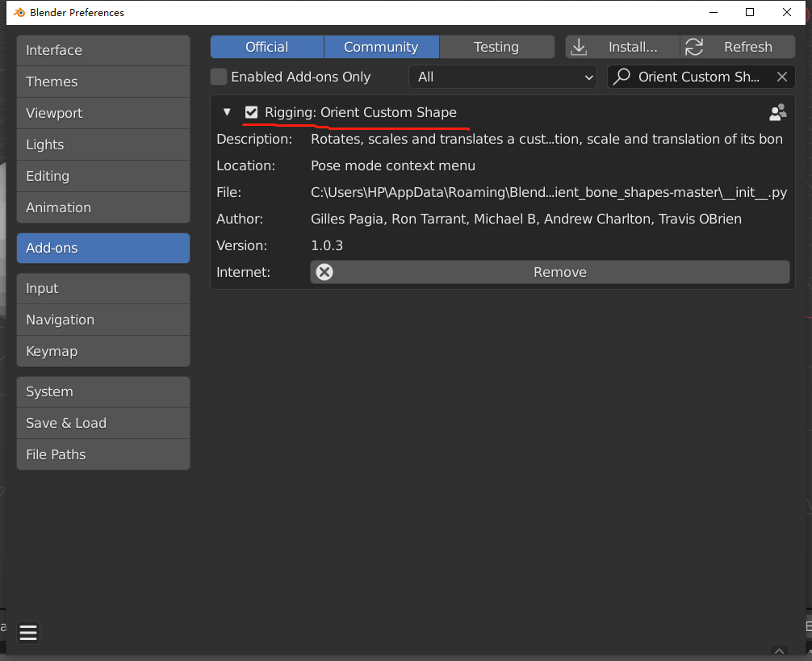
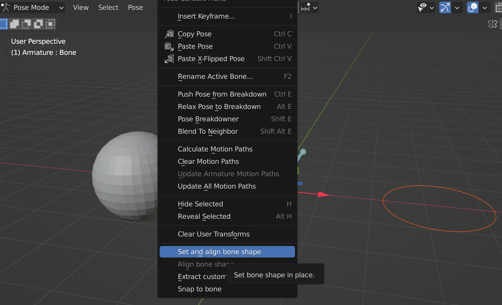

# 自定义骨骼形状

## 0. 为什么要使用自定义骨骼形状

- 更方便的区分骨骼类型
- 更方便地区分骨骼操作方式

## 1. 设置自定义骨骼形状

模式： Object Mode

- 步骤 1 ：添加一个需要的 Mesh 图形，或者其他对象转换而成的 Mesh 对象，作为自定义的骨骼形状；
- 步骤 2 ：选择 Bone > Bone Properties > Viewport Display > Custom Shape > Custom Object > 选中刚生成的 Mesh 对象
  
- 步骤 3 ：如果需要，再进一步调整 Transform

> 注意：
>
> 1. 作为形状的 Custom Object ，必须是 Mesh 对象，否则没有外观；
> 2. 骨骼的坐标轴是沿着骨骼指向作为 Y 轴，外观 mesh 对象一般使用的是 Gloal 坐标轴，所以会产生转向，导致骨骼最终外观方向 和 mesh 对象不一致

## 2. 骨骼坐标轴和对象坐标轴的区别

骨骼坐标，Y 轴 指向骨骼自身方向

对象坐标，坐标轴一般默认和世界坐标轴（Global）一致

## 3. 手动对齐方式

在骨骼套用形状之前，先把 Mesh 对象的坐标轴，调整成和骨骼坐标轴一致

但如果骨骼本身位置并不是很正的话，移动过程非常繁琐

## 4. 使用 Add-on

[Orient bone shapes](https://github.com/scaredyfish/orient_bone_shapes)

1. 安装
   
2. 定位到 Pose Mode 下
3. 先选中 Mesh 对象，再选中骨骼，右键 Set and align bone shape。会在 Mesh 对象的位置生成一个一模一样的骨骼外观
   

> 注意：  
> 如果要让骨骼位置不移动，需要先将 Mesh 对象移动到骨骼的位置
> 记住 如果Set and align bone shape如果显示灰色是因为,你的选择中的物体不是mesh 需要 右键 convert 一下.
 

 

> 参考资料：
>
> - [Blender [2.8/2.9] How to create PERFECT Custom Bone Shapes](https://www.youtube.com/watch?v=5Rltnk36PtI)

 

 

配套视频教程：
[https://space.bilibili.com/43644141/channel/seriesdetail?sid=299912](https://space.bilibili.com/43644141/channel/seriesdetail?sid=299912)

文章也同时同步微信公众号，喜欢使用手机观看文章的可以关注

