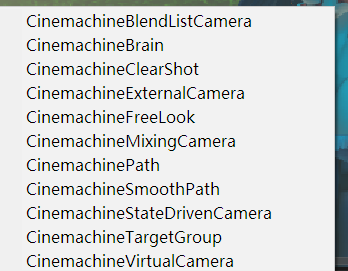
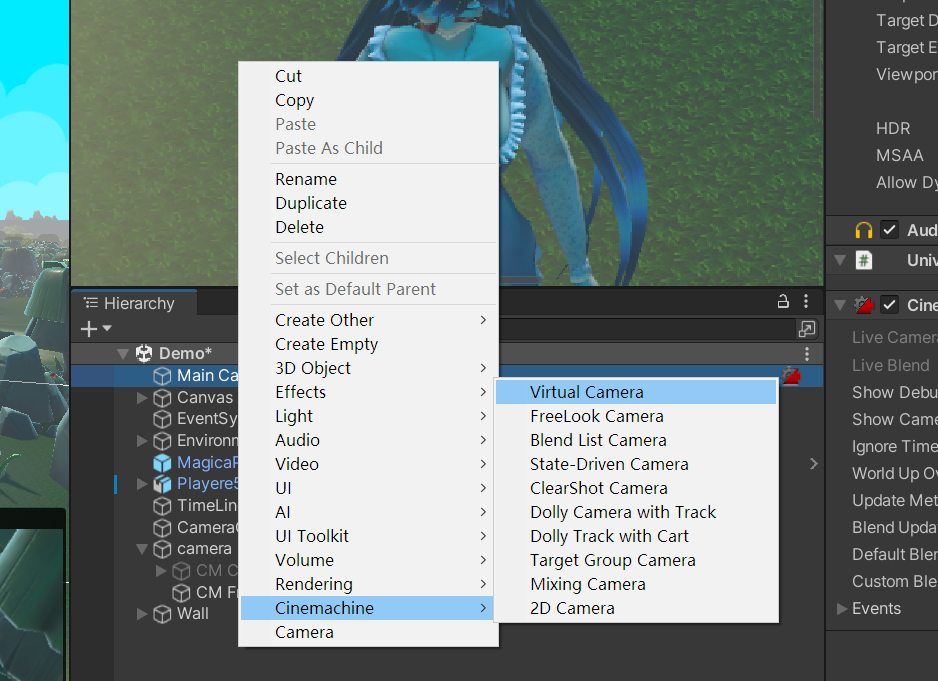

+ 第三个相机 使用遇到障碍物阻挡 然后自动切摄像头
+ 第5个相机 第三人称自由移动
+ 第六个 根据人物位置还有其他的变化,实现相机的切换
+ 第七个 轨道相机,我建议创建的时候直接在Hierachy中创建,成品dolly track相机,Dolly track 一个是相机跟着轨道动,一个是模型跟着轨道动,一般为鸟,实测人物也可以,同时记得在你需要使用的物体身上添加添加脚本,
+ target Group camera 这个相机,他是针对你需要观察多个物体的时候去使用的相机
+ 2D camera 2D的相机,他有一个功能就是可以根据网格体显示相机位置,也就是相机他不会跑出边界.

+ 非常好的入门资料,我的坚持用到再去具体详细.
https://www.bilibili.com/video/BV1vJ411J76K?p=6&vd_source=d018df40edbb612f39981f41f2e7f5b5

### 请配合使用Playables完成更高级自定义控制的TimeLine
+ 相关链接在Unity动画系统 Playables中.