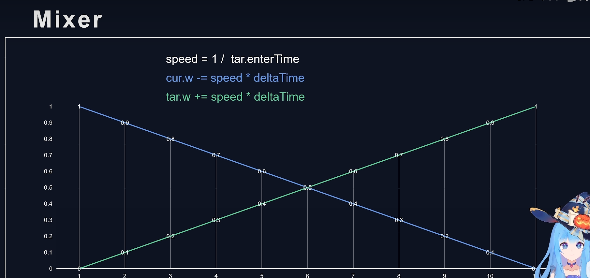
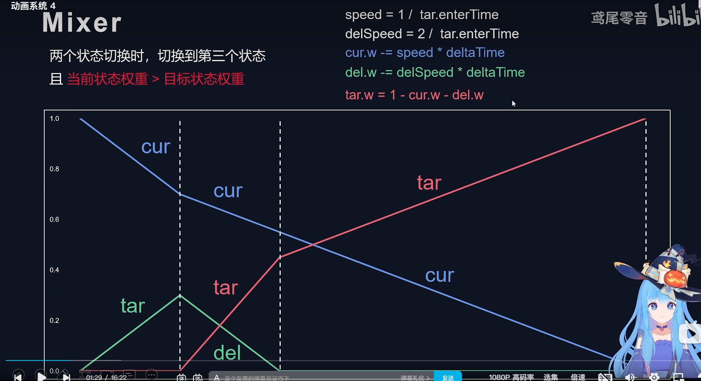
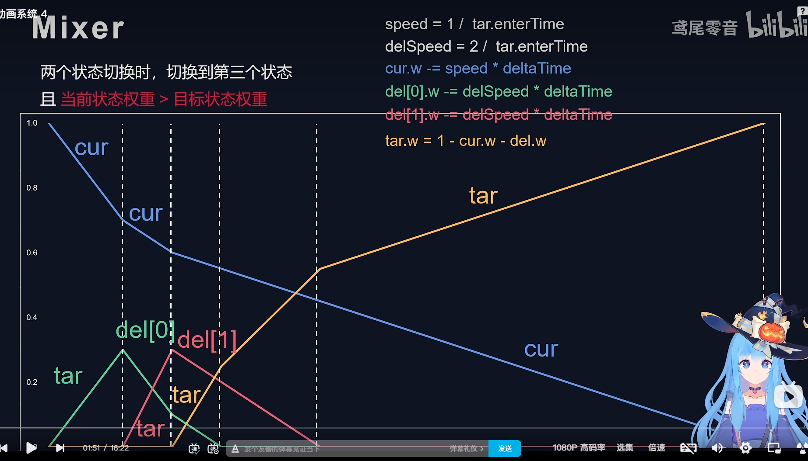
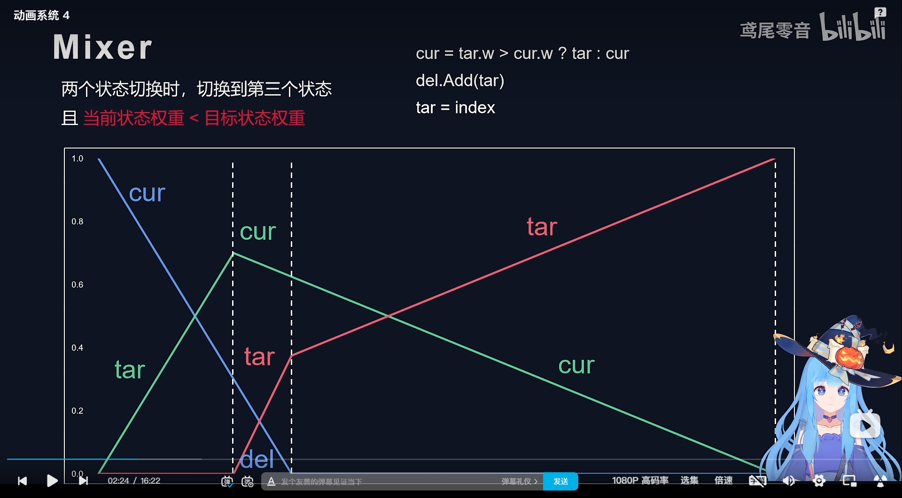

+ 链接: https://www.zhihu.com/question/464825919
+ 动画混合的基本原理是啥:
  + 动画混合无疑就是计算两个动画分别所处的位置,然后混合,例如动画A 和动画B ,两个动画时间相同,经过1秒钟, A动画左手 移动一个运动轨迹,B动画是另一个轨迹,计算左手骨骼平均位置的混合值,就是混合出来的具体动画, 因此动画混合的是骨骼位置(网格点的位置)
+ 两个不同长度的动画又如何混合呢:
  + 长度不同,一个动画跑完了,另一个动画还没到一半就很尴尬,我们这里的动画混合基于权重混合, 动画混合总时长一直变化T ,但是有一个不变的是,现实中的变化A秒,这个A/T的百分比就是混合后动画前进的百分比,因此基于这个百分比,再和权重相乘,就是每条动画自己要前进的百分比,比如,动画A最开始权重为1,非常大,而B非常小,所以A动画最开始前进的就非常快,
  + 表现的就是A动画为主,A动画开始就跑的非常快,之后越来越慢,但是会跑完,B动画也就相反,百分比跑法,跑完百分之100就完成了各种动画,这样就可以忽略了各个动画的长度 

### 混合教程(分三种情况)
1. 两段动画直接交换(看曲线颜色,一个青色,一个绿色, cur就是当前动画.w代表权重)
   + 这里切动画的逻辑是,以最终的动画target,为依据,1代表百分之百进度条,tar.enterTime 代表动画的总体时长
   + 为什么用百分之百,因为动画他是时间为计量单位,没有说每秒钟动画跑好多长度,这里相除意思,每秒钟跑多少比例的动画,这里以target最终目标为主,
   
2. 两段动画正在切换过程中,突然红色线作为新的动画,需要你放弃青色动画,让红色动画先介入.
   + 两倍速度保证动画切换完,原来的青色目标动画下降完,然后权重跟着减少就行
   
3. 面对多个打断动画,这边建议,做个数组,保存每个下降的动画,然后依次减少
   

4. 原来的目标动画权重已经大于原来的状态动画,新的动画作为新加入的,
   + 可以做成把原来的动画当做状态动画,两个在切换,动作就不会僵硬,这里的依据是,那个权重的大的动画就要被当做状态动画,避免小的动画当做状态,然后切换,就没抓住重点
   