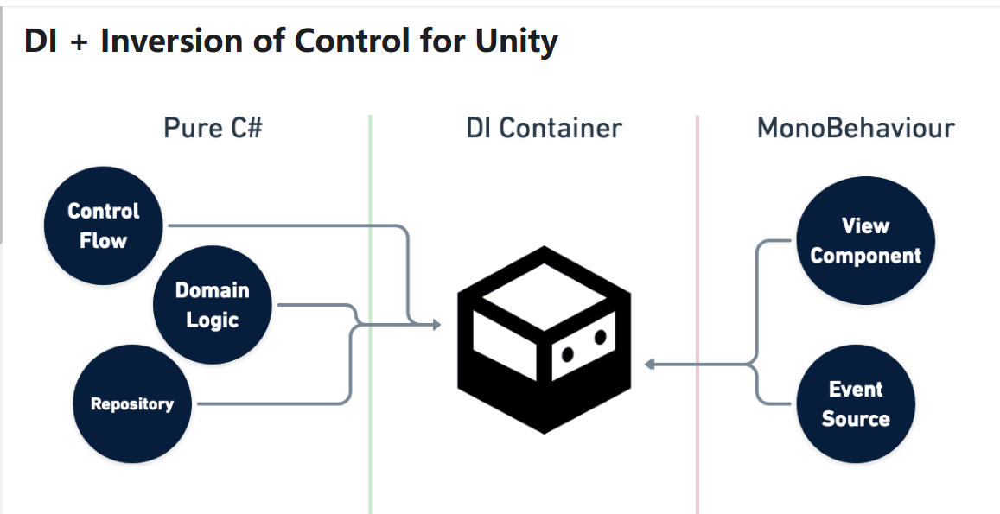

1. 优点:
   + 相较于其他几个DI框架,性能最快,语法也简答很多,Gc回收性能较低
   + VContainer 他可以让你完全脱离MonoBehavior ,拥有模仿的Start,Update的方法
   + 自动注入需要的类实例,降低类之间的耦合,自此,你完全可以分开写逻辑,一共包括,VC插件作用域注册,然后主逻辑类,次逻辑类,视图类,
   + 同时VC不在需要你写所谓的单例模式,他的枚举LifeTime.Singled以这种方式提供,所以用起来吧!非常爽哈哈哈!
   + 

2. 书写的细节
   + 为了联动视图类继承自MonoBehaviour类,所以Unity的插件也是可以在作用域托管的,需要你使用RegisterComponent,同时在作用域序列化显示这个组件,这个组件一般套用在Button上面,然后使用使用,
   + 作用域注册类,然后在构造函数Resolve类,获得适当时机的类实例,需要对你认为的唯一构造函数使用[Inject]来完成注射,推荐在你注册的类前面使用Readonly来方便VContainer注射.

3. InJect(注射的目标)
   + 构造函数
   + 普通函数(配合Unity Test FrameWork)
   + 字段也可以注射