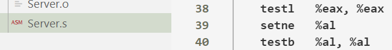
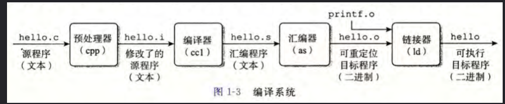
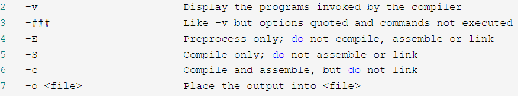

##  首先我们忽略一些一步到位的插件
1. c/c++ Complie Run 这个软件非常方便一步到位，直接编译加运行，+ f6编译运行 
+ F7 我们可以输入一些编译的命令（比如mingw socket lib_32这个静态库，我们在gcc中使用 gcc hello.cpp -o hello -lws2_32,在这个输入中我们可以直接添加 -lws2_32。所以 我猜测F7就是手动加入GCC编译时命令
+ F8 是不是使用额外的终端运行
  
2. RUN code 没用过

----
## 讲解c++ 程序编译的几个时期和形态
+ 第一步 ：头部文件加载和宏的加载时期      gcc hello.c -o hello.i -E得到 hello.i  
+  第二步 ：字法分析 语法树匹配 编译阶段(是否存在语法错误)转换成汇编代码 gcc hello.c -o hello.s -S 得到hello.s   
+  第三步 ：汇编阶段汇编代码得到机械码          -c  hello.o
+  连接静态库和动态库然后执行程序（区别前者是副本后者是链接，所以前者容易重复，但是他速度快https://www.cnblogs.com/cyyljw/p/10949660.html）
+  第四步 ：最后 连接各个 hello.o文件生成hello.exe,静态链接也就是连接的.o文件



---
## 重点讲述 vscode的其中两个重要文件task.json 和launch.json
### 第一个文件task.json
+ 这个文件用于编译的作用,所以你会看到args中其实就是在使用g++的命令,这个不就是代替了g++的手动输入吗,直接使用g++ -o生成可执行的文件.
```JavaScript
{
    "tasks": [
        {
            "type": "cppbuild", //任务类型（这里是c++对应cppbuild   typescript 代表了JavaScript ）
            "label": "这个是Server.cpp 的调试配置", // 可以随便命名，但是要和后面的launch.json 中preLaunchTask一样
            
            
            "args": [ //（常用）编译时使用的参数，和命令行下相同
                "-fdiagnostics-color=always", // gcc 的命令
                //-fdiagnostics-color = always，它会应用一些不错的颜色。 (在linux上工作正常，在msys上工作不多)
                //-fmessage-length = n，它优化了n个字符长度的行的输出。
                
                "Server",//这个对应目录中的Server.cpp
                
                "-o",  //代表g++ -o 输出一个新的文件
                
                "${fileDirname}\\${fileBasenameNoExtension}.exe",  //这里是生成了Server.exe 所以你会发现args两个文件名,第一个你的源文件,第二个你要生成的文件名
                //${fileDirname} -/home/your-username/your-project/folder
                //${fileBasenameNoExtension} -file
                //{fileBasename} -file.ext
                //${relativeFileDirname} -folder目录的名字
                //${relativeFile} - folder/file.ext
                
                "-lws2_32"
            ], //上述内容相当于在命令行下输入了: gcc Server.cpp -o Server.exe
            
            
            "options": { //编译器的目录
                "cwd": "${fileDirname}"
            },
            
            
            "problemMatcher": [ //使用gcc捕捉错误
                "$gcc"
            ],
            
            "group": { //添加测试组的选修
                // kind：定义此任务属于的执行组。它支持 "build" 以将其添加到生成组，也支持 "test" 以将其添加到测试组。
                //  isDefault: 设置成true的话，当按下 Ctrl+Shift+B. 任务就会执行，这很方便；如果设置成false，则需要在面板中执行：Tasks: Run Build Task.才能执行任务。
                "kind": "build",
                "isDefault": true
            },
            "detail": "调试器生成的任务。"
        },

```

## 第二个文件lanuch.json 
+ 配置调试的文件
+ 说c/c++ Complie Run方便,编译到运行一步到位,但是vscode中的单步调试还是需要自己配置文件,这两个文件都可以复制,然后自行更改
``` c++
{
    //这个debug文件容易出现找不到你要debug的.o文件,所以找寻文件目录就是一个非常深思的问题,注意两个目录的配置
    //program 你要debug的项目文件推荐下面的写法,一般workspacedir 不行就用fileDirename
    //cwd     文件目录的开始推荐这种写法,两者配合可以有好的效果,如果你的出现了找不到debug的文件问题,尝试更改两者.
    // Use IntelliSense to learn about possible attributes.
    // Hover to view descriptions of existing attributes.
    // For more information, visit: https://go.microsoft.com/fwlink/?linkid=830387
    "version": "0.2.0",
    "configurations": [
        {
            "name": "Server1",
            "type": "cppdbg",
            "env": {
                "filename": "${fileBasenameNoExtension}"
            },
            "request": "launch", //launch模式允许我们打断点进行调试，默认即可
            "program": "${fileDirname}/${fileBasenameNoExtension}",
            //即"program": 建议使用上面的写法不推荐workspacedir,自动匹配你当前写的文件
            //需要改写的实际可执行二进制文件的路径(包含文件名)，debug调试的是二进制也就是hello.o文件
            //
            "args": [
                "filename"
            ], //（常用）程序(main函数)的入口参数
            "stopAtEntry": false, //在入口处暂停，选true相当于在入口处增加断点
            "cwd": "${workspaceFolder}", //当前的文件目录
            "environment": [], //添加到程序的环境变量
            "externalConsole": false, //外部控制台，true在调试时会开启系统控制台窗口，false会使用vscode自带的调试控制台
            "setupCommands": [
                {
                    "description": "Enable pretty-printing for gdb",
                    "text": "-enable-pretty-printing",
                    "ignoreFailures": true
                }
            ],
            "preLaunchTask": "这个是Server.cpp 的调试配置", //（常用）运行和调试前要执行的task(编译)任务，任务名要和task.json里的"label"对应
        },
```
---

+我还是认为vs2017用的舒服.


## g++各种命令的使用
+ g++ rect.o hellorect.o -lm -static -o hellorec  //-static 链接-o成静态库