## 异步 
+ 图片中我们需要关注几个点
  <br><br>
+ 两个重要的关键字  async 和await
  + 异步的设计初衷就是在执行函数时需要等待的动作重建一个线程,然后让这个线程继续执行
  + 所以目前await 写在的就是我们需要停下来的async里面,lambda表达式也是如此
<br><br>
+ await 
   + await 工作机制 当实际方法遇到尚未完成的第一个await表达式时，它将返回。因此，它返回一个Task，它将在异步方法本身完成时完成。请注意，await的作用相反-将Task< T >展开为T值，这是此行的工作方式：
   + 这东西我们看第一章图片 中直接调用的WebClient的Download函数,直接返回了string
   + 大部分的时候我们是调用自己的Task.Run()  返回的是Task 或者Task< TResult>
   + 但是往往我们await Task.Run 得到的是一个int,这是为什么 不是 返回的是Task吗,利用的await的工作机制,把Task< int>的int反取出来.

<br>

+ Task Run
  + 这个Func< TReturn> func是一个官方委托,所以Task.Run就是一个返回任务Task标志的壳子
  + 这个委托就只有一个返回值没有参数,通过他来决定到底返回的是Task 还是Task< TReturn>看后面
  

  <br>
+ 返回类型 (重点)  这里面有很大的学问
   +看下面的介绍
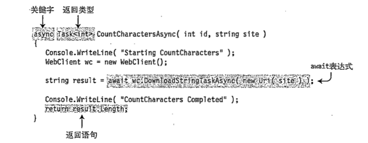
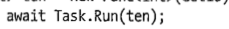
<br><br><br><br>

## 异步的返回类型(这个是根据Task.Run(委托的形式))
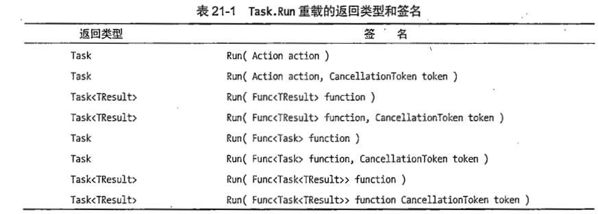
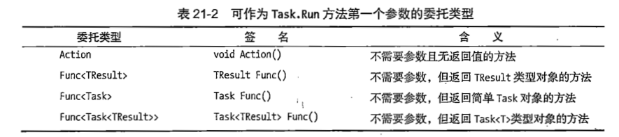
### 第一:&emsp;委托形式是Action的时候(无返回值)
```C#
// 这种属于函数形式的写法
 public static async void CalccuateSumAsync(int i1, int i2)
        {

            int sum = await Task.Run(() => GetSum(i1, i2));
            Console.WriteLine("value: {0}", sum);
            // 因为是
        }

```

+ 没有任何返回值只是一个简单的调用
+ lambda的写法(重点关注task.run的委托的形式)
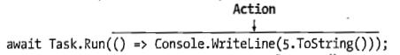
<br><br><br>


### 第二: &emsp;委托形式是TResult Func()的时候(返回的是int类似类型时候)
+ 返回来一个6,这个TResult 不就是6吗
+ lambda的写法(重点关注task.run的委托的形式)
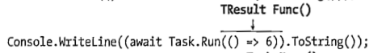
<br>
<br><br>

### 第三:&emsp;委托形式是Task Func()的时候(返回的是int类似类型时候)
```C#
// 这种属于函数形式的写法 
// 函数的写法用函数返回值来敲定到底返回那个  这里我们把sum 分装成了Task
 public static async Task CalccuateSumAsync(int i1, int i2)  //注意返回了一个Task
        {

            int sum = await Task.Run(() => GetSum(i1, i2));
            Console.WriteLine("value: {0}", sum);
            return sum;
```

+ 括号内的task run 封装成Task 然后括号外的task run封装成task< task> 然后await 解开一次不就得到了task吗
+ lambda的写法(重点关注task.run的委托的形式)
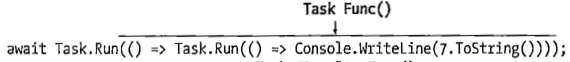
<br><br><br><br><br>
### 第四:&emsp;委托形式是Task < TResult> Func()的时候(返回的是int类似类型时候)
+ 括号内的task run 封装成Task < int> 注意有返回值的时候就封装成了Task<类型> 然后括号外的task run封装成task< task< int>> 然后await 解开一次不就得到了task< int>吗
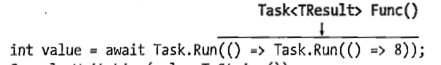

<br><br><br>


## 取消一个异步操作
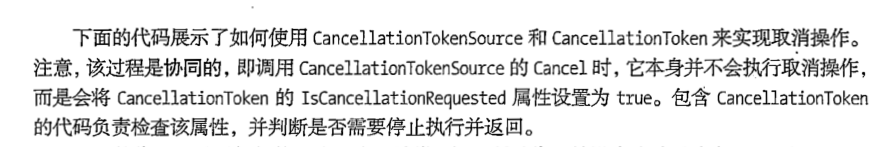
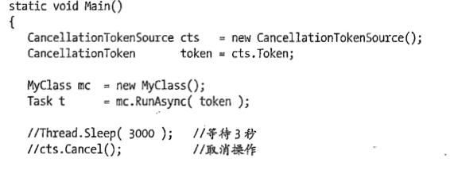
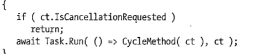
<br><br><br><br>


## 等待的异步 
+ > t.Wait()               //等t任务结束.
+ > Task.WaitAll(t1,t2);   //t1 和t2当然是Task,等待他们全部完成
+ > Task.WaitAny(t1,t2);   //只要一一个完成就行

<br>
## 异步里面的等待
+ 可以理解为WaitAll 的翻版
+ > List<Task<string>> tasks= new List<Task<string>>();
+ > tasks.Add(t1);
+ > tasks.Add(t2);
+ > await Task.WhenAll(tasks);   //差不多的操作
  
<br>
## 异步推迟
+ > await Task.Delay(1000);
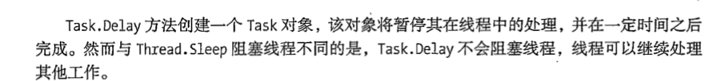