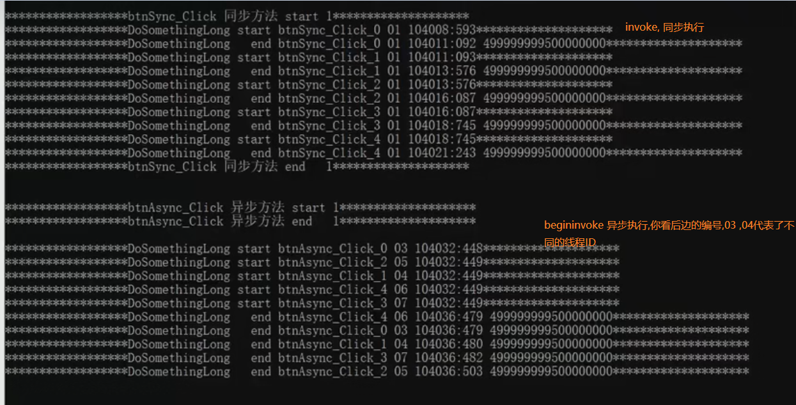

+ 任何异步多线程都离不开委托delegate --lambda-action/Func
+ 委托的异步调用
+ 异步多线程:发起调用,不等待结束就直接进入下一行(主线程)
    + 动作会有新的线程执行.


## 线程特点
+ 特点一:
  + 多线程和界面使用(说白了,多线程就是为了给大量计算创建子线程,然后先执行完后面代码)
    + 场景一: 一个计算量子语言的按钮, 测量光子速度的按钮,这两个按钮之间并没有太大的联系(不卡UI界面,多线程妙用)
      + 同步单线程: 小明点击了量子语言按钮陷入了大量的计算, 此时点击光子按钮没反应,这是因为单线程量子语言的计算没有完成,只有完成,你才能重新开启一个线程.
      + 异步多线程: 点击量子语言,创建了量子语言的子线程后端计算,代码照常执行完成,此时界面因为没有卡代码所以,你可以继续点击,
+ 特点二:
  + 多线程并不会随着你写的线程数而增加
    + cup: 1核3线程
    + 1个线程时间13000ms ,5个线程 4269 ,性能只有三倍
    + 多个线程之间的协调需要资源, 例如线程的创建管理都是资源
    + 物理上只有3线程,你写了5线程并没有更快.

+ 特点三:
 + 根据第一张图片,你看异步中,start线程顺序和end线程顺序他不是一张
 + 图片中我们启动时,是0,1,2,3,4,顺序,但是到打印这个线程编号时过了一段时间,所以线程的启动不是有顺序的.
 + 同一个线程执行的时间都不一致,这个能力跟cpu的调度有关,所以执行看运气.

+ 特点四:
  + 线程他是不可预测的,所以对于有些需要顺序执行的线程就很烦恼,避免下面的坑:
    + 不要尝试使用延时一个线程,然后再一个线程,巨大的坑不要尝试
    + 不要使用多模式的风骚操作  

## 多线程.net的版本介绍
1.   
```C#
// .NerFramework 1.0 1.1
            // 首先Thread线程api非常丰富,可以玩的非常花俏,但是线程是系统分发的,其实这些操作不太好
            // Thread启动线程是没有控制的, 所以你可以启动一万个,但是死机,所以不安全.
            ThreadStart _threadStart = () =>
            {
                Console.WriteLine("**********************异步方法开始了**********************");
                Thread.Sleep(2000);
                Console.WriteLine($"**********************异步方法结束了{Thread.CurrentThread.ManagedThreadId}**********************");
            };
            Thread _thread = new Thread(_threadStart);
            _thread.Start();

        }    
``` 
2. 
```C#
 Console.WriteLine("");
            // .NerFramework 2.0
            // ThreadPool :所以TreadPool池化资源设计思想,线程是一种资源,之前我们1.0时代,你要用就去找计算机申请,而池化是一个容器,现在你要线程就去找这个容器去拿
            // ThreadPool 限制了最大线程数量 ,Api又太少了,控制顺序能力太弱了,不好用
            WaitCallback _waitCallback = o =>
            {
                Console.WriteLine("**********************异步方法开始了**********************");
                Thread.Sleep(2000);
                Console.WriteLine($"**********************异步方法结束了{Thread.CurrentThread.ManagedThreadId}**********************");
            };
            ThreadPool.QueueUserWorkItem(_waitCallback);

```

3. 这个也是我们目前使用的方法
```C#
 // .NerFramework 3.0
            // Task 多线程最好使用方式,提供了丰富api,也有线程池,非常适合开发.

            Action _action = () =>
            {
                Console.WriteLine("**********************异步方法Task开始了**********************");
                Thread.Sleep(2000);
                Console.WriteLine($"**********************异步方法Task结束了{Thread.CurrentThread.ManagedThreadId}**********************");
            };
            Console.WriteLine("");

            Task _task = new Task(_action);
            _task.Start();
```

4. 额外的并发主线程和子线程
```C#
    Console.WriteLine("");
            // Parallel 他可以让主线程和多线程并发运行,不浪费主线程的运算资源,其他的是直接让子线程完成,这个是主线程也当做子线程运算.
            // 
            WaitCallback _waitCallback = o =>
            {
                Console.WriteLine("**********************异步方法开始了**********************");
                Thread.Sleep(2000);
                Console.WriteLine($"**********************异步方法结束了{Thread.CurrentThread.ManagedThreadId}**********************");
            };
            ThreadPool.QueueUserWorkItem(_waitCallback);
```


## Task异步多线程
+ 不要使用线程套线程,
+ Task的妙用 Task.Run 返回执行的Task ,利用list<task> 来存储需要执行的线程
+ 回调线程Continuewith ,回调线程Id号有可能是当前线程,也有可能创建了新的线程完成回调
```C#
             Task _task = new Task(_action);
            _task.Start();  // 这个是启用线程

            List<Task> _list_task = new List<Task>();   //这种写法好啊, 后面的task使用.ToArray来返回数组
            _list_task.Add(Task.Run(() => Console.WriteLine("chusheng 1")));
            _list_task.Add(Task.Run(() => Console.WriteLine("chusheng 2")));
            _list_task.Add(Task.Run(() => Console.WriteLine("chusheng 3")));
            _list_task.Add(Task.Run(() => Console.WriteLine("chusheng 4")));
            _list_task.Add(Task.Run(() => Console.WriteLine("chusheng 5")));
            TaskFactory _taskFactory = new TaskFactory();
            
            // TaskFactory 比较方便,他存储了一些好用的api来使用

            // ContinueWhenAny 有一个线程完成了,就执行后面的线程,同时后面的lambda表达式创建了一个新的线程,让后返回,所以这个函数本身就是一个线程
            _taskFactory.ContinueWhenAny(_list_task.ToArray(), o => { Console.WriteLine($"其中有一个线程完成了{Thread.CurrentThread.ManagedThreadId}"); });

            //ContinueWhenAll 当所以线程完成后,再执行 
            _list_task.Add(_taskFactory.ContinueWhenAll(_list_task.ToArray(), o => { Console.WriteLine($"全部线程完成了{Thread.CurrentThread.ManagedThreadId}"); }));

            // 名字是一样的,不如前面好用 
            Task.WaitAny(_list_task.ToArray());
            Console.WriteLine("项目完成一切口");
            Task.WaitAll(_list_task.ToArray());
            Console.WriteLine("任务搞完了");
```


### 多线程使用技巧
+ 情况一 多次读取,因为主线程计算太快,所以读取不到想要的值,
 ```C#
         for (int i = 0; i < 5; i++)
            {
                int k = i;   //这里的i和k不相同, 如果看结果你发现, i都是5, k是0,1,2,3,4,这是为什么
                // 对于i来说他运行于主线程,所以i的计算从1到5非常快,到子线程读取他的时候,就会是5,而k他是每次创建,所以有5个k;
                Task.Run(() =>
                {
                    Console.WriteLine($"start线程所处于的循环{i} {k}, 当前线程编号 {Thread.CurrentThread.ManagedThreadId}");
                    Thread.Sleep(2000);
                    Console.WriteLine($"end线程所处于的循环{i} {k}, 当前线程编号 {Thread.CurrentThread.ManagedThreadId}");
                });
            }
```

+ 情况二 线程的存储也会有问题
 ```C#
        List<int> intlist= new List<int>();
        for(int i=0;i<10000;i++){
            Task.Run(()=>intlist.Add(i));
            

        }
        Console.WriteLine(intlist.Count);  //这里并没有10000 ,而是999n个数,每次运算结果不同
```

+ 对于线程而言,就是读取和存储时往往出现问题,这就是线程安全,线程不安全,就是单线程顺序执行和多线程结果不同这就是线程不安全.

### await/async语法
+ 首先他不是一个创建线程的方法,创建线程还是需要利用Task.run()
+ 他是c#5.0的新语法, 他的语法规则可分为 有返回和无返回
+ await 必须写在Task.run的前面,所以await本身不多线程,但是往往牵扯多线程
+ await的优势在于,await Task.run 后面的语句相当于一个回调语句,不用你自己再去写一个回调函数了,
1.  无返回值线程语法的编写
```C#
   // 函数一 这里原来是没有返回值的,但是async语法自动返回一个Task, 所以返回值上面你要写Task
   public void task_changsh()
        {
            Console.WriteLine($"当前task_changsh主线程的线程是start: {Thread.CurrentThread.ManagedThreadId}");
            Task.Run(() =>
            {
                Console.WriteLine($"当前task_changsh子线程的线程是start: {Thread.CurrentThread.ManagedThreadId}");
                Thread.Sleep(2000);
                Console.WriteLine($"当前task_changsh子线程的线程是end: {Thread.CurrentThread.ManagedThreadId}");

            });


            Console.WriteLine($"当前task_changsh主线程的线程是end: {Thread.CurrentThread.ManagedThreadId}");

        }


        public async Task task_chanshiAsync()  //返回Task是重点
        {
            Console.WriteLine($"当前task_chanshiAsync主线程的线程是start: {Thread.CurrentThread.ManagedThreadId}");
            await Task.Run(() =>
             {
                 Console.WriteLine($"当前task_chanshiAsync子线程的线程是start: {Thread.CurrentThread.ManagedThreadId}");
                 Thread.Sleep(2000);
                 Console.WriteLine($"当前task_chanshiAsync子线程的线程是end: {Thread.CurrentThread.ManagedThreadId}");

             });
            //await 后面的语句等价于将下面语句替换成
            Console.WriteLine($"当前task_chanshiAsync主线程的线程是end: {Thread.CurrentThread.ManagedThreadId}");  //原来的语句
             _task.ContinueWith(o => { Console.WriteLine($"当前task_chanshiAsync主线程的线程是end: {Thread.CurrentThread.ManagedThreadId}"); });//替换成这个语句


        }

```
2.  有返回值的线程编写
```C#
//带有返回值long类型,经过async 必须返回Task 后,就将返回值类型从long 变成 Task<long>枚举
   public long task_changsh_long()
        {
            Console.WriteLine($"当前task_changsh_long主线程的线程是start: {Thread.CurrentThread.ManagedThreadId}");
            long result = 0;
            Task.Run(() =>
            {
                Console.WriteLine($"当前task_changsh_long子线程的线程是start: {Thread.CurrentThread.ManagedThreadId}");
                for (int i = 0; i < 1000000; i++)
                {
                    result += i;
                }
                Console.WriteLine($"当前task_changsh_long子线程的线程是end: {Thread.CurrentThread.ManagedThreadId}");

            });


            Console.WriteLine($"当前task_changsh_long主线程的线程是end: {Thread.CurrentThread.ManagedThreadId}");
            return result;
        }

        public async Task<long> task_changsh_long_async()
        {
            Console.WriteLine($"当前task_changsh_long_async主线程的线程是start: {Thread.CurrentThread.ManagedThreadId}");
            long result = 0;
            await Task.Run(() =>
            {
                Console.WriteLine($"当前task_changsh_long_async子线程的线程是start: {Thread.CurrentThread.ManagedThreadId}");
                for (int i = 0; i < 1000000; i++)
                {
                    result += i;
                }
                Console.WriteLine($"当前task_changsh_long_async子线程的线程是end: {Thread.CurrentThread.ManagedThreadId}");

            });


            Console.WriteLine($"当前task_changsh_long_async主线程的线程是end: {Thread.CurrentThread.ManagedThreadId}");
            return result;  //改返回的值类型会不变,只是 async 会将返回类型long自动封装成Task<long>
        }


```


### await函数执行的顺序
+ 源码:
```C#
  public static void Main(string[] args)
        {
            Program _program = new Program();
            _program.Fma_Task();
        }

         
         
         public void Fma_Task()
        {
            Console.WriteLine($"当前Main主线程的线程是start: {Thread.CurrentThread.ManagedThreadId}");
            task_chanshiAsync();
            Console.WriteLine($"当前Main主线程的线程是end: {Thread.CurrentThread.ManagedThreadId}");
        }


  public async void task_chanshiAsync()
        {
            Console.WriteLine($"当前task_chanshiAsync主线程的线程是start: {Thread.CurrentThread.ManagedThreadId}");
            Task _task = Task.Run(() =>
             {
                 Console.WriteLine($"当前task_chanshiAsync子线程的线程是start: {Thread.CurrentThread.ManagedThreadId}");
                 Thread.Sleep(2000);
                 Console.WriteLine($"当前task_chanshiAsync子线程的线程是end: {Thread.CurrentThread.ManagedThreadId}");

             });
            await _task;
            Console.WriteLine($"当前task_chanshiAsync主线程的线程是end: {Thread.CurrentThread.ManagedThreadId}");

        }
1. "当前Main主线程的线程是start:
2. " 当前task_chanshiAsync主线程的线程是start:
3. "当前Main主线程的线程是end:                 // 对于这里函数的调用,你就可以发现await的神奇之处,他会及时返回主线程,遇见await快速返回,并不会耽误主线程
4. "当前task_chanshiAsync子线程的线程是start:
5. "当前task_chanshiAsync子线程的线程是end: 
6. "当前task_chanshiAsync主线程的线程是end:    //  因为await语法特写,所以这里是子线程回调语句输出十分正常

```


