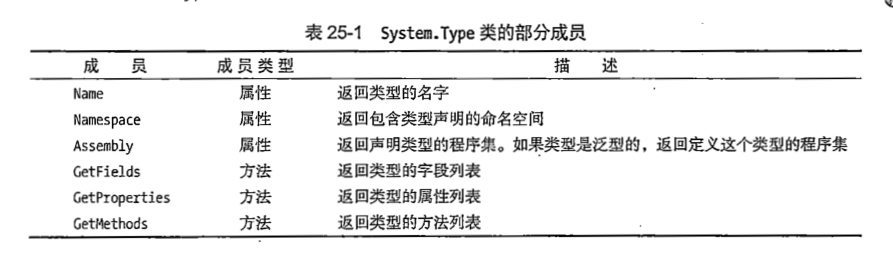

## 反射
+ 有反射才能使用自定义特性


+ 请注意成员类型 
+ 如果是方法 后面写的列表,你应该使用数组来承接
+ 这些基本上都是string 所以数组你只要遍历打印就行
```C#
               // v是实例化
                Type t = v.GetType();
                Console.WriteLine($"Object type : {t.Name}");
                FieldInfo[] fi = t.GetFields();   //数组承接

               //也可以不通过实例化直接传入 类的名字推荐后者
               Type tbc = typeof(DerivedClass 类名);  //建议使用
```