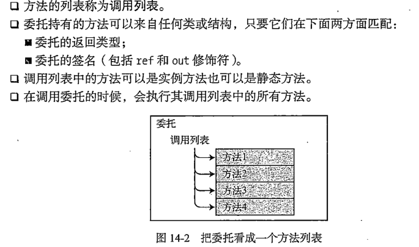
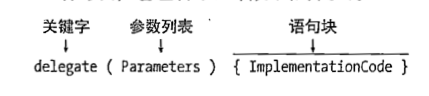
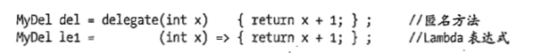
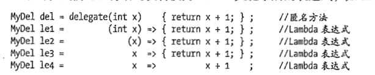

# 委托 匿名函数 lamba表达式
+ 委托实现了匿名函数和lamba表达式


## 委托的细节和性质
+ 委托本身算是一个安全的函数指针或函数指针列表
+ 委托可以调用那些函数 返回值和形参一样的函数.
+ 委托本身还是一个类型
  + 

## 综上所述
``` C#
delegate void MyDel (int x);
```

| delegate | void | MyDel                          | (int x); |
| -------- | ---- | ------------------------------ | -------- |
| 声明方式 | void | 这里你可以理解为你委托的类型名 | (int x); |

## 委托的初始化
| delVar | new | MyDel | (MyInstoBj.MyM1)         |
| ------ | --- | ----- | ------------------------ |
|        |     |       | 利用实例化类的函数初始化 |

| delVar | new | MyDel | (SClass.OtherM2) |
| ------ | --- | ----- | ---------------- |
|        |     |       | 静态方法         |

## 委托的本质还是引用 
+ 所以在将新的函数指向委托的时候 ,旧的委托会被垃圾回收
+ 委托是函数指针的列表可以一次第一多个函数
```C#
delVar1 =new MyDel (MyInstoBj.MyM1)
 delVar2 =new  MyDel (SClass.OtherM2)
MyDel _delVar3= delVar1+delVar2;   //这个就变成了函数指针的列表组合调用.

// 委托实现了+=操作  实验正面可以多次调用相同的函数
MyDel delvar= inst.MyM1;
delVar+= SC1.m3;
delVar+= X.Act;

// 删除操作-=自然同理 
这里引出一个委托函数指针的列表结构,在+=上面函数以后,他们的顺序从上入图
//委托调用 invoke 方法
delVar.invoke(65);  //写这种把让人一眼看出是一个委托
delVar(65);
```
| inst.MyM1  从最开的找 那么意味着 从这个地方往下找到第一匹配的然后删除 |
| --------------------------------------------------------------------- |
| SC1.m3                                                                |
| X.Act                                                                 |


---
## 基于委托实现了匿名方法 
+ 作用域 匿名函数的外部作用域和上一层相同.


```C#
// 使用委托 
delegate int OutherDel(int Inp);
class Paogram
{
      public static int Add2(int x)
        {
            return x * 20;
        }
}
// 这种类只需要实例化一次的时候
Paogram Paogram1=new Paogram();  // 先实例化 
OutherDel OutherDel1234=Paogram1.Add2;  //然后传递指针 非常麻烦


// 替代写法 (大量节约时间)
OutherDel OutherDel1234= delegate int(int x){
    return x*20;
}
```

----

## 改进匿名函数的冗余写法引入lamaba表达式
+ 还是用委托承接
+ lamba表达式本质还是承接在委托上面
+ lamba表达式创建的是一个匿名函数,那么委托这个函数指针列表,就可以来装载他.


