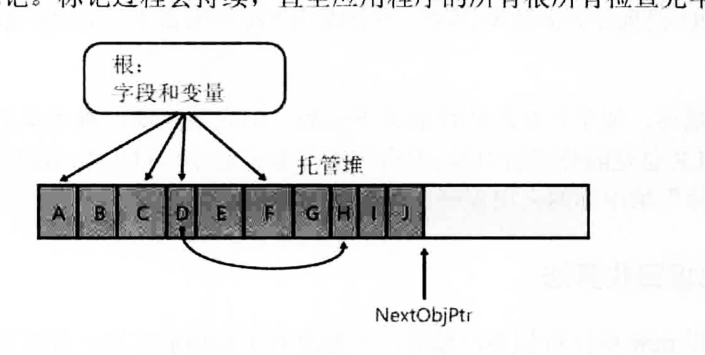
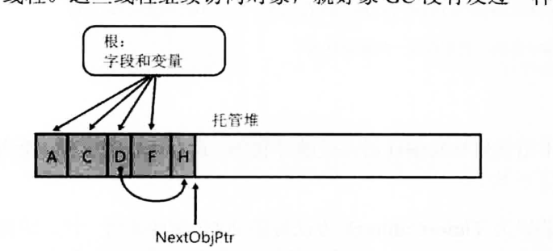
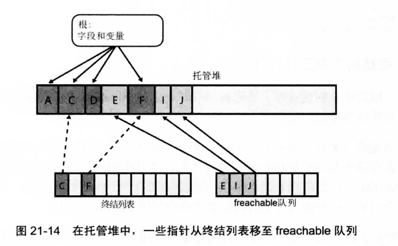
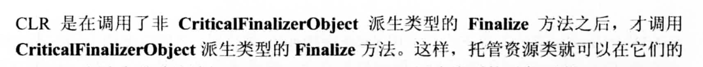
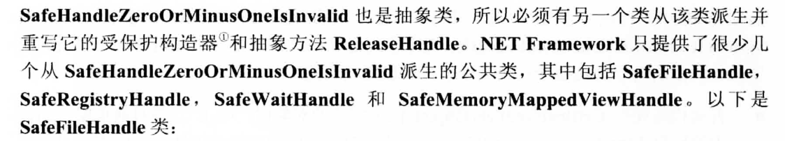
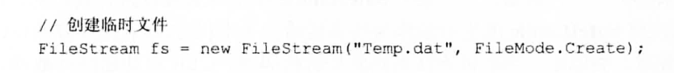
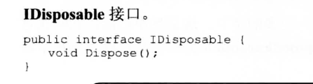

+ 书籍引用 CLR c#第四版
## 对象的是如何在托管堆开辟的
+ 首先为父类类分配在托管堆分配空间
  + 也就意味着父类和子类在空间上存在连续性,这样存在了一个线程只调用一部分空间,可以之间挂载cpu的高速缓存,这样速度非常快,但前提是你需要删除一些对象,内存优先
+ 同步块索引的概念,决定引用的多线程同步
+ 当前代内存空间充足时,现将NextObjptr指向的空间,
   + 在调用对象的构造器 将对象的this指定给Nextptr
   + 然后new 返回对象引用
   + Nextptr加上占用字节指向下一个新值

## 垃圾回收代数的情况
+ 如果第0代满了那么就会进行一次垃圾释放,剩下的对象就会晋升到第1代,最多到第二代
+ 第0代被释放几次以后,才有可能释放第1代,主要是为了性能,你想第0代因为创建时间比较短,所以垃圾在第0代回收率高一些,
+ 同时如果一次所有代都回收,造成了性能浪费.

## 垃圾回收的策略(引用跟踪算法)
+ 不要在意对象什么时候会被当成垃圾(智能玄学)但是有种策略可以延迟垃圾回收
  + >t.Dispose();//当对象执行到这一句,才能开始考虑他是否可回收
+ CLR先停下线程,检查每个字段变量和引用,如果他们有引用的对象,那么就将托管堆中的引用同步块索引中的一个bit标1,就代表他还被别人用到的.
  + 默认都是0,所以经过一轮的搜索,就知道了那些没有被引用,同时多个引用实际上还是指向托管堆的同一个空间,

+ 回收空间,压缩空间
  + 没用的之间不管,但是托管堆他的优势在于连续空间,这样删除以后岂不是造成多个小空间,要解决删除空间变量还能指向正确位置,当前变量减去删除的字段空间大小,在赋值地址给引用,就可以成立了.

## 垃圾回收的本质操作

+ 如果一个对象实现了Finalize的写法,那么就会有终结列表的对象指向托管堆,垃圾回收时,说明终结列表已经有对象他们是不可达了,是垃圾了,所以一部分对象就被转移到了freachable队列
+ 转移到freachable队列的对象,此时需要调用他的Finalize对象语句,所以又把垃圾给复活了,对象被提升到了第二代了
+ 所以只有第二代被回收时,才会直接调用freachabel队列中的对象使用Finalize来释放对象.

## SafeHandle和Finalize的关系
+ SafeHandle继承自CriticalFinalizerObject(有SafeHandle原代码p466)
  + CriticalFinalizerObject提供了三种保障
    + 一旦创建CriticalFinalizerObject继承类对象的时候,CLR就会对继承结构的所有Finalize方法进行编译,所以至少将对象添加到Fiznalize队列中
    + 
      + 如果FileStream(资源托管类不是CriticalFinalizerObject)他的Finalize就可以访问磁盘文件(是CriticalFinalizerObject),因为后者是在前者释放完以后才释放
    + 这个不清楚(P467 )
+ SafeHandle 因为windows和其他平台的原因,所以句柄0和-1是无效的,SafeHandle提供了一个继承类确保句柄转换安全
  + 
  + 意味着你只要使用SafeFileHandle平台就行
+ SafeHandle运行机制
  + 他是如何确保多个线程中资源是否被释放的,利用计数器的增加,类似于c++中的智能指针,一旦有增加一个引用,就会加1

## SafeHandle的使用
+ 利用CreateFile函数让句柄保存到SafeFileHandle中去,实现了安全释放
  
+ 只要你实现了IDisposable接口,就会在你的FileStream(其他类似)上调用Dispose,自动调用SafeFileHandle的Dispose,Dispose只决定什么时候释放,其他的放到SafeFileHandle就能保证安全释放了
  + FileStream自己实现了IDispisable,所以其他的想要使用Dispose,你得看实现没有
  