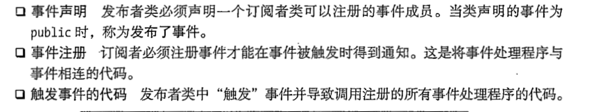
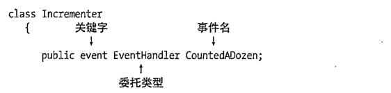
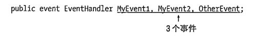

## 事假
1. 事假他不是一个类型,这点他和委托有着根本区别,他是类的成员.
  + 所以他只能声明在类或其他结构体中
----
2. 事假他的本质跟监控委托相似,通常我们把事件的调用写在一个类的函数中,当我们调用函数时候,他就会通知绑定的函数,然后执行这些函数.
    + 首先他是依托委托来实现 
```public event EventHandler CountedADoze```
    + 事件他像一个邮局,他通过委托来传递邮件 ,然后想要订阅邮件的人向他注册,当邮件有邮件信号时,通过委托来送达,订阅的人收到消息
    + 我们主要通过三个步骤来实现这个过程
    
    
3. 依托上面的步骤



```C#
delegate void Hander();                  //第一步订阅事件的信息发送工具委托
                                         //确定邮件的格式
class Incrementer
{
    public event Hander CountedADozen;   //第二步 声明事件,提供邮局的地址
                                         //当然 不同的变量名代表不同的邮局
    public void DoCount()
    {

        for (int i = 1; i < 100; i++)
            if (i % 12 == 0 && CountedADozen != null)
                CountedADozen();         //这里我认为是事件的精华之处,如果你直接
                
                //调用事件与委托没有任何区别  ,所以这里是在调用DoCount 函数的时候
                
                //发送信号 让订阅者知道,所以邮局的发送信号在类中去写,通过DoCount
                
                //变相的去调用

    }
    class Dozens
    {
        public int DoznszCount { get; private set; }
        public Dozens(Incrementer incrementer)
        {
            DoznszCount = 0;
            incrementer.CountedADozen += IncrementDozensCount;  
                                       //第三步订阅邮局.
        }
        void IncrementDozensCount()
        {
            DoznszCount++;
            Console.WriteLine("Now number is{0}\n", DoznszCount);
        }
    }

 static void Main()
        {
            Incrementer incrementer = new Incrementer();
            Dozens dozensCounter = new Dozens(incrementer);
           
            incrementer.CountedADozen += () => { Console.WriteLine("This is new tianjai1\n"); };      //因为依靠委托,所以lambda也支持 
            incrementer.CountedADozen += delegate () { Console.WriteLine("zhe shi yige 匿名函数\n"); };
            
            incrementer.DoCount();//核心 我们利用DoCount 变相调用事件,这也就监控委托,
            
            Console.WriteLine("Number of sozens={0}", dozensCounter.DoznszCount);


```


---
## 上面我们书写了委托的完整写法 
+ 但是我们更加推荐这种官方通过的事件写法
+ 首先我们不在需要书写一个委托,官方提供了一个委托(大大降低我们的工作量)

    + object sender 这个形参用于绑定当前对象的,事件是类的成员当然要绑定到自己的类
    + EventArgs e 这个是传递参数的,如果你不重写EventArgs,使用null,来代表无参数.
    + 如果我们需要订阅的函数,这个函数也要像委托一样,提供一样的参数,当然这个是前提.
    + 如果我们重写EventArgs e 我认为你就可以把想要改变的值放到这个类中去
+ 具体写法(我们认为官方提供的事件方便我们的的操作)
```C#
public class IncrementEventArgs : EventArgs   // 这里我们重写了事件的参数 目的是为了
                                              // 使用参数,而不是启用他,用null来代替
{
    public int IterationCount { get; set; }   // 你可以存放你想要改变的值

}


class Incrementer
{
    public event EventHandler<IncrementEventArgs> CountedADozen;
                                                  //EventHandler是一个 你需要用覆写的
                                                  //args来重写确定args类型

   
    public void DoCount()
    {
        IncrementEventArgs Args = new IncrementEventArgs();
        for (int i = 1; i < 100; i++)
            if (i % 12 == 0 && CountedADozen != null)
                CountedADozen(this, Args);        //如果你没有写Args 就默认不开启,使用                                null

    }
class Dozens
    {
        public int DoznszCount { get; private set; }
        public Dozens(Incrementer incrementer)
        {
            DoznszCount = 0;
            incrementer.CountedADozen += IncrementDozensCount;

        }
        void IncrementDozensCount(Object source, IncrementEventArgs args) 
                                 //跟写委托一样,这里不过我们要遵循系统委托的格式.
        {
            args.IterationCount++;
            Console.WriteLine("Now number is{0}\n", args.IterationCount);
        }
    }
     class progarm
    {

        static void Main()
        {
            Incrementer incrementer = new Incrementer();
            Dozens dozensCounter = new Dozens(incrementer);
            incrementer.DoCount();
            Console.WriteLine("Number of sozens={0}", dozensCounter.DoznszCount);


        }
```
