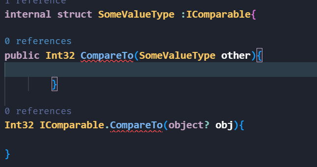
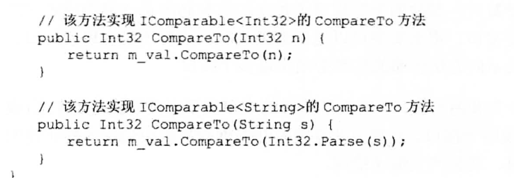

+ 推荐这个学习资料(接口的显示实现和多态) https://blog.csdn.net/qq_22170875/article/details/104641080
### 接口的书写标准(接口)
+ 接口自己是一个类,但是他是专门用于方法的,所以它的书写不能有很多东西.例如字段.
  + 接口成员不允许使用访问修饰符，所有接口成员都隐式为公共成员。
  + 接口成员只能包括方法、属性、索引器、事件，本质都是方法,不能有字段,更不能包含方法体。
  + 不能用关键字static、virtual、abstract或sealed来定义接口成员。
  + 如果要隐藏从基接口中继承的成员，可以用new关键字来定义。
  + 接口中只能定义你认为每个子类中必须实现的方法,继承接口的类必须实现接口中所有成员,除非子类是抽象类。

### 接口的显示实现和隐士实现(根本还是多态)
+ 隐士实现
  + 子类和父接口在CRL中他们的方法都是指向子类的方法.,在编译后,他们都是指向方法段的同一个方法.
+ 为什么需要显示实现:
  + 为什么需要显式实现接口呢？假设一个类实现了多个接口，每个接口中都有一个定义相同的方法，我们用一个类来继承这两个接口,我们没法区分实现的是哪一个接口中的方法，普通实现方法就行不通了。所以，显式方法就是为了解决这个问题产生的。显式实现时采取 【接口名.方法名】方式就行了。
  + 原理:
     + 我认为还是利用了多态的性质,我们显示的实现【接口名.方法名】他在继承类中是private,所以你只能用base指向 Zilei去使用显示的实现,这个不就是利用多态的性质
     + >interface base;  class Zilei: base;
  + 写法 
    + > 在继承的子类中 书写 【接口名.方法名】 不能给他添加任何的修饰符例如 virtual public等 因为他的性质是在接口中实现的,你没有任何特权.
+ <mark>请不要乱用显示实现
  + 继承类不能调用显示实现
  + 对于继承类的继承类而言他是不可见的因为private
  + <mark>使用的方式在哪儿(防止装箱上面有大用途):
     + 下面图片中 就是使用场景,我们继承类必须实现接口的方法,但是我们参数希望是别的引用类,而不是Object,Object每次传入参数都会导致装箱,浪费性能,
     + 所以在书写显示实现,以后我们就可以书写自己的版本了,非常大的性能提升.
     + 

### 接口中的泛型
+ 接口泛型的好处及其用法 : 
  + 实现类型的约束:
   + 下面的这种写法可以实现类型的约束,有助于我们书写方法固定特写的类型,避免装箱的操作,装箱是十分浪费性能的,类似于c++的操作
   + > class Number: Icomparable< int32>,Icomparable< string>
   + 
  + 实现类型的继承和约束:
    + 很多时候根本没有泛型,但是我们可以让一个子类继承自一个基类,同时书写继承多个接口,这个不就是STL的迭代器规范吗,这样我们可以让类的实现规范化.
+ 生成IL指令让接口不发生装箱
+ 从string等转换成Object 装箱以后,叫做了类型不安全,只有在方法中一直保持String类型才是,类型的安全性.