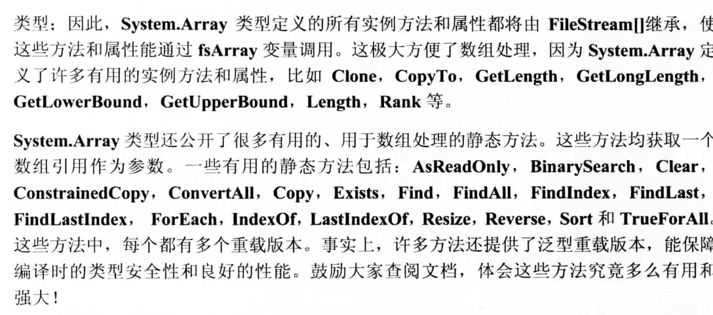
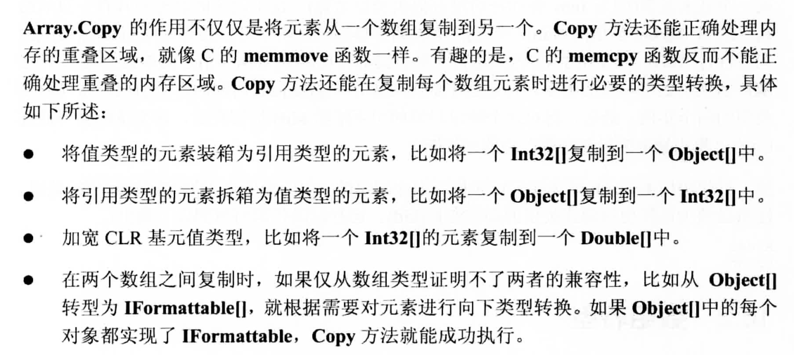

+ 数组继承自Object,所以数组是引用类型,数组名称只是引用. 
+ array.copy 拥有强大的功能
  + 甚至可以做到两个不同数组类型的转换
  + array.copy本质还是浅拷贝,所有在赋值引用的时候,并没有在堆中创建一个新的对象,而是复制的是引用本身,所以叫做浅拷贝.
+ 所有数组继承自 System.array,System.array提供了很多方法
  + 

+ 下标0开始一维数组
  + 只针对一维下标0,下面的这些版本开会支持ICollection< T>泛型版本,以免装箱,二维实在不好实现.
+ 所有数组都继承
  + IEnumberable 迭代器版本
  + ICollection  ICollection是IEnumerable的加强型接口，它继承自IEnumerable接口，提供了同步处理、赋值及返回内含元素数目的功能
  + IDictionary 和 IList 则是扩展 ICollection 的更为专用的接口 ,如果 IDictionary 接口和 IList 接口都不能满足所需集合的要求,可能是IList 太过详细的原有,所有不太满足集合的要求.

+ 数组后面一点点就没看了