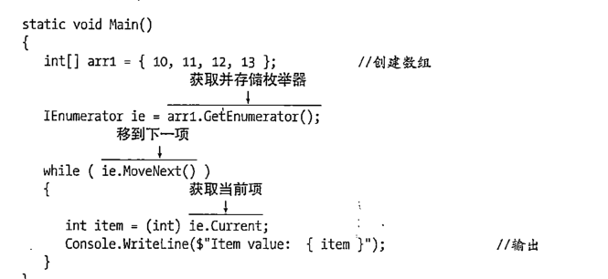
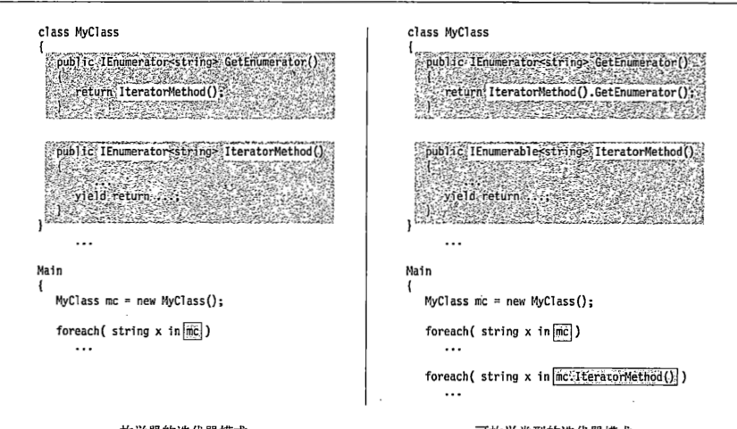

## 枚举器
+ 有点像迭代器
+ 三个方法 MoveNext(返回 bool) Current Reset(重置) 
  

```C#
           IEnumerator ie = arr1.GetEnumerator();   //GetEnumerator返回枚举器
            while (ie.MoveNext())
            {
                int item = (int)ie.Current;
                Console.WriteLine($"Item value : {item}");
```


### 自定义实现枚举器(IEnumerator和IEnumerable关系)
+  GetEnumerator  返回的是IEnumerator 
+  GetEnumerator通常是一个类继承自IEnumerable接口 ,这个接口提供一个GetEnumerator函数返回一个IEnumerator
+  :smirk: 由此得出:
   +  第一步我们需要重写IEnumerable接口提供一个GetEnumerator的方法
   +  第二步我们需要重写自定义的枚举器IEnumerator 重写他的三个方法
   +  IEnumerable:是否开启枚举器的功能:smile: able结束代表是否的
   +  IEnumerator: 枚举器到底如何运行
  
```C#

namespace songge
{
    class ColorEumator : IEnumerator   //实现三种方法
    {//第二步
        string[] colors;
        int positon = -1;
        public ColorEumator(string[] OutColors)
        {

            colors = new string[OutColors.Length];
            OutColors.CopyTo(colors, 0);
        }

        public object Current  //如果是泛型接口您就要返回 IEnumerator<T>
        {
            get
            {
                if (positon == -1)
                    throw new InvalidOperationException();
                if (positon >= colors.Length)
                    throw new InvalidOperationException();
                return colors[positon];
            }
        }


        public bool MoveNext()
        {

            if (positon < colors.Length - 1)
            {
                positon++;
                return true;
            }
            else
                return false;

        }
        
        public void Reset()
        {

            positon = -1;
        }
    }


    class Startrum : IEnumerable   //第一步  泛型接口返回IEnumerator<T>
    {// 为什么可以返回这个 因为我们实现了 ColorEumator<T> 到IEnumerator<T>
    //这里就不是协变和裂变了,我们是直接实现了

        string[] colors = { "violet", "blue", "green" };
        public IEnumerator GetEnumerator()
        {

            return new ColorEumator(colors);

        }
    }


    class program
    {
        static void Main()
        {
            Startrum startrum_1 = new Startrum();
            foreach (string colors in startrum_1)
                Console.WriteLine(colors); 
                //foreach 自动调用 GetEnumerator
        }
    }


```
## 上面的方式都没用 太麻烦了
+ 幸好C#大哥为我们考虑 让我们用迭代器来创建枚举器让我们自定义大幅度省力
+ 迭代器的根本是一种解释性的创造枚举器
+ 根本写法是 你需要返回在类中的GetEnumerator 返回一个IEnumerator<T>类型 
+ 这个返回值可以通过一个函数简介传递,配合yield用法 ,yield是一种解释,在循环中调用yield 他不会马上循环完,在获取到下一个信号的时候,在调用下一个

### 有两种创作模式供你选择
+ 首先我们再也不用继承枚举器的两个基类
+ 在IteratorMethod 书写yield 来解释返回的数组的顺序,下面我们即将看到数组输入时候的情况
+ GetEnumerator 返回IEnumerator<T> 这个是核心所在
+ GetEnumerator 借用IteratorMethod 间接返回
+ 然后你就实现这个类的枚举器了,他会自动找到你要迭代的数组 ,看下面代码


```C#
 class Color   //从此类的枚举器实现大幅度减少,多亏迭代器yyds
    {
        public string[] intcolor;
   
        public Color(string[] outcolor)
        {
            intcolor = new string[outcolor.Length];
           
            outcolor.CopyTo(intcolor, 0);

        }
        public IEnumerator<string> GetEnumerator()//核心
        // 两点 实现第一 GetEnumerator  第二 返回IEnumerator<string>
        {

            return IEnumeratorMethod();

        }

        public IEnumerator<string> IEnumeratorMethod()
        {// 这里推荐这种写法循环的调用yield
            for (int i = 0; i < intcolor.Length;i++)
                yield return intcolor[i];

        }

    }
Main(){  //最终我们拥有了循环一个类的能力
foreach (string str in color_1)
                Console.WriteLine(str);
}
```
