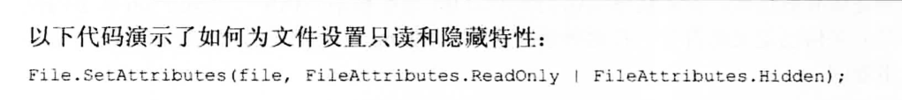

#### 基本的使用方式
+ 枚举的只能继承那些值类型
    ```C#
     enum color :byte{
     white,
     red,
     blue
     }
    ```
+  使用的方法和操作  
```C#
Console.WriteLine(Enum.GetUnderlyingType(typeof(color)));  //返回基类 system.byte
Console.WriteLine(Enum.Format(typeof(color), 3, "G"));     //利用值返回对应的string
Array colors = (color[])Enum.GetValues(typeof(color));     // 返回一个Array 里面装的Enum值.
```
#### 结合特性实现高级应用 位运算
+ 参考文章: https://segmentfault.com/a/1190000038318231?sort=votes
+ 文件的属性设置就用到了位标志
  
+ 比较麻烦的地方,位运算
  + 当你枚举使用[Flags]特性的时候
  + 也就是表明当你把几个枚举利用按位运算关联的时候,他们并不会直接用按位运算方式计算,而是以一种集合的方式储存起来
  + 这种集合的标志就是[Flags] 用来开启是否以类似数组的形式储存起来
  + 如果没有[Flags]就是直接按位计算,直接输出数字,而不是Action.Walk | Action.Run
  + <mark> 注意下面代码的第块区域
```C#
[Flags] //添加Flags标记便可声明一个位标志
enum Action
{
    None = 0,
    Walk = 0x0001,
    Run = 0x0002,
    Speak = 0x0004
}

//声明一个行为
var action = Action.None;
//判断该行为是否能走 输出false
Console.WriteLine((action & Action.Walk) != 0);
Console.WriteLine((action & Action.Walk) == Action.Walk);
Console.WriteLine(action.ToString());   //打印Action.None

//添加行走和奔跑行为
action = action | Action.Walk | Action.Run;
Console.WriteLine((action & Action.Walk) != 0);//true
Console.WriteLine((action & Action.Run) != 0); //true
Console.WriteLine(action.ToString());   //打印Action.Walk | Action.Run
// 运算的方式action & Action.Run Action.Run会跟类似action数组每个枚举值计算
// 这里 action因为有Action.Run 会有两个Action.Run计算得1,所以会直接输出 所以返回true


//删除走的行为
action = action &~ Action.Walk;
Console.WriteLine((action & Action.Walk) != 0);//false
Console.WriteLine((action & Action.Run) != 0); //true
Console.WriteLine(action.ToString());   //打印Action.Run

```


