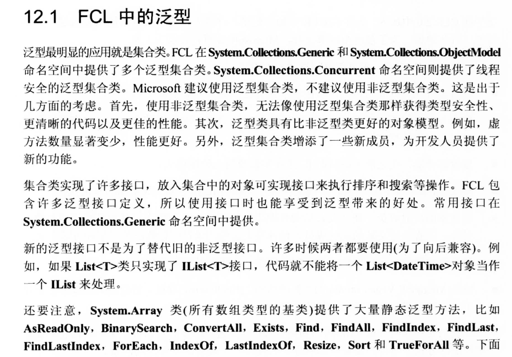
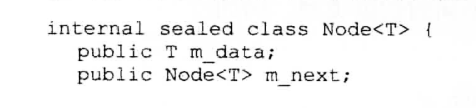
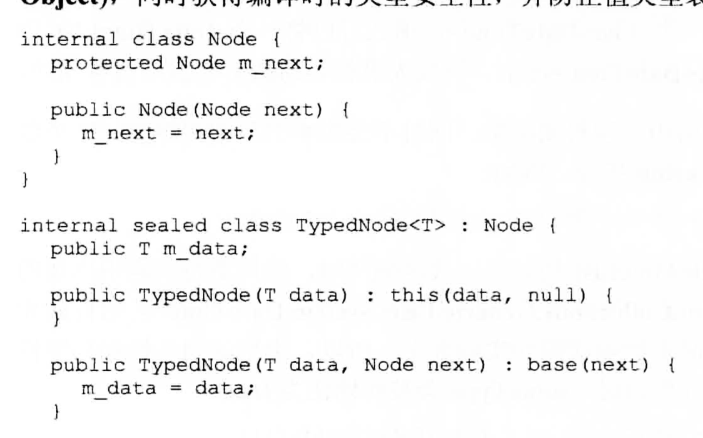
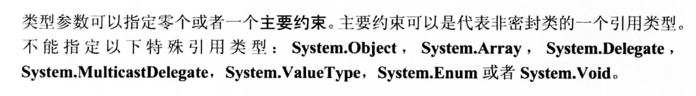
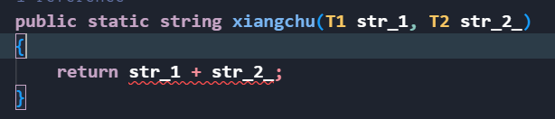
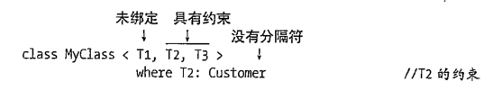
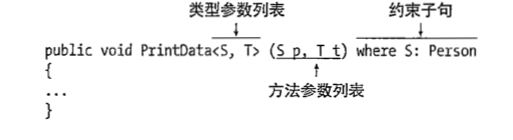
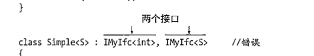
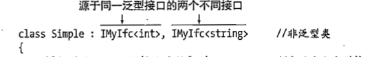

### 泛型的优势和特点和优化
+ 特点
  + 如果不写泛型,那么在参数上面你只能去写Object,这样就会频繁的装箱和拆箱,造成几倍的性能浪费,写了泛型就可以利用泛型来指定类型,而不去考虑参数的转换.
+ 代码编译的优化
  + 当CLR文件编译一个List< String>的时候,他在.dll文件(大致意思)上就会生成一个,下次在遇见就不会在编译了
+ 匹配的过程
  + c#首先会继续类型的匹配,然后才是泛型的匹配
  + 这样就意味着如果你有非泛型,那么会优先调用,然后才是你的泛型
### 泛型主要集中的区域



### 泛型使用技巧
#### 使用技巧一
+ 链表中书写泛型(如果我们直接采用下面的写法存在一些问题)
  + 因为我们是写的泛型 所以我们希望链表的各个节点都是不同类型
  + 那么头节点是 Node< Text> 下一个节点是 Node< Int> 那么图片中第二参数他们的<T>是不同的 出现了转换 这个是很麻烦的
  + 
  
  + 正确做法 :
    + 先写一个基类,在基类中定义Next Node 利用多态来解决这个问题
    
#### 使用技巧二(泛型的同一性 书)
+ 简化书写,同时c#提供手段保证,这两个类型是一致的
+ 在文件开头书写
> using DateTimeList =System.collections.Generic.List< System.DateTime>;
> 使用typeof时候他们之间是等价的.

#### 使用技巧三(错误用法)
+ 在泛型内部使用显示转换是明显的错误 T a =(string) b
+ 你直接将T and =null 也是错误的 因为当T是值类型时,他不存在指向null引用类型, 但是你对他使用 ==null 和!=null是合法的,因为值类型时,不管值是多少都会返回false
+ 还是前面提到的 给泛型随便使用操作符是违法

### 泛型的三种约束十分重要
#### 主要约束(主要是针对引用类型)
+ 你不能使用where 约束下面这些特殊的引用类型

+ class 和struct 两个特殊的主要约束
  > internal sealed class ParmaryConstranitOfClass< T> where T:class  或者 struct 前者代表你T是一个引用类型 而 struct是代表值类型
  + class 和struct 的区分有很多的作用,class 说明你继承了Object 岂不是 那几种方法就可在泛型中书写了.
  
#### 次要约束(这个是让你的T 必须实现一部分接口)
> private static List< TBase> ConvertList< T,Tbase> (Ilist< T> list )where T:TBase; 
+ 这种写法好处是 两个参数发生了联系,至少你能确定,T和TBase 有了一定的关系,而不是毫无目的
 
#### 构造器约束(让你的引用类型 必须有一个无参数的构造)
+ 配合struct使用时非法的,c#中值类型他会默认提供一个初始值,所以你写struct就是多余的
+ internal sealde class ParmaryConstranitOfClass< T> Where T:new(){};


## 泛型有很多的应用地方
### 泛型类
+ 因为你不知道实例化的类的内部构造 such as: 一个Type you don`t kown 他们之间是否可以相乘
+ 这也导致你不能在泛型类中轻易使用各种运算符(如下图,即使简单的加法你实现也有问题)

+ Object 类实现了 ToString Equals GetType 所以这三个你可以随意使用


---
### 泛型函数
+ 没有什么可以讲的 ,但是他的where 依旧比较硬核跟 泛型类的约束相似.
+ 好像string根本就不算类和int相似.



--- 
### 泛型委托
+ 我认为前面的都没啥新奇的,这个委托需要写一写
 ```C#
delegate T3 Mydelegat<T1, T2, T3>(T1 t1, T2 t2);
Mydelegat<string, string, string> mydelegat_1 = new Mydelegat<string, string, string>(Person.xiangchu);               //的确非常复杂.
```

--- 
### 泛型接口
+ 在泛型上面拓展泛型这样的确不太理想过于复杂(当然你也可以但是要保证接口泛型参数一致)

+ 所有我认为非泛型的拓展接口更加合适
  


  ---

### 委托的协变和逆变(不规范书写将会导致编译通不过)
+ 委托的协变(如果返回值有继承关系,可以利用)
  + 解决一个老生常谈的问题,我们两实例化的形参有继承关系,而我们的实例化的对象却没有继承关系
  + 这个只适用于改变返回类型
    + >delegate T Factory<(out) T>  out协变 改变返回类型T
    + >Factory<_Dog> Dog_1= new ......   //Anmail 是Dog的父类
    + >Factory<_Anmail> Anmail =Dog_1;   //实现了这种委托的转变 
+ 委托的逆变技术(参数的继承,扩展到整个委托的继承关系)
   + 一般我们有这种需求
   + >delegate void Factory<(i)n T>(T a);
   + > Factory<_Anmail> Anmail =new ......
   + > Factory<_Dog> Dog_1= Anmail   // 显然这种操作不合理
   + > Dog_1(new Dog());            //但是 参数 new Dog() 转成anmail似乎就合理了
   + 所以in给第三行的代码提供了一个合法性,让你先通过编译
  

<mark>换一种解释方式(强烈建议观看这个解释)

>  public delegate TResult Func<(in) T, out TResult>(T arg);
>  Func<(Object, ArgumentException> F1 = null;

>  Func<(string, Exception> F2 = F1;  //
+ 程序入口:
  + 每个概念需要从他的程序入口理解, 只有F2调用时才能用到我们前面的协变等, F2调用那么首先是F2接受参数,因为调用了F1 所以是String 转Object 没有问题,
+ 然后进入程序内部:
   + F2指向F1,而F1在程序内部就是ArgumentException,这里你会好奇,在程序开头为什么不会发生Exception,ArgumentException这个违法行为,这是因为Exception他是协变,是返回值,不是输入值,所以开头没有这种情况, 
+ 程序末尾,因为最终是F2返回,所以内部F1 ArgumentException会变成Exception 转换合法,这个就是协变和逆变的终极合理性

### 接口的协变和逆变 
+ 主要用于参数的类型转换 ,其他的想不到了别的用途
```C#
 class Animal { public string Name; }
    class Dog : Animal { }
    
    
    interface ImyIf<out T>
    {
        T GetFirst();

    }
    class SimpleReturn<T> : ImyIf<T>
    {

        public T[] items = new T[2];
        public T GetFirst() { return items[0]; }

    }
    class Program
    {
        static void DoSomething(ImyIf<Animal> returner)
        {
            Console.WriteLine(returner.GetFirst().Name);
        }

        static void Main()
        {
            SimpleReturn<Dog> dogReturner = new SimpleReturn<Dog>();
            dogReturner.items[0] = new Dog()
            {
                Name = "Avolea"
            };

            ImyIf<Dog> animaRetruner = dogReturner;   //正确
            ImyIf<Animal> animaRetruner = dogReturner;   //正确
            SimpleReturn<Animal> animaRetruner = dogReturner;   //报错
            // 这里虽然没有任何意义 但是他显示的写了出来
            // 第一种和第二种正确 他们的使用含义清楚
            // 第三种失败的原因在于 类他无法使用out,所以这种转变失败
            // ImyIf<Dog> 转ImyIf<Animal> 失败,是因为Imyif<Dog>的初始化就不成功,new 接口不太现实 
            DoSomething(dogReturner);
        }


    }

```