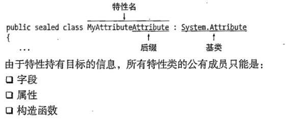
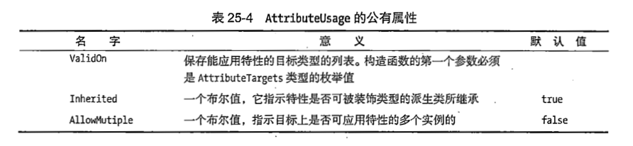
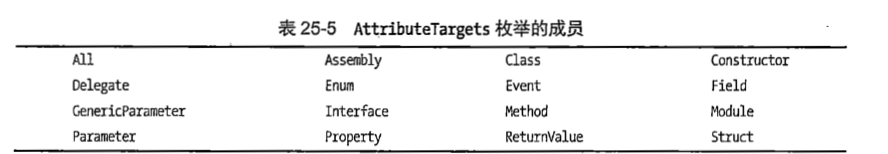

## 特性
###  Obsolete
+ 展示类方法是否弃用
```C#
 [Obsolete("Use new Method",false)]
static public void PrintOut(string str){
```

### Conditional
+ 判读条件,配合#define定义来开启一些函数是否调用
```C#
#define windows  //把windows 设置 true 后面的自然执行.
  [Conditional("windows")]
        static public void windowsPrintOut()
        {
            Console.WriteLine("这是来自windows平台");

        }
```

### 方法调用者的信息
+ 特点在于调用者的信息展示,CallerFilePath 后面在写一个变量,当有人调用这个方法的时候,就会把信息文件名传给我们的写的变量
+ 所以只适用于方法
```C#
public static void MyTrace(string message,
[CallerFilePath] string filname = "",
[CallerLineNumber] int linneNumber = 0,
[CallerMemberName] string callMember = ""){
Console.WriteLine($"File :         {filname}");
Console.WriteLine($"line :         {linneNumber}");
Console.WriteLine($"call from :         {callMember}");
Console.WriteLine($"message :         {message}");

        }
```


### 调试不进入函数的特性


<br>
<br>
<br>

## 自定义特性
+ sealed关键字
+ 后缀名必须有
+ 特性本质是一个特殊类所以使用sealed关键字区分类

```C#
public sealed class MyAttributeAttibute : System.Attribute
    {
        public string Description;
        public string Version;
        public string Reviewer;

public MyAttributeAttibute(string desc){
            Description = desc;
        }
    }
[MyAttributeAttibute("simple class",Version= "Version 3.56"), Serializable]
// 注意我们自定特性类中,没有写两个参数的构造函数是如何实现的
// 我们只写了一个参数,后面是使用Version=的方式,所以如果你想图简便,就要使用这种方式.
```
### 约束自定义特性AttributeUsage

+ 第一个VaildOn AttributeTarget提供了多个枚举值当做限制
+ 
```C#
[AttributeUsage(AttributeTargets.Class|AttributeTargets.Method,Inherited =true,AllowMultiple =false)]

public sealed class MyAttributeAttibute : System.Attribute  //写在自定义特性上面,用来约束
```

## 属性的调用和是否应用成功
### 否应用成功isDefined
```C#
            Type t = mc.GetType();  //获取我们应用属性的类的实例化
            bool isDefined = t.IsDefined(typeof(MyAttributeAttibute), false);
            // 调用t.isDefined 传入属性类的Type 来检测.如果成功就true
``` 

<br>
<br>
<br>

### 属性的调用GetCustomAttributes(获取类的属性数组)

```C#
            Type Ta = typeof(MyAttributeAttibute);   
            Object[] AttArr = t.GetCustomAttributes(false);  //一个类有多个属性我们需要选一个
            foreach (Attribute a in AttArr)
            {
                MyAttributeAttibute attr = a as MyAttributeAttibute;//直到遍历到我们需要查看的属性才展开
                if (null != attr)
                {
                    Console.WriteLine($"Description   : {attr.Description}");
                    Console.WriteLine($"Version   : {attr.Version}");
                    Console.WriteLine($"Reviewer   : {attr.Reviewer}");


                }
```